# Mathematical setup for laser-induced PFC cavitation transfer

**English-only Modeler theory reference.** This is the mathematical setup to implement and test, not a solved target model. Construct and solve fresh COMSOL cases from it; do not use earlier project modeling results. The starting controls deliberately remove individual couplings, then restore them when they change the requested prediction.

## 1. Questions and admissible cases

Retain PFC nanodroplets in a finite water-droplet stamp, the primary PFC-containing carrier layer beneath film/PVC, and PFC embedded in hydrogel. In the primary layer, compare direct liquid-to-film loading and liquid-to-intact-PVC-to-film transmission. For hydrogel compare a bulk cavity, a liquid pocket with an actual exit, and an interfacial blister. Compare sealed and vented versions rather than assuming one.

The requested limits are (i) highest verified single-shot pressure or jet velocity in a stated bounded operating set and (ii) the repeatable intact-transfer envelope. A numerical verification result is not experimental verification. Pressure location, area, time response and reference pressure, and velocity region/mass/diameter/tracking duration, are part of the quantity being maximized.

External harmonic ultrasound is not the default input. Thermal diffusion, nonlinear growth/collapse/rebound, laser-generated stress transients and compressibility remain relevant. Extended resonance calculations are optional controls only when they resolve a specific loss or interaction.

## 2. Source deposition, before assuming a bubble

Start with a prescribed measured or declared laser waveform and an absorber. Interception and absorptance define solid deposition; conjugate heat transport subsequently defines liquid heating. In the simplest absorption-only optical transport, scattering and reflection after entrance are neglected:

$$
\begin{aligned}P_{\mathrm{abs}}&=f_{\mathrm{geo}}A_\lambda P_{\mathrm{in}},\qquad E_{\mathrm{abs}}=\int P_{\mathrm{abs}}\,\mathrm dt,\\ \partial_z I&=-\mu_a I,\qquad Q_{\mathrm{abs}}=\mu_a I,\qquad \int_{\Omega_a}Q_{\mathrm{abs}}\,\mathrm dV=P_{\mathrm{abs}}.\end{aligned}
$$

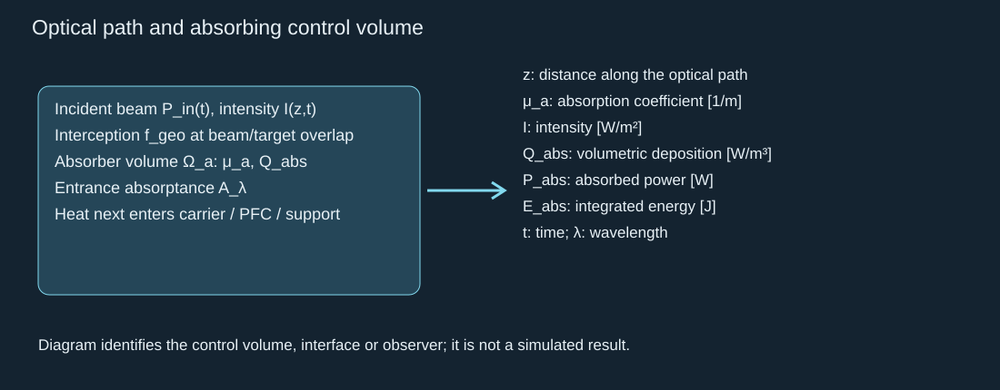

For a thin solid film, use a measured absorbed boundary flux instead of double-counting both boundary and volume deposition. A sparse particulate absorber can instead use measured particle absorption cross-sections and resolved/localized heating; scattering, aggregation and shielding require optical refinement. Do not use source output as liquid heat or as bubble mechanical energy. Surface-versus-volume absorption changes losses and spatial heating ([Schoppink 2024](https://doi.org/10.1063/5.0233144)).

Start conduction without phase change; then add advection and conjugate boundaries:

$$
\begin{aligned}\rho c_p(\partial_tT+\boldsymbol u\!\cdot\nabla T)&=\nabla\!\cdot(k\nabla T)+Q_{\mathrm{abs}},\\ \boldsymbol q&=-k\nabla T,\qquad \alpha=k/(\rho c_p),\\ \delta_T&\sim\sqrt{\alpha\tau_h},\qquad \mathrm{Fo}=\alpha\tau_h/L_h^2.\end{aligned}
$$

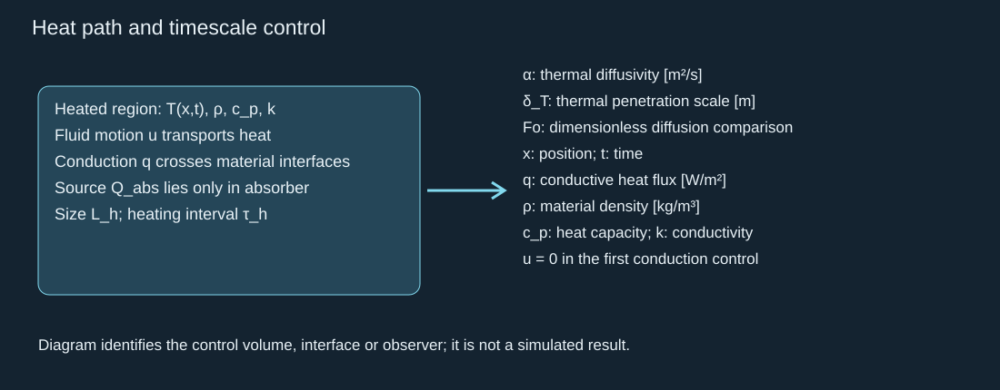

Impose temperature/heat-flux continuity or a declared thermal contact resistance at solid–liquid/gel interfaces, and measured/declared external heat losses. Compare heating duration, thermal diffusion and acoustic crossing times before using impulsive initial conditions. A heating delay can precede a much faster bubble event; this does not make the entire irradiation impulsive. Temperature alone is not a nucleation probability.

A prescribed seed supplies an honest post-nucleation reference. A nucleation-predictive model additionally needs a formulation-specific metastability/activation law, nuclei/shell statistics and an observation volume/time definition. A normal boiling point is not a nanodroplet activation threshold. Optical PFH/gold and PFP/loaded-absorber evidence must retain their formulations ([Wei 2014](https://doi.org/10.1364/OL.39.002599), [Strohm 2011](https://doi.org/10.1364/BOE.2.001432)); acoustic OFP/DFB parameters do not initialize an optical target by default.

## 3. Finite phase inventory and thermodynamic closure

For each volatile species, start with a finite closed inventory and a uniform vapor state. Positive mass transfer is liquid into vapor. For the spherical control:

$$
\begin{aligned}\dot m_{v,s}|_{\mathrm{phase}}&=\int_{\Gamma_s}j_s\,\mathrm dA,\qquad \dot m_v=4\pi R^2 j_m\quad\text{in the full-surface control},\\ m_l+m_v&=m_{\mathrm{tot}},\qquad j_m L_v=(\boldsymbol q_l-\boldsymbol q_v)\!\cdot\boldsymbol n,\\ \dot U_b&=\dot Q_b-p_b\dot V_b+h_v\dot m_v,\qquad \dot V_b=4\pi R^2\dot R.\end{aligned}
$$

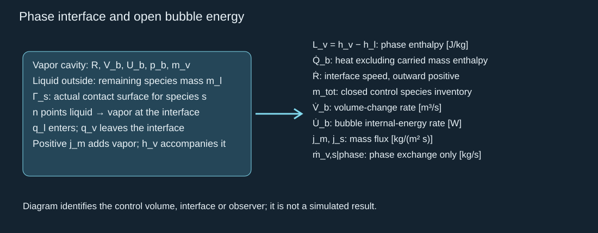

The Stefan limit neglects interface storage and kinetic-energy corrections. The full spherical transfer area assumes the modeled liquid species contacts the whole cavity surface; dispersed water/PFC cases instead need actual species contact areas and transport pathways. Residual PFC cores do not automatically contact the cavity wall. The lumped bubble balance neglects internal velocity gradients and assumes fixed noncondensable gas inventory. Use consistent species reference energies so the phase term is not counted twice as both internal-energy conversion and added latent heat.

The species integral gives phase exchange, not the entire in-domain vapor-mass change when inlet/outlet or dissolution fluxes also exist. The two-state inventory is a closed reference. For a vented/pocket-exit or dissolving case, track remaining liquid, in-domain vapor, cumulative escaped species, dissolved species and any retained shell reservoir. Include signed boundary mass flux and its carried enthalpy; do not hold the active in-domain inventory constant after venting. Define whether the control volume includes escaped material.

Track water vapor, PFC vapor and noncondensable gas separately when they coexist; in the spatial model keep their actual interfaces and transport. Equilibrium saturation is one reference closure at the interface temperature. A finite-rate closure needs measured/justified accommodation and heat/mass transport; condensation can lag rapid compression. Enforce nonnegative inventories, an exhaustion event and reverse exchange on cooling. A connected aqueous carrier is not an unlimited PFC reservoir ([Doinikov 2014](https://doi.org/10.1118/1.4894804), [Akhatov 2001](https://doi.org/10.1063/1.1401810)).

An ideal mixture is only a dilute-vapor control:

$$
\begin{aligned}p_b&=p_g+\sum_s p_{v,s},\qquad p_{v,s}V_b=m_{v,s}\mathcal R_s T_b,\\ p_b&=p_b(\rho_b,T_b,\{Y_s\})\quad\text{in the real-fluid refinement}.\end{aligned}
$$

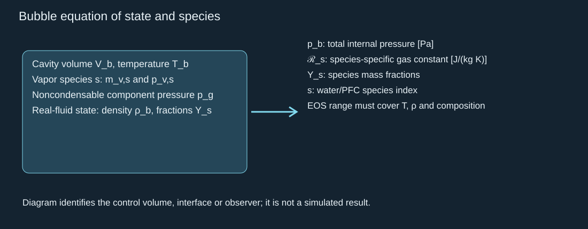

Choose species-specific liquid/vapor EOS and thermal/transport properties over the modeled range, with uncertainty cards. Do not extrapolate constant saturation pressure, a polytropic exponent or an ideal gas law to an unverified dense/high-temperature state. If the target formulation is not known, run named reference species and sensitivity cases; retain the unknown target mapping explicitly. Shell elasticity, rupture and aggregation are separate closures, not supplied by the hydrogel modulus.

Earlier published work supplies useful bulk-material references now: use [the recovered PFH/PFP cards](pfc-material-cards.html) for named constant-coefficient heat controls, source-dependent property sensitivity and phase references. The actual batch assignment and high-state extrapolation remain separate; they do not prevent those calculations. Apply neat-PFC properties to its inventory and carrier properties to the surrounding flow. The recovered cards flag the source's water-diffusivity unit error and incompatible heat-capacity values instead of hiding them.

## 4. Radial nonlinear controls and spatial escalation

Use Rayleigh–Plesset only as a spherical, incompressible reference. The thermal/phase model supplies the internal pressure:

$$
\rho\left(R\ddot R+\frac32\dot R^2\right)=p_b-p_\infty-\frac{2\sigma}{R}-\frac{4\mu\dot R}{R}
$$

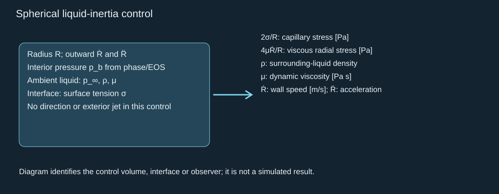

This standard control neglects evaporation-induced velocity slip and assumes effectively uniform cavity pressure. A supplied seed, fixed gas law and frozen vapor state can isolate signs/energy, but cannot predict laser onset or a directed jet. Check the empty-cavity Rayleigh integral at a finite radius against the numerical solution; do not use its zero-radius singularity as a maximum. Compressible radial models supply an intermediate wave/radius check, not spatial jet topology ([Liang 2022](https://doi.org/10.1017/jfm.2022.202)).

For jets/shocks, use conservation in each bulk phase with a valid compressible closure:

$$
\begin{aligned}\partial_t\rho+\nabla\!\cdot(\rho\boldsymbol u)&=0,\\ \partial_t(\rho\boldsymbol u)+\nabla\!\cdot(\rho\boldsymbol u\otimes\boldsymbol u)&=\nabla\!\cdot\boldsymbol{\mathsf T},\\ \partial_t(\rho E)+\nabla\!\cdot[(\rho E+p)\boldsymbol u]&=\nabla\!\cdot(\boldsymbol\tau\boldsymbol u-\boldsymbol q)+Q_{\mathrm{abs}},\\ \boldsymbol{\mathsf T}&=-p\boldsymbol{\mathsf I}+\boldsymbol\tau,\qquad E=e+\tfrac12|\boldsymbol u|^2.\end{aligned}
$$

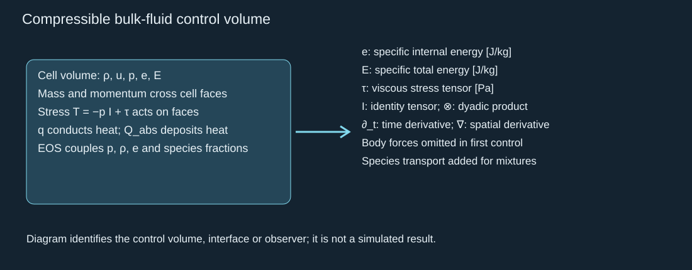

Declare whether gravitational loading is negligible on the event timescale. Add species conservation/diffusion for mixtures; advection, shock dissipation and thermal conduction must share a consistent energy balance. An incompressible two-phase interface can verify slow shape/volume behavior but cannot verify a shock pressure. Artificial interface width, stabilization and phase regularization require sensitivity checks along with mesh/time refinement.

At the moving liquid–vapor boundary, do not equate liquid velocity and interface speed when mass crosses. With normal liquid → vapor, vapor-minus-liquid jump notation, and curvature equal to the surface divergence of that normal:

$$
\begin{aligned}j_m&=\rho_l(\boldsymbol u_l-\boldsymbol v_\Gamma)\!\cdot\boldsymbol n=\rho_v(\boldsymbol u_v-\boldsymbol v_\Gamma)\!\cdot\boldsymbol n,\\ [\![\boldsymbol{\mathsf T}]\!]\boldsymbol n-j_m[\![\boldsymbol u]\!]&=\sigma\kappa_\Gamma\boldsymbol n-\nabla_s\sigma,\\ \kappa_\Gamma&=\nabla_s\!\cdot\boldsymbol n=-2/R\quad\text{for a spherical vapor cavity}.\end{aligned}
$$

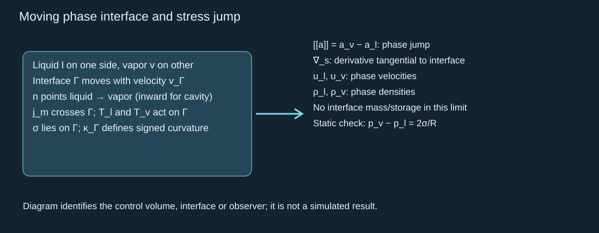

A massless interface with constant surface energy equal to the constant tension, no surface heat conduction, no interfacial viscosity, and no other interfacial energy source has the following conservative energy control. Here **h** is specific thermodynamic enthalpy; it is distinct from boundary stand-off distance in later geometry laws.

$$
\begin{aligned}\boldsymbol w_k&=\boldsymbol u_k-\boldsymbol v_\Gamma,\qquad h_k=e_k+p_k/\rho_k,\quad k\in\{l,v\},\\ j_m[\![h+\tfrac12|\boldsymbol w|^2]\!]&=[\![(\boldsymbol\tau\boldsymbol n)\!\cdot\boldsymbol w]\!]-[\![\boldsymbol q]\!]\!\cdot\boldsymbol n,\\ E_\Gamma&=\sigma A_\Gamma,\qquad \dot E_\Gamma=\sigma\int_\Gamma\nabla_s\!\cdot\boldsymbol v_\Gamma\,\mathrm dA\quad(\text{constant }\sigma).\end{aligned}
$$

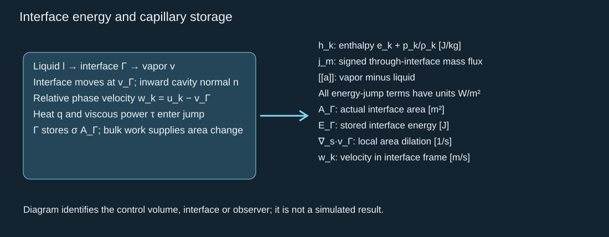

Derivation: integrate the conservative bulk energy equation across a moving pillbox. Its relative energy flux is mass-carried total energy minus stress power plus conductive heat. Subtract interface-velocity times the momentum jump; the remaining mass flux contains enthalpy and relative kinetic energy, giving the displayed energy jump. The removed capillary power supplies the change of interface area. With negligible relative kinetic and viscous terms this reduces to the Stefan equation in section 3, with the same evaporation sign. For a spherical material interface, the lost bulk capillary-work rate equals the gained surface-energy rate; include both in the global conservation check.

This is a derived constant-tension reference, not the general interfacial thermodynamic closure. Temperature-dependent surface free energy, surface entropy/storage, surfactants, interfacial viscosity or chemical reaction require the corresponding surface energy/entropy balance and kinetic constitutive law ([Anderson et al. 2007](https://doi.org/10.1017/S0022112007005587)). Mixture diffusion also transports species enthalpy. A model must retain these terms or document the limit in which they can be neglected. Bulk and interface energy conservation alone do not supply an activation or nonequilibrium mass-transfer rate.

In the global ledger, include bulk capillary traction work and surface-energy change once, with opposite signs; do not add capillary work again as an external energy input to a ledger that already includes E_Γ. For interfaces ending at a solid, include the solid–liquid/solid–vapor surface energies and contact-line/wetting work under the selected contact law. The displayed surface-area transport formula assumes a closed surface or an explicitly accounted edge flux; it is not a complete moving-contact-line law.

The static Laplace check fixes the stress-jump sign. At a solid/gel boundary impose no penetration or a declared permeable law, the appropriate slip/wetting/contact-line condition, and traction/heat exchange. Outlets and outer acoustic boundaries must be tested for reflection and domain-size dependence.

## 5. Jet topology and finite-geometry predictions

Compare cavity-growth loading, meniscus-focused exterior ejection, outer-interface instability, internal collapse re-entry, post-release bridge stretch, source/collapse shocks and compliant blister loading. Resolve event ordering and identify internal/exterior liquid separately. Potential flow or boundary integrals give an early inertial focusing control; two-phase flow adds topology/viscosity/wetting; compressible multiphase flow adds shocks; three dimensions resolve separate azimuthal/off-axis filaments. None of these stages supplies the laser source or phase closure automatically.

Use appropriate geometry-specific references: [Supponen 2016](https://doi.org/10.1017/jfm.2016.463) for internal jet scaling, [Tagawa 2012](https://doi.org/10.1103/PhysRevX.2.031002) for focused capillary exit jets, [Gonzalez-Avila & Ohl 2016](https://doi.org/10.1017/jfm.2016.583) for a finite droplet, and [Lechner 2020](https://doi.org/10.1103/PhysRevFluids.5.093604) for spatial near-wall collapse. Their thresholds, velocities and source conditions are not interchangeable. Shape convergence is not peak-speed or peak-pressure convergence.

## 6. Hydrogel and film/PVC mechanics

Start a cavity/pocket/blister with a separately specified geometry. A useful finite-deformation elastic control for a gel is an isochoric neo-Hookean energy with an independent volumetric penalty:

$$
\begin{aligned}W(\boldsymbol F)&=\frac G2(\bar I_1-3)+\frac K2(J-1)^2,\\ \bar I_1&=J^{-2/3}\operatorname{tr}(\boldsymbol F^{T}\boldsymbol F),\qquad J=\det\boldsymbol F,\\ \rho_{s0}\ddot{\boldsymbol d}&=\operatorname{Div}\boldsymbol{\mathsf P},\qquad \boldsymbol{\mathsf P}=\partial W/\partial\boldsymbol F.\end{aligned}
$$

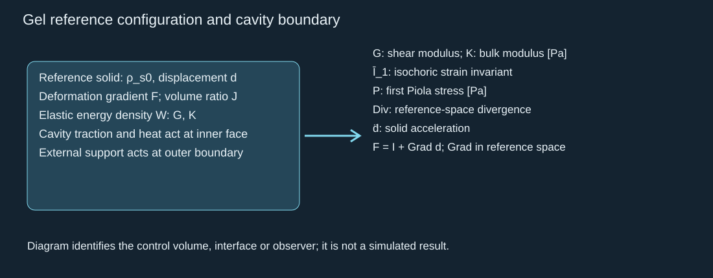

This is a declared reference law, not a calibrated hydrogel material card. Independently verify elastic work and reactions; then add relaxation, temperature dependence, damage/fracture or poroelastic transport when their timescales or observations require them. Hydrated material is not automatically an open liquid jet channel. Compliance may focus/redirect a jet, store work, dissipate energy or eject damaged matrix. Separate liquid and gel ejecta. A fitted static modulus does not define a rapid dynamic loss law ([Brujan 2001](https://doi.org/10.1017/S0022112000003347)).

Li's water-vapor composite stamp supports a compliant blister-transfer reference; it does not demonstrate embedded-PFC jet stabilization ([Li 2024](https://doi.org/10.1073/pnas.2318739121)). Test repeatability/distortion at matched useful load and energy, together with solvent path, reset and damage.

For a first small-slope thin film/PVC control, separately define each layer, support and pressure difference in the chosen positive displacement direction:

$$
\begin{aligned}\rho_f t_f\partial_t^2w+D_f\nabla_\parallel^4w&=\Delta p_n-t_{\mathrm{coh}},\\ D_f&=\frac{E_f t_f^3}{12(1-\nu_f^2)},\qquad \Gamma_{\mathrm{sep}}=\int_0^{\delta_c}t_{\mathrm{coh}}(\delta)\,\mathrm d\delta.\end{aligned}
$$

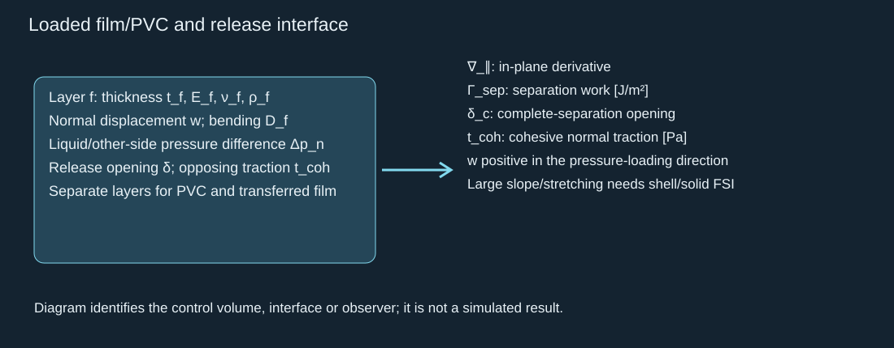

Do not assume pressure above an adhesion value guarantees release. Duration, contact area, bending/inertia, mode mix and separation work also matter. Cohesion or wetting laws need independent calibration/reference cases. If intact PVC lies between liquid and transferable material, fluid impact is applied to PVC; the film receives transmitted traction through the specified contact/interface. Couple motion when it changes cavity volume, thermal contact or vents. Fluid/solid traction and velocity compatibility, with a conservative energy transfer, provide the FSI check.

## 7. One source to finite arrays and a uniform-fluid limit

Start with 3–5 separated spheres and the verified finite-phase single-bubble closure. A leading incompressible, large-separation interaction control is:

$$
\rho\left(R_i\ddot R_i+\frac32\dot R_i^2\right)=p_{b,i}-p_\infty-\frac{2\sigma}{R_i}-\frac{4\mu\dot R_i}{R_i}-\rho\sum_{j\ne i}\frac{R_j^2\ddot R_j+2R_j\dot R_j^2}{d_{ij}}
$$

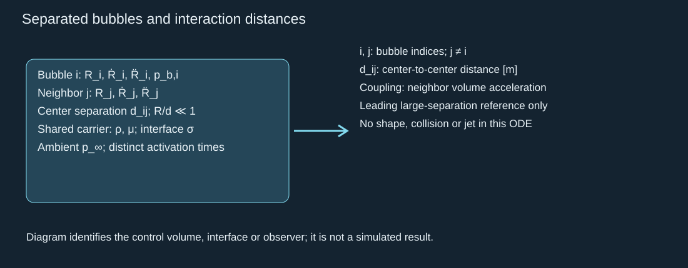

The coupling is the leading neighbor pressure from spherical volume acceleration; it neglects higher-order convective/shape interactions and finite wave transit. Use it only where the assumed separation and transit limits hold. Treat close bubbles, coalescence, asymmetry and boundaries in the spatial model. At a remote weak-acoustic observer the separated monopole control instead includes propagation:

$$
p'(\boldsymbol x,t)\simeq\sum_i\frac{\rho}{4\pi r_i}\ddot V_i(t-r_i/c),\qquad r_i=|\boldsymbol x-\boldsymbol x_i|
$$

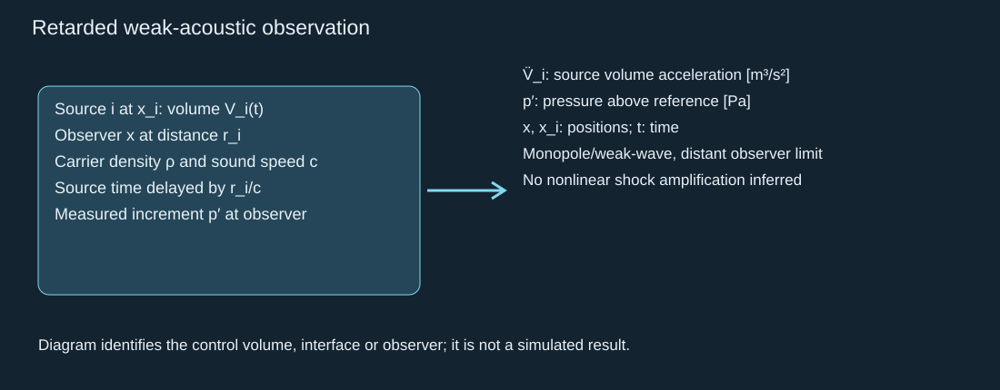

Fix total absorbed/available energy while changing count, spacing and delays; do not multiply identical single-source energy by bubble count and call the resulting gain an array benefit. State coherence separately from synchronization. Preserve shielding, absorption redistribution, thermal competition, finite PFC inventory and source-history modification. Independently addressed stamp sites can exhibit substrate cross-talk without being an interacting liquid bubble array.

For the continuum check, define number density and void fraction, then compare its finite-domain observer response against a resolved/discrete population:

$$
\phi(\boldsymbol x,t)=n_b(\boldsymbol x,t)\langle V_b\rangle,\qquad d\ll\ell_{\mathrm{avg}}\ll L_{\mathrm{macro}}
$$

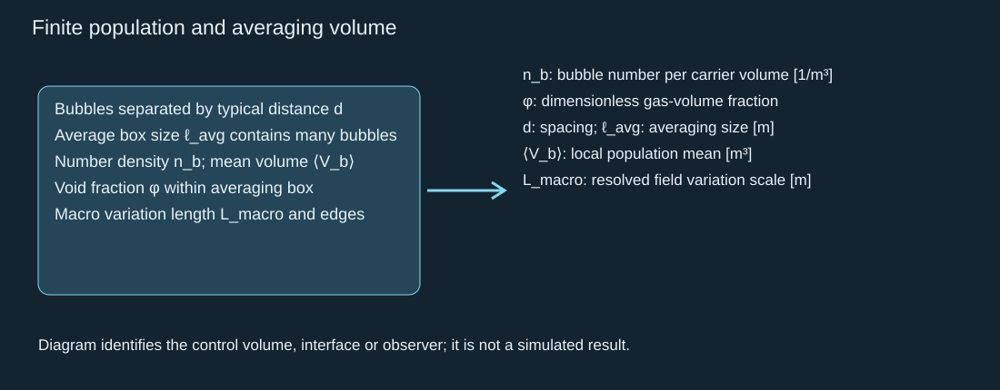

A feasible averaging scale and edge treatment are required, not guaranteed. Couple mixture mass/momentum/energy to finite species and radius/temperature distributions; include activation and coalescence consistently with number, mass and volume. A linear effective-medium closure is a weak-amplitude control. Strong collapse in a supposedly uniform PFC fluid is not solved by replacing nonlinear sources with one fitted resonance frequency. Verify vanishing-density, isolation, conservation and discrete–continuum limits before using homogenization.

## 8. Output definitions, energy bounds and honest maxima

Track a defined jet region and nonzero mass. The kinetic-energy bound concerns mass-weighted RMS speed, not a tip containing arbitrarily little mass:

$$
\begin{aligned}m_j&=\int_{\Omega_j}\rho\,\mathrm dV,\qquad U_{\mathrm{rms}}^2=\frac1{m_j}\int_{\Omega_j}\rho|\boldsymbol u|^2\,\mathrm dV,\\ E_j&=\tfrac12m_jU_{\mathrm{rms}}^2\leq E_{\mathrm{available}},\qquad U_{\mathrm{rms}}\leq\sqrt{2E_{\mathrm{available}}/m_j}.\end{aligned}
$$

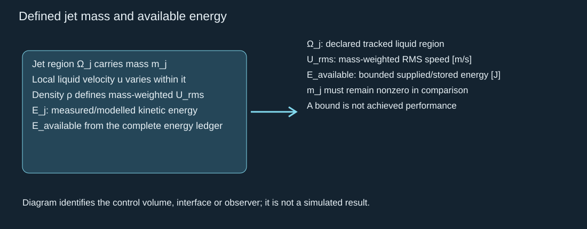

Define available energy from changes in the complete system energy and net source/boundary fluxes relative to a fixed physical baseline, with an admissible residual state. Arbitrary absolute internal-energy reference constants cannot increase the bound; species inventory and exported enthalpy must use consistent reference zeros so those constants cancel. Stored thermal energy is not all convertible work: bound convertibility/free-energy change under the declared ambient reservoir and thermodynamic constraints.

The ledger includes declared initial thermal/elastic changes and boundary work as well as laser input, subtracts outgoing heat/work/energy, and avoids counting phase enthalpy twice. A preparation-heat subtraction alone does not allocate jet energy. Specify what constitutes the jet and whether additional energy arrives during tracking. Radius speed, re-entrant jet speed, exterior tip speed and RMS speed are separate observables.

Use a pressure observer with a stated physical area and temporal response, and integrate actual receiver traction separately:

$$
\begin{aligned}p_{\mathrm{obs}}(t)&=\frac1{A_o}\int_{A_o}\int g(t-s)[p(\boldsymbol x,s)-p_{\mathrm{ref}}]\,\mathrm ds\,\mathrm dA,\quad \int g(s)\,\mathrm ds=1,\\ \boldsymbol F_f(t)&=\int_{A_f}\boldsymbol{\mathsf T}_l\boldsymbol n_f\,\mathrm dA,\\ \boldsymbol{\mathcal I}_f&=\int_{t_0}^{t_1}[\boldsymbol F_f(t)-\boldsymbol F_{\mathrm{ref}}]\,\mathrm dt.\end{aligned}
$$

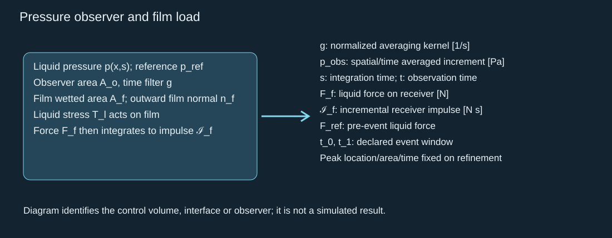

Here g defines a nonnegative unit-gain averaging metric with units 1/s. Choose a causal kernel with declared finite support: g is zero outside lag 0 to τ_g, where τ_g is the fixed averaging duration; specify its shape as well as its integral. An actual instrument transfer function is calibrated and forward-modeled separately. Keep observer area/location, kernel and physical response interval fixed while refining or comparing cases. State the pre-event pressure/force baselines and event start/end times; document whether rebound, later heating or later shots enter the window. The liquid-face force is not the total film net force until opposite-side loads, supports and interfacial forces are included.

Dynamic pressure, linear water-hammer increment, collapse shock pressure and transmitted film traction answer different questions. Receiver impedance/motion, incidence and pulse duration matter; sound speed is a compressibility scale, not a universal velocity cap. Repeatable intact transfer adds declared criteria for intactness, placement, satellites, thermal damage, reset and variability. Without these definitions and a bounded energy/material/geometry/count/delay set, “highest achievable” has no unique answer.

## 9. Required verification and comparison deliverables

1. Solve optical/source integrals, analytic conduction limits and total thermal balances before fitting phase or jet efficiencies.
2. Verify phase inventory, reverse exchange, exhaustion and EOS range, then radial signs and the finite-radius Rayleigh integral.
3. Verify spatial mass, momentum, energy, surface energy and static Laplace limits; test reflection/domain/interface-width effects.
4. Verify gel work, film reaction/traction and FSI transfer; test actual solvent paths and separation criteria.
5. Refine time, space, interface regularization and pressure observer consistently. State unresolved singular/shock/continuum limits.
6. Compare all architectures and both layer paths with water/PFC-free controls; preserve multiple benefits and penalties.
7. Compare one bubble, 3–5 bubbles and arrays at fixed total input and the same physical receiver/velocity definition.
8. Deliver solved native COMSOL files, reproducible construction, numerical tables, source/property cards and independent checks. This document is not a substitute for those models.
9. After verification teach the completed models using teach-mattcc; use bilingual variable-labeled chapters, formula-first answers and an independent learner rebuild. Prepared content is not mastery.

## 10. A compound-specific reference without assigning the target

The target PFC is not identified by the inspected water-system manuscript or a verified material card. PFH is a named reference compound, not the project identity. NIST reports distinct property datasets and valid temperature intervals. In a selected Antoine reference, pressure units must be retained:

$$
\log_{10}\!\left[p_{\mathrm{sat}}/(1\ {\rm bar})\right]=A-\frac{B}{T+C}
$$

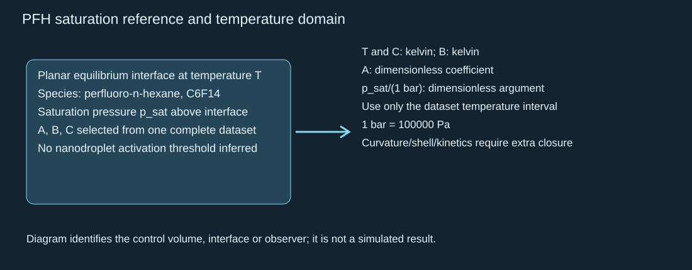

See the [parameter and evidence ledger](laser-pfc-parameter-ledger.json) for the source-specific coefficients, phase enthalpy/heat-capacity conversions, declared synthetic inputs and unknown target fields. Literature dataset spread is not a target confidence interval. Low-temperature heat capacity cannot silently be treated as a high-temperature constant; saturation fits do not replace a compressible EOS.

## 11. Relevant dimensionless diagnostics

Use the same material, geometry and event definitions in each group; they diagnose which terms to retain, not an activation or successful-transfer threshold:

$$
\begin{aligned}\mathrm{Pe}&=UL_h/\alpha,\quad \mathrm{Ste}=c_p\Delta T/L_v,\quad \mathrm{We}_j=\rho U_j^2d_j/\sigma,\\ \mathrm{Oh}_j&=\mu/\sqrt{\rho\sigma d_j},\quad M_w=|\dot R|/c,\quad M_j=U_j/c,\\ \gamma&=h/R_{\max},\quad \chi_G=G/\Delta p,\quad \mathrm{De}=\tau_{\mathrm{relax}}/t_{\mathrm{event}}.\end{aligned}
$$

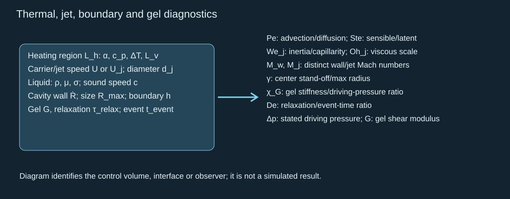

Choose the thermal region and phase heat capacity/latent enthalpy consistently. A small jet Mach number does not prove a collapse shock is weak. Low Ohnesorge number or large Weber number does not establish intact transfer. Gel relaxation is compared with the single laser/bubble event, without introducing an unnecessary harmonic forcing protocol. Stand-off alone omits curvature, confinement and layer motion.

## 12. Dependency and derivation chain

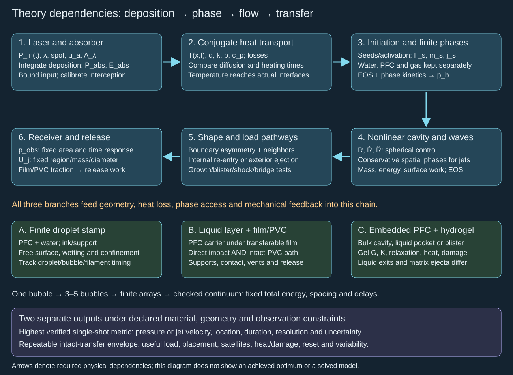

1. Integrating volumetric absorption over the actual absorber gives deposited power; integrating in time gives energy. Conjugate heat transport maps that deposition to interface temperature and conductive flux. This is why optical output alone cannot initialize bubble mechanical energy.
2. Integrating bulk mass conservation over a moving vapor control volume gives its net interface mass influx. The enthalpy difference across that interface produces the Stefan limit when interface storage, mechanical and kinetic corrections are negligible. The open-system first law gives heat input, volume work and carried mass enthalpy separately.
3. A thermal/species EOS gives internal pressure. In the spherical incompressible limit, continuity gives inverse-square radial flow; integrating liquid momentum to the outer reference pressure and applying capillary/viscous boundary stress gives Rayleigh–Plesset. Non-spherical spatial momentum is needed to determine a jet.
4. Integrating total fluid/solid energy and boundary work bounds energy allocated to a specified jet mass. Dividing its kinetic-energy definition by that mass gives the RMS-speed ceiling; it supplies no guaranteed tip speed, launch or transfer.
5. Neighbor spherical volume acceleration supplies the leading interaction pressure. Retarded weak monopoles give a distant acoustic control; neither replaces close-bubble topology or nonlinear shocks. Population averaging additionally requires scale separation and discrete–continuum checks.
6. Integrating boundary traction gives receiver force and then impulse. Film/gel deformation changes cavity volume and transmitted traction, so release needs the structural/contact energy relation as well as liquid pressure.

These derivations explain where each closure enters and which observable is lost when it is omitted. The labeled laws above and the finite-radius Rayleigh/energy checks support independent implementation.

The detailed build/test assignments are in the local English Modeler handoff; retained hypotheses and experiments are in [the exploration map](laser-pfc-exploration.html). The public teaching chapter is a conceptual and calculation bridge, not an assertion of a calibrated PFC maximum.
