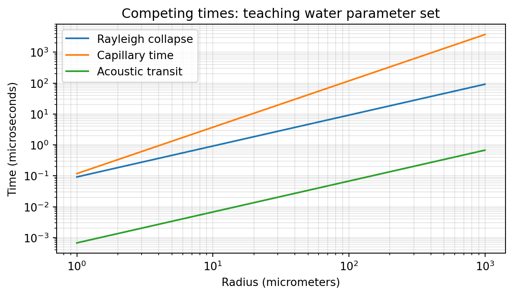
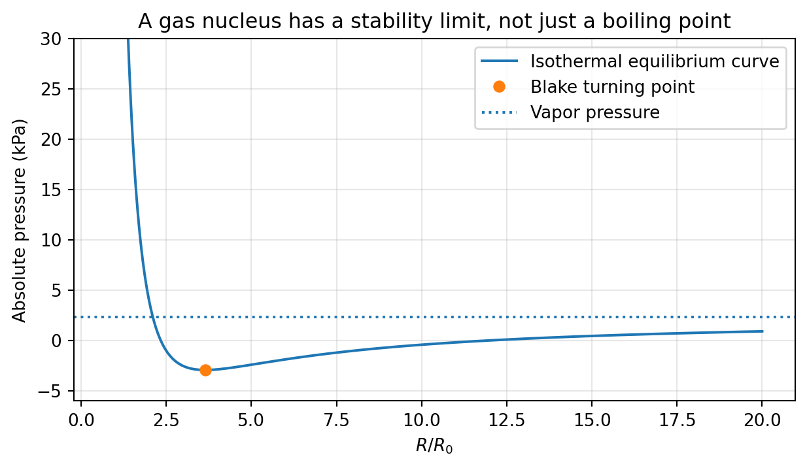
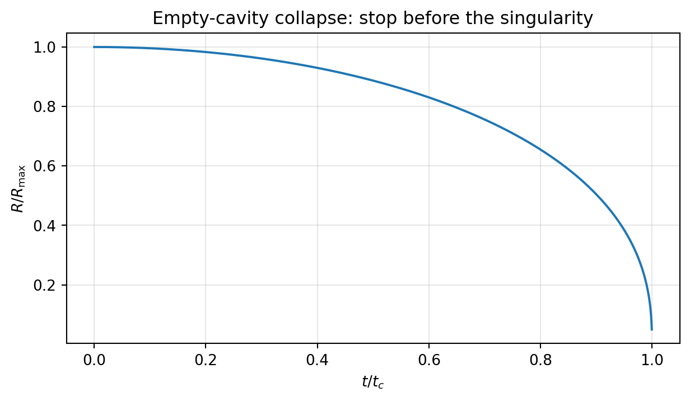
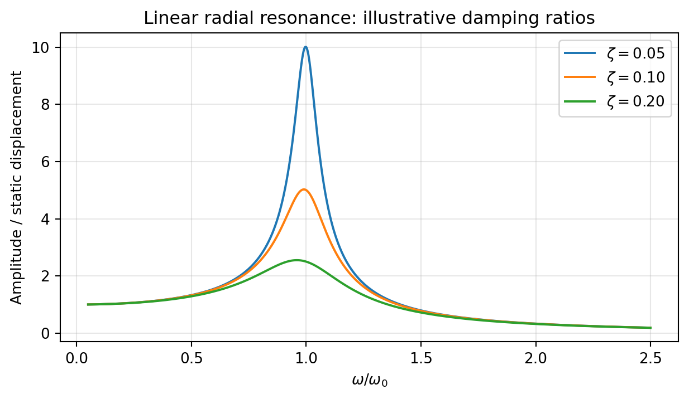
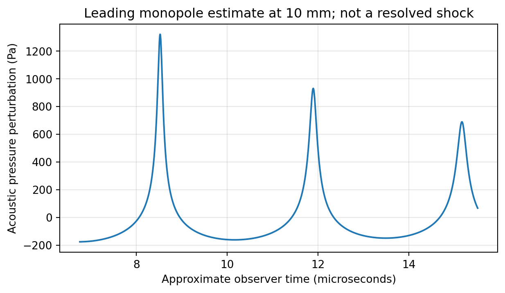
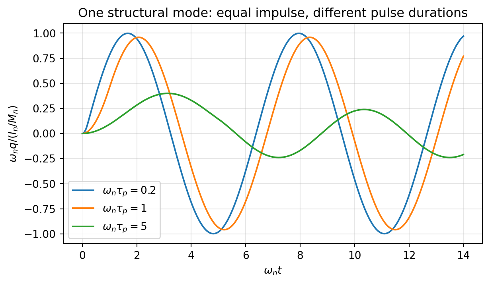

# Preface / 前言 {.unnumbered}

**Bubble Cavitation Dynamics: From Fluid Mechanics to Laser-Driven Transfer** is an original teaching text for Pengfei, an engineering-mechanics student who already understands continuum mechanics, fluid dynamics, differential equations, and elementary vibration theory. You do not need a previous course in bubble dynamics. You do need to be willing to distinguish a governing equation from the assumptions that make it solvable.

**《气泡空化动力学：从流体力学到激光驱动转印》**是一部为鹏飞编写的原创学习教材。读者已掌握连续介质力学、流体力学、微分方程和基础振动理论，但不需要事先学习过气泡动力学。学习本书的关键，是始终区分支配方程本身与使其能够求解的模型假设。

The organizing question is: **How does a localized pressure or energy disturbance become bubble motion, liquid motion, and finally useful—or destructive—mechanical loading?** A bubble is a moving interface coupled to liquid inertia, interfacial stress, gas thermodynamics, phase change, and sometimes a deformable solid. Learning only a radius equation would leave most of that question unanswered.

本书围绕一个问题展开：**局部压力或能量扰动，如何转变为气泡运动、液体运动，并最终形成有用或有害的机械载荷？**气泡是一个运动界面，它与液体惯性、界面应力、气体热力学、相变，有时还与可变形固体相耦合。仅仅学会一个半径方程，不足以完整回答这个问题。

## What your materials contribute / 资料如何进入本书

The supplied archive contains 35 papers, spanning 1949–2026 and 506 PDF pages, including cover sheets and accepted-manuscript pages. Their contributions fall into four overlapping groups: spherical-bubble mechanics; nucleation and laser energy conversion; jets and droplet vaporization; and compliant boundaries, printing, and detachment. The core mechanisms, selected equations, and relevant results were inspected directly. Other papers were inspected at abstract or overview level and are used as directed reading, not as evidence for unexamined quantitative claims. Appendix B records the role and reading depth of every paper.

你提供的压缩包包含35篇论文，年代跨越1949—2026年，共506个PDF页面，包括封面和接收稿页面。其内容可分为四个相互交叉的主题：球形气泡力学；成核与激光能量转换；射流与液滴汽化；以及柔性边界、打印和脱离。书中核心机制、部分关键方程和相关结果均经过直接检查；其余论文主要检查摘要或概述，用作延伸阅读，而不被用来支持未经核查的定量结论。附录B说明每篇论文的用途和阅读深度。

Citations such as **[[S390](#src-s390)]** identify a paper by its folder number in your export, not by an invented bibliography order. **[B1]** is the independently verified companion textbook. Equations derived here and numerical examples created here are original teaching material; they are not digitized experimental data or claimed reproductions of a paper. The archive's original PDFs are not redistributed in this package.

例如，**[[S390](#src-s390)]**表示你导出资料中编号为390的文件夹所对应的论文，而不是任意重新编排的文献序号。**[B1]**表示独立核实的配套教材。本书的推导和数值示例属于原创教学内容，并非从实验图中提取的数据，也不宣称复现了某篇论文。交付包不重新分发原始论文PDF。

## How to study / 如何学习

On a first pass, read Chapters 1–7 in order, derive the Rayleigh–Plesset equation without looking at the answer, and run the numerical laboratory in Chapter 13. On a second pass, study Chapters 8–12 and connect each additional physical effect to an observable that the spherical model cannot predict. Chapter 15 then develops a staged research model for a liquid–PVC–film system. Chapter 16 supplies worked problems rather than merely a list of questions.

第一遍学习时，请按顺序阅读第1—7章，尝试不看答案独立推导Rayleigh–Plesset方程，并运行第13章的数值实验。第二遍学习时，阅读第8—12章，把每一个新增物理效应与球形模型无法预测的可观测量联系起来。第15章进一步建立液体—PVC—薄膜体系的分阶段研究模型。第16章提供详细习题解答，而不只是题目清单。

Keep three notebooks: a derivation notebook, a parameter-and-units ledger, and a model-discrepancy log. In the last one, write down what each model deliberately leaves out. A useful model is not the one containing the most physics; it is the simplest model whose missing physics does not invalidate the quantity you intend to predict.

建议准备三份学习记录：推导笔记、参数与单位台账、模型偏差记录。在最后一份记录中，明确写出每个模型有意忽略的物理过程。有用的模型不一定包含最多的物理内容，而应当是在不使目标预测量失效的前提下，尽可能简单的模型。

## Scope and limitations / 范围与边界

This is a foundation-to-research textbook centered on single bubbles and bubble-driven transfer. Bubble clouds, sonochemistry, sonoluminescence, turbulent cavitating machinery, and fully developed multiphase acoustics are introduced only where needed. The numerical code solves spherical radial mechanics with specified closures. It does not simulate nucleation, resolve shocks, predict biological effects, or calculate film fracture. Laser and pressure experiments require suitable local safety controls; the calculations here do not establish safe operating conditions.

本书以单气泡和气泡驱动转印为中心，连接基础理论与科研建模。气泡云、声化学、声致发光、湍流空化机械和完整多相声学，仅在必要时作简要说明。配套代码求解采用指定闭合关系的球形径向动力学，不模拟成核、不解析激波、不预测生物效应，也不计算薄膜断裂。激光与压力实验必须遵守所在实验室的安全管理要求；本书计算不能用来确定安全操作条件。

# 1. A bubble as a mechanical system / 气泡作为力学系统

## 1.1 The object you are modeling / 你究竟在研究什么

Imagine a spherical cavity of radius $R(t)$ in an otherwise unbounded liquid. Its interior may contain noncondensable gas, vapor of the surrounding liquid, or both. The surrounding liquid carries most of the kinetic energy in many radial-motion problems. Consequently, the bubble is not best imagined as a little solid particle with a fixed mass. It is a deformable interface that continuously recruits liquid into motion. [[S419](#src-s419), [S413](#src-s413)]

设想一个半径为$R(t)$的球形空腔，位于其他方面无限延伸的液体中。内部可以包含不凝性气体、周围液体的蒸气，或者二者的混合物。在许多径向运动问题中，大部分动能储存在周围液体中。因此，不应将气泡简单理解为具有固定质量的小固体颗粒；它是一个不断带动液体运动的可变形界面。[[S419](#src-s419), [S413](#src-s413)]

We use $p_B$ for total pressure immediately inside the bubble and $p_L$ for liquid pressure immediately outside its interface. The remote liquid pressure is $p_\infty(t)$. Unless explicitly called a pressure difference, all pressures are **absolute**. A negative acoustic pressure usually means a negative deviation from a positive ambient pressure; it does not automatically mean negative absolute pressure.

用$p_B$表示气泡界面内侧的总压力，$p_L$表示界面外侧紧邻液体的压力，$p_\infty(t)$表示远场液体压力。除非明确说明是压差，本书压力均为**绝对压力**。负声压通常是相对于正环境压力的负偏差，并不自动意味着绝对压力为负。

For a static clean spherical interface with constant surface tension $\sigma$, the Young–Laplace balance is

对于表面张力$\sigma$恒定、洁净且静止的球形界面，Young–Laplace平衡关系为

$$p_B-p_\infty=\frac{2\sigma}{R}. \tag{1.1}$$

This immediately explains why a microscopic gas bubble can have a substantially higher internal pressure than the surrounding water. The factor two comes from the two equal principal curvatures of a sphere. It is not the factor four for a soap bubble with two liquid–gas surfaces.

这个关系直接解释了为什么微小气泡的内部压力可以明显高于周围水的压力。系数2来自球面的两个相等主曲率，而不是肥皂泡中由两个液—气表面产生的系数4。

## 1.2 Cavitation, boiling, and vaporization are not synonyms / 空化、沸腾和汽化并非同义词

**Vaporization** is a liquid-to-vapor phase change. **Boiling** usually emphasizes vapor production in a liquid made sufficiently hot relative to local pressure. **Cavitation** usually emphasizes cavity formation and evolution associated with a pressure reduction. Laser-induced optical breakdown can create a hot, pressurized cavity before its subsequent expansion and collapse are described by cavitation dynamics. These categories overlap physically, but the route by which the cavity is created determines the correct source model. [[S390](#src-s390), [S408](#src-s408), [S409](#src-s409), [S415](#src-s415)]

**汽化**是液体向蒸气的相变。**沸腾**通常强调液体温度相对于局部压力足够高而产生蒸气。**空化**通常强调与压力降低有关的空腔形成和演化。激光光学击穿可先形成高温、高压空腔，随后其膨胀和塌缩才由空化动力学描述。这些概念在物理上存在交叉，但空腔的形成途径决定了应采用何种源项模型。[[S390](#src-s390), [S408](#src-s408), [S409](#src-s409), [S415](#src-s415)]

A phase-change nanodroplet may vaporize into a bubble without immediately undergoing violent inertial collapse. A thermally formed bulge may detach a solid platelet without producing an ejected liquid microjet. Conversely, a stress wave may delaminate a film without a nearby bubble being the loading agent. Your sources contain examples of all three distinctions. [[S387](#src-s387), [S72](#src-s72), [S340](#src-s340)]

相变纳米液滴可以汽化为气泡，却不立即发生剧烈惯性塌缩。热致鼓包可以使固体薄片脱离，而不产生向外喷出的液体微射流。反过来，应力波也可能使薄膜分层，而不需要附近气泡作为加载主体。你提供的资料中，这三种区别都有对应实例。[[S387](#src-s387), [S72](#src-s72), [S340](#src-s340)]

## 1.3 Four balances and one moving boundary / 四类平衡与一个运动界面

A complete calculation may require liquid momentum and mass conservation, interfacial traction balance, heat and species transport, and solid mechanics. These are coupled through the interface position. The moving boundary is part of the unknown, so specifying a pressure history alone is not generally enough to specify the whole problem.

完整计算可能需要液体动量与质量守恒、界面牵引平衡、热量与组分输运，以及固体力学。这些过程通过界面位置相互耦合。运动边界本身也是未知量，因此，单独指定压力历程通常不足以定义整个问题。

Before deriving equations, state the intended output. For $R(t)$ far from boundaries, a radial ordinary differential equation may suffice. For jet direction, interface shape must be resolved. For peak collapse pressure, compressibility and measurement bandwidth become central. For film release, interfacial fracture and structural inertia cannot be inferred from radius alone. [[S339](#src-s339), [S362](#src-s362), [S409](#src-s409), [S418](#src-s418)]

推导方程前，先明确所需输出。若研究远离边界的$R(t)$，径向常微分方程可能已经足够。若研究射流方向，必须解析界面形状。若研究塌缩峰值压力，可压缩性和测量带宽就成为关键。若研究薄膜释放，则不能仅凭气泡半径推断界面断裂与结构惯性。[[S339](#src-s339), [S362](#src-s362), [S409](#src-s409), [S418](#src-s418)]

## 1.4 The first scale analysis / 第一次尺度分析

Choose a characteristic radius $R_*$ and a positive inertial pressure difference $\Delta p$. Then define an inertial velocity and time. Compare these with acoustic propagation, capillary restoration, viscous diffusion, and thermal diffusion:

选取特征半径$R_*$和正的惯性驱动压差$\Delta p$，由此定义惯性速度和时间，再与声传播、毛细回复、黏性扩散和热扩散进行比较：

$$U_* = \sqrt{\frac{\Delta p}{\rho}},\qquad
 t_I=\frac{R_*}{U_*},\qquad t_a=\frac{R_*}{c},\qquad
 t_\sigma=\sqrt{\frac{\rho R_*^3}{\sigma}}, \tag{1.2}$$

$$t_\nu=\frac{R_*^2}{\nu},\qquad
 t_\alpha=\frac{R_*^2}{\alpha},\qquad \nu=\frac{\mu}{\rho}. \tag{1.3}$$

These are comparison scales, not five independent predictions of the bubble lifetime. In particular, $t_\alpha$ based on the entire bubble radius may not represent heat transfer across a much thinner thermal boundary layer. Likewise, a long total lifetime does not prevent the last part of collapse from becoming acoustically fast.

这些是用于比较的尺度，而不是气泡寿命的五个独立预测。尤其是，以整个气泡半径计算的$t_\alpha$，不一定代表更薄热边界层中的传热时间。同样，即使总寿命很长，塌缩末期仍可能进入与声传播相当的快速过程。

{width=88%}

**Checkpoint.** Explain why a model can predict maximum radius accurately yet predict collapse pressure poorly. The answer should mention the different timescales and physical effects sampled by these two observables.

**自检。**为什么模型可能准确预测最大半径，却严重误判塌缩压力？回答应涉及这两个可观测量所对应的不同时间尺度和物理效应。

# 2. Nucleation and static stability / 成核与静态稳定性

## 2.1 Why a favorable pressure does not guarantee a bubble / 为什么有利压差并不保证成泡

The statement $p_\infty<p_v(T)$ suggests that vapor is thermodynamically favored, but creating a new interface costs energy. For a spherical vapor embryo of radius $r$ in a simplified isothermal liquid, let $\Delta p=p_v-p_\infty>0$. Treating $\sigma$ as constant and neglecting compressibility, the classical work of formation is

条件$p_\infty<p_v(T)$说明蒸气在热力学上可能更有利，但产生新界面需要消耗能量。考虑简化等温液体中半径为$r$的球形蒸气胚核，令$\Delta p=p_v-p_\infty>0$。假定$\sigma$恒定并忽略可压缩性，经典形成功为

$$\Delta G(r)=4\pi\sigma r^2-\frac{4\pi}{3}\Delta p\,r^3. \tag{2.1}$$

Differentiation gives an unstable critical embryo and an energy barrier:

求导可得不稳定临界胚核及其能垒：

$$r_* = \frac{2\sigma}{\Delta p},\qquad
\Delta G_* = \frac{16\pi\sigma^3}{3\Delta p^2}. \tag{2.2}$$

An embryo smaller than $r_*$ tends to shrink in this model; one larger than $r_*$ can grow. This argument is an energy landscape, not a complete microscopic nucleation calculation. Molecular-scale curvature, nonuniform temperature, impurities, and very rapid pressure changes can invalidate its quantitative assumptions. The distinction between homogeneous and heterogeneous inception is particularly important when comparing focused-ultrasound nucleation with droplet activation. [[S390](#src-s390), [S405](#src-s405)]

在该模型中，小于$r_*$的胚核倾向于缩小，大于$r_*$的胚核则可能增长。这个论证描述的是能量图景，而不是完整的微观成核计算。分子尺度曲率、非均匀温度、杂质以及极快速压力变化，都可能破坏其定量假设。比较聚焦超声成核与液滴激活时，尤其要区分均相成核和非均相成核。[[S390](#src-s390), [S405](#src-s405)]

A rate model introduces a nucleation rate density $J$, with units $\mathrm{m^{-3}s^{-1}}$. Under an independent-event Poisson approximation, the probability of at least one event in an observation volume is

速率模型引入成核率密度$J$，单位为$\mathrm{m^{-3}s^{-1}}$。在独立事件的泊松近似下，观测体积内至少发生一次事件的概率为

$$J\sim J_0\exp\!\left[-\frac{\Delta G_*}{k_BT}\right],\qquad
P=1-\exp\!\left[-\int\!\!\int_{V_{\mathrm{obs}}}J(\mathbf x,t)\,dV\,dt\right]. \tag{2.3}$$

Thus a reported “threshold” depends on observation volume, exposure duration, event probability, and detection criterion. A 50% activation pressure is not an intrinsic material constant in the same sense as density. Near-threshold laser studies and statistical droplet experiments illustrate why the threshold definition must accompany the number. [[S408](#src-s408), [S405](#src-s405)]

因此，文献中的“阈值”取决于观测体积、暴露时间、事件概率和检测判据。50%激活压力并不像密度那样是一个简单的材料固有常数。近阈值激光研究与液滴统计实验表明，给出阈值数值时，必须同时给出其定义。[[S408](#src-s408), [S405](#src-s405)]

## 2.2 Pre-existing nuclei change the problem / 预存气核改变问题性质

A trapped gas pocket or pre-existing microbubble already has an interface. Its expansion may be controlled by mechanical stability rather than by paying the full homogeneous-nucleation barrier. Surface roughness, wetting, dissolved gas, and contamination therefore alter observed inception. Do not identify a single low-pressure image with proof of homogeneous nucleation; such a claim requires a controlled mechanism argument. [[S390](#src-s390), [S419](#src-s419)]

被困气穴或预存微气泡已经具有界面，其膨胀可能主要受机械稳定性控制，而不必重新跨越完整的均相成核能垒。因此，表面粗糙度、润湿性、溶解气体和污染都会改变观测到的初生条件。不能仅凭一张低压条件下的图像，就认定发生了均相成核；这一判断需要受控的机制证据。[[S390](#src-s390), [S419](#src-s419)]

Consider a gas nucleus with a polytropic closure $p_g R^{3\kappa}=C$, where $C>0$, and an approximately constant vapor pressure $p_v$. Static equilibrium requires

考虑满足多方关系$p_gR^{3\kappa}=C$的气核，其中$C>0$，并假设蒸气压$p_v$近似恒定。静态平衡要求

$$p_{\mathrm{eq}}(R)=p_v+\frac{C}{R^{3\kappa}}-\frac{2\sigma}{R}=p_\infty. \tag{2.4}$$

At an equilibrium, a small increase in radius is restoring when $dp_{\mathrm{eq}}/dR<0$: the internal-minus-external driving pressure becomes negative. If the slope becomes positive, a small expansion produces further outward drive. The turning point therefore identifies a quasi-static loss of stability, often called the Blake threshold within this nucleus model.

在平衡点附近，若$dp_{\mathrm{eq}}/dR<0$，半径微增会使内外驱动压差变为负值，因而具有回复作用。若斜率为正，微小膨胀会产生进一步向外的驱动。因此，曲线转折点对应准静态稳定性的丧失，在该气核模型中通常称为Blake阈值。

For $3\kappa>1$, differentiation yields

对$3\kappa>1$的情况，求导得

$$R_B=\left(\frac{3\kappa C}{2\sigma}\right)^{1/(3\kappa-1)},\qquad
p_B^{\mathrm{crit}}=p_v-\frac{2\sigma}{R_B}\left(1-\frac{1}{3\kappa}\right). \tag{2.5}$$

Here $p_B^{\mathrm{crit}}$ denotes a critical **ambient pressure**, not the bubble-interior pressure $p_B$ used elsewhere; the superscript is essential. For isothermal gas, $\kappa=1$ and $C=p_{g0}R_0^3$, so $R_B=\sqrt{3p_{g0}R_0^3/(2\sigma)}$ and $p_B^{\mathrm{crit}}=p_v-4\sigma/(3R_B)$. We will call this pressure $p_{\mathrm{Blake}}$ below to avoid notation confusion.

这里$p_B^{\mathrm{crit}}$表示临界**环境压力**，不是其他章节中的泡内压力$p_B$，因此上标不可省略。对于等温气体，$\kappa=1$、$C=p_{g0}R_0^3$，于是$R_B=\sqrt{3p_{g0}R_0^3/(2\sigma)}$，且$p_B^{\mathrm{crit}}=p_v-4\sigma/(3R_B)$。下文将其记作$p_{\mathrm{Blake}}$，避免符号混淆。

{width=88%}

## 2.3 Static instability is not dynamic activation / 静态失稳不等于动态激活

A finite-duration tension pulse can end before a nucleus grows appreciably, even if its minimum pressure crosses a static threshold. Conversely, resonant oscillations can accumulate a large radial response under repeated forcing. A dynamic threshold therefore requires a pressure waveform, an initial nucleus state, and a criterion such as a prescribed expansion ratio. The Rayleigh–Plesset equation evolves an existing nucleus; it does not itself specify when a nucleus first appears.

即使有限时长负压脉冲的最低压力越过静态阈值，脉冲也可能在气核充分长大前结束。反过来，在重复激励下，共振振动可以形成很大的径向响应。因此，动态阈值需要同时指定压力波形、初始气核状态，以及例如某个膨胀比之类的判据。Rayleigh–Plesset方程描述已有气核的演化，本身并不决定气核何时首次出现。

**Worked interpretation.** Suppose two formulations activate at different measured pressures. It is not yet valid to conclude that their liquid cores have different vapor pressures. Differences in droplet size, shell mechanics, embedded absorbers, internal nucleation sites, and event-counting methods may explain the observation. Compare one factor at a time and distinguish vaporization detection from inertial-cavitation detection. [[S349](#src-s349), [S387](#src-s387), [S405](#src-s405)]

**解释示例。**假设两种配方在不同测得压力下激活，还不能据此断言其液核具有不同蒸气压。液滴尺寸、壳层力学、吸收颗粒、内部成核位点和事件统计方法的差异，都可能解释这一现象。应尽量逐一控制变量，并区分汽化检测与惯性空化检测。[[S349](#src-s349), [S387](#src-s387), [S405](#src-s405)]

# 3. Deriving the Rayleigh–Plesset equation / 推导Rayleigh–Plesset方程

## 3.1 Assumptions before algebra / 先写假设，再做代数

Assume an isolated spherical bubble in an infinite, incompressible Newtonian liquid of constant density $\rho$ and viscosity $\mu$. The liquid is spherically symmetric and at rest infinitely far away. Ignore gravity, translation, neighboring bubbles, and interfacial mass flux in the kinematic condition. Let the gas pressure be spatially uniform and surface tension constant. These assumptions—not the name of the equation—define the baseline model. The classical spherical-cavity framework is represented in your archive by Plesset's paper; later closures and extensions add gas, viscosity, and compressibility as needed. [[S419](#src-s419), [S413](#src-s413)]

假设一个孤立球形气泡位于密度$\rho$、黏度$\mu$恒定的无限大不可压缩牛顿液体中。液体运动具有球对称性，无穷远处静止。忽略重力、平移、邻近气泡，并在运动学条件中忽略界面质量通量。泡内压力空间均匀，表面张力恒定。定义基础模型的是这些假设，而不是方程名称。你提供的Plesset论文代表了经典球形空腔理论框架；后续闭合与扩展根据需要加入气体、黏性和可压缩性。[[S419](#src-s419), [S413](#src-s413)]

## 3.2 Continuity determines the velocity field / 连续性决定速度场

For radial liquid velocity $u(r,t)$, incompressibility gives $r^{-2}\partial_r(r^2u)=0$. Therefore $r^2u=A(t)$. With $u(R,t)=\dot R$, we obtain

对于液体径向速度$u(r,t)$，不可压缩条件给出$r^{-2}\partial_r(r^2u)=0$，因此$r^2u=A(t)$。代入$u(R,t)=\dot R$，得到

$$u(r,t)=\frac{R^2\dot R}{r^2},\qquad
\phi(r,t)=-\frac{R^2\dot R}{r},\qquad u=\partial_r\phi. \tag{3.1}$$

Notice that liquid velocity decreases as $r^{-2}$, not as $r^{-1}$. The latter scaling will appear later for a radiated acoustic pressure in the far field. Confusing the incompressible near flow with the acoustic radiation field is a common conceptual error.

注意，液体速度按$r^{-2}$衰减，而不是$r^{-1}$。后者将在远场辐射声压中出现。把不可压缩近场流动与声辐射场混淆，是一个常见概念错误。

## 3.3 Bernoulli produces the inertia terms / Bernoulli方程给出惯性项

The unsteady Bernoulli equation, with the potential chosen to vanish at infinity, is $\partial_t\phi+u^2/2+p/\rho=p_\infty/\rho$. Differentiate $\phi$ at **fixed spatial position $r$**, and only afterwards set $r=R(t)$:

取无穷远处势函数为零，非定常Bernoulli方程为$\partial_t\phi+u^2/2+p/\rho=p_\infty/\rho$。应先在**固定空间位置$r$**处对$\phi$求时间偏导，然后再令$r=R(t)$：

$$\left.\partial_t\phi\right|_{r=R}
=-(2\dot R^2+R\ddot R),\qquad
\frac{p_L-p_\infty}{\rho}=R\ddot R+\frac32\dot R^2. \tag{3.2}$$

Differentiating $\phi(R(t),t)$ as a total derivative at the start would introduce an extra moving-boundary term and give the wrong coefficient. This is the exact point at which many otherwise sound derivations lose the factor $3/2$.

如果一开始就对$\phi(R(t),t)$求全导数，就会额外引入运动边界项，导致系数错误。许多看似合理的推导，正是在这里丢失了正确的$3/2$系数。

## 3.4 Normal stress supplies capillarity and viscosity / 法向应力给出毛细项和黏性项

The liquid normal stress is $T_{rr}=-p+2\mu\partial_r u$. Equation (3.1) gives $\partial_r u|_R=-2\dot R/R$, so $T_{rr,L}=-p_L-4\mu\dot R/R$. Balancing normal traction across the spherical interface, with negligible gas viscosity, gives

液体法向应力为$T_{rr}=-p+2\mu\partial_r u$。由式(3.1)，有$\partial_r u|_R=-2\dot R/R$，因此$T_{rr,L}=-p_L-4\mu\dot R/R$。忽略气体黏性，对球形界面作法向牵引平衡，得到

$$p_L=p_B-\frac{2\sigma}{R}-\frac{4\mu\dot R}{R}. \tag{3.3}$$

Combining (3.2) and (3.3) produces the Rayleigh–Plesset equation in its common incompressible form:

联立式(3.2)和(3.3)，得到常用不可压缩形式的Rayleigh–Plesset方程：

$$\boxed{\rho\left(R\ddot R+\frac32\dot R^2\right)
=p_B(t)-p_\infty(t)-\frac{2\sigma}{R}-\frac{4\mu\dot R}{R}.} \tag{3.4}$$

During expansion, the viscous term opposes outward motion. During collapse, $\dot R<0$, so it contributes outward resistance. The sign is therefore physically consistent in both directions. Surface tension always favors reduced area; it is not a damping term, because it can reversibly store and release energy.

在膨胀阶段，黏性项阻碍向外运动；在塌缩阶段，$\dot R<0$，该项则形成向外的阻力。因此，它在两个方向上的符号都符合物理意义。表面张力始终倾向于减小面积，但它不是阻尼项，因为它可以可逆地储存和释放能量。

## 3.5 Closing the equation / 方程如何闭合

A frequently useful teaching closure separates gas from vapor:

一个常用教学闭合关系，将不凝性气体与蒸气分开处理：

$$p_B=p_g+p_v,\qquad
p_g=p_{g0}\left(\frac{R_0}{R}\right)^{3\kappa},\qquad
p_{g0}=p_0-p_v+\frac{2\sigma}{R_0}. \tag{3.5}$$

Here $R_0$ is an equilibrium reference radius at ambient pressure $p_0$, not necessarily the radius at the chosen simulation start. If the simulation starts at maximum expansion $R_{\max}$, the gas content still has to be specified. Setting $R_0=R_{\max}$ automatically redefines the gas content and can accidentally create a bubble that is in equilibrium when it should collapse.

这里$R_0$是环境压力$p_0$下的平衡参考半径，不一定等于所选仿真起始时刻的半径。若从最大膨胀半径$R_{\max}$开始计算，仍必须另行指定气体含量。直接令$R_0=R_{\max}$会重新定义气体含量，可能误将本应塌缩的气泡设置为平衡态。

The initial-value problem requires $R(t_0)>0$, $\dot R(t_0)$, a forcing history, and closure parameters. A single measured maximum radius does not determine initial gas mass, vapor content, temperature, and source energy independently.

初值问题需要$R(t_0)>0$、$\dot R(t_0)$、外部激励历程和闭合参数。单独测得一个最大半径，不能独立确定初始气体质量、蒸气含量、温度以及源能量。

## 3.6 The same equation from theoretical mechanics / 从理论力学重新得到同一方程

Integrating the liquid kinetic energy gives

对液体动能积分得

$$T=\frac12\rho\int_R^\infty u^2\,4\pi r^2dr
=2\pi\rho R^3\dot R^2
=\frac12 M_R(R)\dot R^2,\qquad M_R=4\pi\rho R^3. \tag{3.6}$$

The radial generalized mass is configuration-dependent. It is not the translational added mass of a sphere. The generalized pressure force is $Q_p=4\pi R^2(p_B-p_\infty)$; the surface energy is $4\pi\sigma R^2$; and the viscous generalized force is $Q_\mu=-16\pi\mu R\dot R$. Substituting into Lagrange's equation recovers (3.4).

径向广义质量随构型变化，它不是球体平移运动的附加质量。广义压力力为$Q_p=4\pi R^2(p_B-p_\infty)$，表面能为$4\pi\sigma R^2$，黏性广义力为$Q_\mu=-16\pi\mu R\dot R$。将它们代入Lagrange方程，即可重新得到式(3.4)。

This derivation reveals the meaning of $3\dot R^2/2$: part of the radial force accelerates newly recruited liquid as the generalized mass changes. It is not an arbitrary nonlinear correction. Multiplying (3.4) by $4\pi R^2\dot R$ yields a useful power balance:

这一推导揭示了$3\dot R^2/2$的意义：随着广义质量变化，一部分径向驱动力用于加速新带动的液体。它并非任意添加的非线性修正。将式(3.4)乘以$4\pi R^2\dot R$，得到实用的功率平衡：

$$\frac{dT}{dt}=(p_B-p_\infty)\frac{dV}{dt}
-\frac{d}{dt}(4\pi\sigma R^2)-16\pi\mu R\dot R^2,
\qquad V=\frac{4\pi R^3}{3}. \tag{3.7}$$

The last term is nonnegative dissipation with a minus sign. This identity is one of the strongest numerical checks available for an incompressible radial solver.

最后一项是带负号的非负耗散量。这个恒等式是检验不可压缩径向求解器的有力工具之一。

# 4. Gas, vapor, heat, and mass / 气体、蒸气、热量与质量

## 4.1 A pressure law is a thermodynamic assumption / 压力定律是一项热力学假设

For fixed-mass ideal gas, an isothermal process gives $p_gV=\mathrm{constant}$, whereas a reversible adiabatic process gives $p_gV^\gamma=\mathrm{constant}$, with $\gamma=c_p/c_v$. A polytropic exponent $\kappa$ interpolates phenomenologically between some behaviors, but it is not automatically a material constant. Thermal gradients, finite-rate exchange, and phase change can make a single exponent inadequate. [[S413](#src-s413), [S409](#src-s409)]

对固定质量理想气体，等温过程满足$p_gV=\mathrm{constant}$，可逆绝热过程则满足$p_gV^\gamma=\mathrm{constant}$，其中$\gamma=c_p/c_v$。多方指数$\kappa$可在某些情况下作为不同过程之间的现象学近似，但它并不自动成为材料常数。温度梯度、有限速率热交换和相变，都可能使单一指数失效。[[S413](#src-s413), [S409](#src-s409)]

Under the ideal-gas, fixed-mass polytropic assumption only, $T_g/T_{g0}=(R_0/R)^{3(\kappa-1)}$. This formula is useful for understanding why compression heats gas. It is not permission to extrapolate to molecular radii and announce a measured collapse temperature. At extreme compression, the thermal model, equation of state, vapor chemistry, and liquid compressibility all deserve scrutiny.

仅在理想气体、固定质量、多方过程假设下，才有$T_g/T_{g0}=(R_0/R)^{3(\kappa-1)}$。这个公式有助于理解压缩为何使气体升温，却不能据此外推到分子尺度半径，并宣称得到了实验塌缩温度。极端压缩时，热模型、状态方程、蒸气化学和液体可压缩性都需要重新检查。

## 4.2 Vapor pressure and vapor mass are different closures / 蒸气压与蒸气质量是不同闭合量

Setting $p_v=p_{\mathrm{sat}}(T_\infty)$ approximates a vapor component that remains near saturation at an effectively fixed interfacial temperature. It does **not** mean the vapor mass is constant. During growth, evaporation may add mass; during collapse, condensation may remove it. Conversely, assigning fixed vapor mass and compressing it as ideal gas is a different model. Never impose both assumptions on the same vapor component without reconciling them. [[S419](#src-s419), [S409](#src-s409)]

令$p_v=p_{\mathrm{sat}}(T_\infty)$，相当于近似认为蒸气组分在有效恒定的界面温度下保持接近饱和状态。这**不意味着**蒸气质量恒定。膨胀时，蒸发可能增加质量；塌缩时，凝结可能移除质量。相反，将蒸气质量固定并按理想气体压缩，是另一个模型。不能不加协调地对同一蒸气组分同时施加这两种假设。[[S419](#src-s419), [S409](#src-s409)]

A lumped gas energy model might start from $d(m_gu_g)/dt=-p_g\,dV/dt+\dot Q$ for a noncondensable fixed mass. An open vapor component adds enthalpy carried by interfacial mass transfer. A detailed model also solves temperature fields and couples saturation pressure to interface temperature. The choice is dictated by the needed observable, not by a preference for a more complicated equation.

对于固定质量不凝性气体，集中参数能量模型可从$d(m_gu_g)/dt=-p_g\,dV/dt+\dot Q$出发。开放的蒸气组分还需加入界面质量输运携带的焓。更详细的模型还要求解温度场，并将饱和蒸气压与界面温度耦合。模型选择应由目标可观测量决定，而不是因为更复杂的方程看起来更高级。

## 4.3 The Stefan condition and interface kinematics / Stefan条件与界面运动学

Let the unit normal point from the bubble into the liquid, and let $j>0$ denote mass flux from liquid to bubble, measured per unit interface area. Mass conservation gives $j=\rho_L(\dot R-u_L)$ and, for a pure vapor interior, $j=\rho_V(\dot R-u_V)$. Thus the familiar kinematic condition $u_L=\dot R$ is an approximation when $j/\rho_L$ is negligible.

令单位法向由气泡指向液体，并令$j>0$表示单位界面面积上从液体进入气泡的质量通量。质量守恒给出$j=\rho_L(\dot R-u_L)$；对于纯蒸气内部，还有$j=\rho_V(\dot R-u_V)$。因此，常用运动学条件$u_L=\dot R$实际上依赖于$j/\rho_L$可以忽略的近似。

Define $q_{L\to i}$ and $q_{V\to i}$ as conductive heat fluxes directed **toward** the interface from the liquid and vapor sides. Neglecting interfacial energy storage and kinetic corrections, the latent-heat balance is

将$q_{L\to i}$和$q_{V\to i}$分别定义为从液体侧和蒸气侧**流向**界面的导热通量。忽略界面储能与动能修正，潜热平衡为

$$jL_v=q_{L\to i}+q_{V\to i}. \tag{4.1}$$

This sign convention makes the physics transparent: positive evaporation requires heat delivered to the interface. If you instead define heat flux along a common outward normal, one of the signs changes. Many apparent disagreements between published Stefan conditions are merely different normal conventions.

这一符号约定使物理意义十分清楚：正的蒸发通量需要热量输入界面。若改为沿同一个外法向定义热流，其中一项的符号会改变。文献中某些看似矛盾的Stefan条件，实际上只是法向约定不同。

## 4.4 Inertia-limited versus heat-limited growth / 惯性控制与热控制的增长

With a sustained positive driving pressure and negligible losses, inertial growth has a characteristic speed of order $\sqrt{\Delta p/\rho}$, so radius can increase approximately linearly over a suitable interval. In a diffusion-controlled thermal regime, the available thermal penetration depth grows like $\sqrt{\alpha t}$; bubble growth can inherit a square-root time dependence under additional assumptions. These are different limits, and a single experiment can move between them. Laser-heated microabsorbers and delayed plasmonic nucleation provide examples where the heating history cannot be discarded. [[S414](#src-s414), [S415](#src-s415)]

在持续正驱动压差且损失可忽略时，惯性增长的特征速度为$\sqrt{\Delta p/\rho}$量级，因此半径在适当时间段内可以近似线性增加。在热扩散控制的情形中，热渗透深度按$\sqrt{\alpha t}$增长；在附加假设下，气泡增长也可能表现为时间的平方根关系。这是两个不同极限，同一实验也可能在二者之间转换。激光加热微吸收体和延迟等离激元成核表明，加热历程不能被随意忽略。[[S414](#src-s414), [S415](#src-s415)]

A Jakob-type number compares sensible heat available in superheated liquid with latent heat demand. Different conventions use different density factors. Always state the definition. For a simple mass-specific comparison, $Ja=c_{p,L}(T_\infty-T_{\mathrm{sat}})/L_v$; other bubble-growth formulations multiply this by $\rho_L/\rho_V$. Numbers quoted under different definitions must not be compared directly.

Jakob类无量纲数比较过热液体可提供的显热与相变所需潜热。不同定义可能包含不同密度因子，使用时必须写出具体定义。例如，简单的单位质量比较为$Ja=c_{p,L}(T_\infty-T_{\mathrm{sat}})/L_v$；其他气泡增长理论还会乘以$\rho_L/\rho_V$。不同定义下的数值不能直接比较。

## 4.5 Dissolved gas and shells / 溶解气体与壳层

A dissolved gas concentration field obeys an advection–diffusion equation in the liquid. At the interface, an equilibrium approximation can use a clearly defined Henry relation, such as $C_s=H_{cp}p_g$ with $H_{cp}$ in concentration-per-pressure units. Other Henry constants are reciprocals or use mole fractions, so importing an unlabeled constant is dangerous. Diffusive gas exchange can control long-lived bubbles even when the first inertial collapse is much faster.

液体中的溶解气体浓度场满足对流—扩散方程。界面平衡近似可以采用明确定义的Henry关系，例如$C_s=H_{cp}p_g$，其中$H_{cp}$的单位为浓度除以压力。其他Henry常数可能是其倒数，或采用摩尔分数定义，因此直接导入未说明定义的常数很危险。即使第一次惯性塌缩极快，扩散气体交换仍可能主导长寿命气泡的后续行为。

For a coated bubble, write a general additional shell traction $\Pi_s(R,\dot R,\text{history})$ in the interfacial balance before choosing a constitutive law. A shell may buckle, rupture, or have surface viscosity. Simply assigning a different constant $\sigma$ cannot represent every shell effect. The formulation dependence in your perfluorocarbon papers is a reason to preserve this distinction. [[S387](#src-s387), [S349](#src-s349)]

对于包覆气泡，应先在界面平衡中加入一般壳层牵引$\Pi_s(R,\dot R,\text{history})$，再选择具体本构关系。壳层可能发生屈曲、破裂或具有表面黏性。单纯更换一个恒定$\sigma$，不能表示所有壳层效应。你提供的全氟碳资料中存在明显配方依赖性，因此更应保留这一物理区别。[[S387](#src-s387), [S349](#src-s349)]


# 5. Inertial collapse, energy focusing, and rebound / 惯性塌缩、能量集中与回弹

## 5.1 The empty-cavity idealization / 空腔理想化

To isolate liquid inertia, consider a spherical cavity that begins at rest at $R=R_{\max}$. Neglect gas pressure, surface tension, viscosity, and compressibility. Let vapor pressure remain constant and let $\Delta p=p_\infty-p_v>0$. The radial equation becomes

为单独研究液体惯性，考虑一个从$R=R_{\max}$处静止开始的球形空腔。忽略气体压力、表面张力、黏性和可压缩性。设蒸气压恒定，且$\Delta p=p_\infty-p_v>0$，则径向方程化为

$$R\ddot R+\frac32\dot R^2=-\frac{\Delta p}{\rho}. \tag{5.1}$$

This is a limit problem, not a literal assertion that a laboratory bubble has no contents. Its value is that it produces an analytic benchmark and exposes the singular nature of idealized collapse. The spherical-collapse framework and its physical limitations are central themes of the classical and compressible-bubble papers in your archive. [[S419](#src-s419), [S409](#src-s409)]

这是一个极限模型，并不是说实验室中的气泡内部真正空无一物。它的价值在于提供解析基准，并揭示理想化塌缩的奇异性。球形塌缩理论及其物理局限，是你所提供经典理论与可压缩气泡论文的重要主题。[[S419](#src-s419), [S409](#src-s409)]

## 5.2 Integrating once / 第一次积分

Write $y(R)=\dot R^2$, so $\ddot R=\tfrac12dy/dR$ along a monotonic branch. Equation (5.1) becomes $R y'+3y=-2\Delta p/\rho$. Multiplication by $R^2$ gives an exact derivative. Applying $y(R_{\max})=0$ yields

在单调运动分支上，令$y(R)=\dot R^2$，则$\ddot R=\tfrac12dy/dR$。式(5.1)变为$Ry'+3y=-2\Delta p/\rho$。两边乘以$R^2$，即可构成全导数。利用$y(R_{\max})=0$，得到

$$\dot R^2=\frac{2\Delta p}{3\rho}
\left[\left(\frac{R_{\max}}{R}\right)^3-1\right]. \tag{5.2}$$

Choose the negative square root during collapse. The speed is not constant; it accelerates strongly as the cavity becomes smaller. The same result follows from equating liquid kinetic energy to the pressure work released by the loss of cavity volume:

塌缩阶段应取负平方根。界面速度不是常数，而是随着空腔变小而迅速增大。同一结果也可以由液体动能等于空腔体积减少所释放的压力功得到：

$$2\pi\rho R^3\dot R^2
=\frac{4\pi}{3}\Delta p\,(R_{\max}^3-R^3). \tag{5.3}$$

The right-hand side remains finite as $R\to0$, but the effective radial mass tends to zero. The model therefore places finite energy into an ever-smaller region with unbounded speed. That is energy focusing within a singular idealization, not a prediction that real water reaches infinite velocity.

当$R\to0$时，右端保持有限，但有效径向质量趋于零。因此，该模型将有限能量集中到越来越小的区域，并给出无界速度。这是奇异理想化中的能量集中，而不是对真实水能够达到无限速度的预测。

## 5.3 The Rayleigh collapse time / Rayleigh塌缩时间

Let $x=R/R_{\max}$. Integrating $dt=-dR/|\dot R|$ from $x=1$ to zero gives

令$x=R/R_{\max}$，将$dt=-dR/|\dot R|$从$x=1$积分至零，得到

$$t_c=R_{\max}\sqrt{\frac{3\rho}{2\Delta p}}
\int_0^1\frac{x^{3/2}}{\sqrt{1-x^3}}\,dx
=0.914681\ldots\,R_{\max}\sqrt{\frac{\rho}{\Delta p}}. \tag{5.4}$$

The substitution $z=x^3$ turns the integral into $\tfrac13 B(5/6,1/2)$, where $B$ is the beta function. The numerical coefficient is therefore not a fitted empirical constant. It follows from the stated assumptions.

作代换$z=x^3$，积分变为$\tfrac13B(5/6,1/2)$，其中$B$为Beta函数。因此，这个数值系数不是实验拟合常数，而是由所列假设推导得到的结果。

**Worked example.** Use the teaching water values $\rho=998\ \mathrm{kg\,m^{-3}}$, $p_\infty=101325\ \mathrm{Pa}$, and $p_v=2339\ \mathrm{Pa}$. For $R_{\max}=100\ \mu\mathrm m$, $\Delta p=98986\ \mathrm{Pa}$ and $t_c=9.184\ \mu\mathrm s$. The volume-work scale is $\Delta pV_{\max}=0.4146\ \mu\mathrm J$. These are calculations for a chosen idealized parameter set, not measurements from a supplied paper.

**计算示例。**采用教学水参数$\rho=998\ \mathrm{kg\,m^{-3}}$、$p_\infty=101325\ \mathrm{Pa}$和$p_v=2339\ \mathrm{Pa}$。当$R_{\max}=100\ \mu\mathrm m$时，$\Delta p=98986\ \mathrm{Pa}$，且$t_c=9.184\ \mu\mathrm s$。体积压力功尺度为$\Delta pV_{\max}=0.4146\ \mu\mathrm J$。这些是所选理想化参数下的教学计算，而非所提供论文中的实验测量。

The capillary pressure at that maximum radius is $2\sigma/R_{\max}=1440\ \mathrm{Pa}$ for $\sigma=0.072\ \mathrm{N\,m^{-1}}$, only about 1.5% of $\Delta p$. Nevertheless, it increases as $R$ shrinks. A term negligible at maximum radius need not remain negligible throughout collapse.

若$\sigma=0.072\ \mathrm{N\,m^{-1}}$，该最大半径处的毛细压力为$2\sigma/R_{\max}=1440\ \mathrm{Pa}$，仅约为$\Delta p$的1.5%。但它会随着$R$减小而增大。在最大半径处可以忽略的项，不一定在整个塌缩过程中都可以忽略。

{width=88%}

## 5.4 The near-collapse power law / 接近塌缩时的幂律

For $R\ll R_{\max}$, equation (5.2) gives $\dot R\simeq-KR^{-3/2}$ with $K=\sqrt{2\Delta pR_{\max}^3/(3\rho)}$. Integration then gives

当$R\ll R_{\max}$时，式(5.2)给出$\dot R\simeq-KR^{-3/2}$，其中$K=\sqrt{2\Delta pR_{\max}^3/(3\rho)}$。再次积分得

$$R\simeq\left[\frac52K(t_c-t)\right]^{2/5}. \tag{5.5}$$

The exponent $2/5$ is a useful asymptotic signature of this particular spherical, incompressible, inertia-dominated limit. It should not be applied automatically to a cylindrical cavity, a strongly nonspherical bubble, or a vapor bubble whose heat transfer controls its final dynamics.

指数$2/5$是这一球形、不可压缩、惯性主导极限的一个有用渐近特征。不能将它自动套用到柱形空腔、强非球形气泡，或者末期运动受传热控制的蒸气泡。

## 5.5 Why real bubbles rebound / 真实气泡为何回弹

Noncondensable gas becomes strongly compressed as the bubble contracts. Its pressure eventually opposes collapse and may drive rebound. Vapor condensation, liquid compressibility, outgoing sound, viscosity, heat transfer, and jet formation influence how much energy remains available for rebound. A measured rebound radius is therefore information about losses and contents, not merely a second copy of the first oscillation. [[S409](#src-s409), [S339](#src-s339)]

气泡收缩时，不凝性气体被强烈压缩，其压力最终抵抗塌缩，并可能驱动回弹。蒸气凝结、液体可压缩性、向外传播的声波、黏性、传热以及射流形成，都会影响回弹可利用的剩余能量。因此，测得的回弹半径包含损失和泡内组分信息，而不是第一次振动的简单重复。[[S409](#src-s409), [S339](#src-s339)]

A rough estimate based on successive maximum radii is $E_2/E_1\approx(R_{\max,2}/R_{\max,1})^3$ when the same pressure-work approximation is appropriate for both maxima. It is not an exact acoustic-energy fraction. Surface energy, residual gas energy, changing vapor content, and nonspherical motion can invalidate the shortcut.

如果两个最大半径时刻都适用相同压力功近似，可粗略估计$E_2/E_1\approx(R_{\max,2}/R_{\max,1})^3$。但这不是精确的声能比例。表面能、残余气体能量、蒸气含量变化以及非球形运动，都可能使这一简化失效。

## 5.6 A conserved mechanical quantity for testing / 用于检验的守恒力学量

For constant $p_\infty=p_0$ and $p_v$, with fixed polytropic gas content and $\kappa\ne1$, define

对于恒定的$p_\infty=p_0$和$p_v$，以及固定多方气体含量，当$\kappa\ne1$时，定义

$$\mathcal E=2\pi\rho R^3\dot R^2+(p_0-p_v)V
+4\pi\sigma R^2+\frac{p_gV}{\kappa-1}. \tag{5.6}$$

Then $d\mathcal E/dt=-16\pi\mu R\dot R^2$. In the inviscid model it is constant. For $\kappa=1$, replace the last term by $-p_{g0}V_0\ln(V/V_0)$, up to an arbitrary additive constant. The gas term is a reversible mechanical potential for the chosen pressure law; it equals the usual ideal-gas internal energy only under the appropriate adiabatic thermodynamic interpretation.

于是$d\mathcal E/dt=-16\pi\mu R\dot R^2$，在无黏模型中该量守恒。当$\kappa=1$时，将最后一项替换为$-p_{g0}V_0\ln(V/V_0)$，允许相差任意加法常数。这里的气体项是所选压力定律对应的可逆力学势；只有在适当的绝热热力学解释下，它才等于通常的理想气体内能。

# 6. Bubble oscillations as vibration theory / 用振动理论理解气泡振荡

## 6.1 Linearization around equilibrium / 平衡态附近的线性化

Let $R=R_0(1+x)$ with $|x|\ll1$, and write $p_\infty=p_0+p_a(t)$. Expand the gas law as $p_g\simeq p_{g0}(1-3\kappa x)$ and $2\sigma/R\simeq(2\sigma/R_0)(1-x)$. Products of small perturbations are second order. The radial equation reduces to

令$R=R_0(1+x)$，其中$|x|\ll1$，并设$p_\infty=p_0+p_a(t)$。展开气体定律$p_g\simeq p_{g0}(1-3\kappa x)$和$2\sigma/R\simeq(2\sigma/R_0)(1-x)$，忽略小扰动乘积等二阶项，径向方程化为

$$\ddot x+2\beta_\mu\dot x+\omega_0^2x
=-\frac{p_a(t)}{\rho R_0^2}, \tag{6.1}$$

$$\omega_0^2=\frac{3\kappa p_{g0}-2\sigma/R_0}{\rho R_0^2}
=\frac{3\kappa(p_0-p_v)+(3\kappa-1)2\sigma/R_0}{\rho R_0^2},
\qquad \beta_\mu=\frac{2\mu}{\rho R_0^2}. \tag{6.2}$$

This is the familiar damped oscillator, but its stiffness is supplied mainly by gas compression and capillarity, and its inertia comes from surrounding liquid. A positive acoustic pressure compresses the bubble, which explains the minus sign in the forcing term. The restoring coefficient must be positive for stable small oscillations.

这就是熟悉的阻尼振子，但其刚度主要来自气体压缩和毛细作用，惯性则来自周围液体。正声压会压缩气泡，因此激励项前有负号。要产生稳定小振动，回复系数必须为正。

If surface tension and vapor pressure are negligible compared with $p_0$, then

当表面张力和蒸气压相对于$p_0$可以忽略时，

$$f_0\simeq\frac{1}{2\pi R_0}\sqrt{\frac{3\kappa p_0}{\rho}}. \tag{6.3}$$

This is the familiar Minnaert-type scaling. The inverse-radius dependence is more important than memorizing a numerical coefficient for one liquid and one ambient pressure. For micron-scale bubbles, ignoring surface tension can produce a noticeable error.

这就是常见的Minnaert类尺度关系。与其记忆某一种液体、某一个环境压力下的数值系数，不如理解频率与半径成反比的规律。对于微米级气泡，忽略表面张力可能造成明显误差。

**Worked example.** For the code's teaching values and $R_0=10\ \mu\mathrm m$, $p_{g0}=113386\ \mathrm{Pa}$, $f_0=342.37\ \mathrm{kHz}$, and $T_0=2.92084\ \mu\mathrm s$. The viscous decay rate is $\beta_\mu=2.0040\times10^4\ \mathrm{s^{-1}}$. These values are obtained by direct substitution into (6.2).

**计算示例。**采用配套代码中的教学参数，且$R_0=10\ \mu\mathrm m$，可得$p_{g0}=113386\ \mathrm{Pa}$、$f_0=342.37\ \mathrm{kHz}$和$T_0=2.92084\ \mu\mathrm s$。黏性衰减率为$\beta_\mu=2.0040\times10^4\ \mathrm{s^{-1}}$。这些数值由式(6.2)直接代入计算得到。

## 6.2 Harmonic response and phase / 简谐响应与相位

For $p_a=P_a\cos\omega t$ and total linear damping rate $\beta$, the steady amplitude is

对于$p_a=P_a\cos\omega t$和总线性阻尼率$\beta$，稳态振幅为

$$|\hat x|=\frac{P_a/(\rho R_0^2)}
{\sqrt{(\omega_0^2-\omega^2)^2+(2\beta\omega)^2}}. \tag{6.4}$$

The phase changes across resonance. In a pressure-driven bubble, remember the sign reversal between pressure and expansive force when interpreting phase. The frequency of maximum displacement response is not exactly $\omega_0$ when damping is appreciable. Nor is a nonlinear bubble's resonance curve guaranteed to match the linear one. [[S413](#src-s413)]

相位会跨越共振区发生变化。对于压力驱动气泡，解释相位时必须记住压力与膨胀驱动力之间的反号关系。当阻尼不可忽略时，最大位移响应对应的频率不再严格等于$\omega_0$。非线性气泡的共振曲线也不一定与线性模型一致。[[S413](#src-s413)]

{width=88%}

## 6.3 Three damping mechanisms / 三种阻尼机制

Viscous dissipation is explicit in the incompressible radial equation. Thermal damping arises because pressure and volume are not related by a perfectly reversible instantaneous law when heat exchange is finite-rate. Acoustic radiation carries energy into the far field and is absent from an incompressible model. Near resonance, a leading small-bubble radiation estimate is $\beta_{\mathrm{rad}}\simeq\omega_0^2R_0/(2c)$; the detailed frequency-dependent impedance is more general. [[S413](#src-s413), [S409](#src-s409)]

黏性耗散直接出现在不可压缩径向方程中。有限速率热交换使压力和体积不再服从完全可逆、瞬时的关系，从而产生热阻尼。声辐射将能量输运至远场，而不可压缩模型不包含这一机制。在共振附近，小气泡的一个首阶声辐射估计为$\beta_{\mathrm{rad}}\simeq\omega_0^2R_0/(2c)$；更一般的描述需要考虑随频率变化的阻抗。[[S413](#src-s413), [S409](#src-s409)]

For the 10-micrometer example, this radiation estimate is about $1.56\times10^4\ \mathrm{s^{-1}}$, comparable in order of magnitude to the viscous rate. Changing $\kappa$ to fit a decaying envelope is not a clean way to model radiation loss: it changes stiffness and thermodynamic assumptions at the same time.

对于10微米示例，这个声辐射估计约为$1.56\times10^4\ \mathrm{s^{-1}}$，与黏性衰减率处于相近量级。通过修改$\kappa$来拟合衰减包络，并不是表达声辐射损失的合理方式，因为这样会同时改变刚度和热力学假设。

## 6.4 What becomes nonlinear first / 哪些效应首先变得非线性

Large oscillations sample the nonlinear gas pressure law, the $\dot R^2$ inertia term, and a changing effective mass. Expansion can be relatively slow and collapse very sharp. Harmonics, subharmonics, multiple responses, and sensitivity to initial conditions can arise in appropriate forcing regimes, but they are not inevitable in every experiment. Keller and Miksis show why radiation matters for large-amplitude oscillations rather than acting as an optional cosmetic correction. [[S413](#src-s413)]

大振幅振荡会显现气体压力定律的非线性、$\dot R^2$惯性项，以及变化的有效质量。膨胀可能相对缓慢，而塌缩十分尖锐。在适当激励条件下，可能出现谐波、次谐波、多重响应和初值敏感性，但并不是每个实验都会如此。Keller和Miksis的研究说明，声辐射会影响大振幅振荡，而不是可有可无的装饰性修正。[[S413](#src-s413)]

**Checkpoint.** A Fourier spectrum containing high frequencies does not by itself prove a shock wave. A sharp but continuous nonlinear waveform also contains harmonics. Shock identification requires a compatible propagation model or suitably resolved measurements.

**自检。**频谱中出现高频成分，并不能单独证明存在激波。尖锐但连续的非线性波形也会含有谐波。识别激波需要相容的传播模型，或具有足够分辨率的测量。

# 7. Compressibility, sound, and model limits / 可压缩性、声辐射与模型极限

## 7.1 Two different small parameters / 两个不同的小参数

The wall Mach number $M=|\dot R|/c$ measures how fast the interface moves relative to sound. For harmonic forcing, $kR=\omega R/c$ compares bubble size with acoustic wavelength. A low wall speed does not automatically make a very high-frequency forcing field spatially uniform. Likewise, a bubble may spend most of its life at small $M$ but leave that regime during its final collapse. [[S413](#src-s413), [S409](#src-s409)]

界面Mach数$M=|\dot R|/c$衡量界面运动相对于声速的快慢。对简谐激励，$kR=\omega R/c$比较气泡尺寸与声波波长。界面速度较低，并不自动保证高频激励场在空间上均匀。同样，一个气泡可能在大部分寿命中保持较小$M$，却在塌缩末期离开这一范围。[[S413](#src-s413), [S409](#src-s409)]

A radial compressible equation can include outgoing acoustic energy while still treating the bubble as spherical. It does not thereby become a three-dimensional shock-resolving simulation. Model dimensionality, thermodynamic closure, and compressibility order are separate choices.

可压缩径向方程可以在保持球形假设的同时计入向外传播的声能，但这并不使它成为三维激波解析仿真。模型维度、热力学闭合和可压缩性近似阶次，是彼此不同的选择。

## 7.2 Keller–Miksis with constant ambient pressure / 恒定环境压力下的Keller–Miksis方程

For the numerical laboratory we deliberately use a constant far-field pressure $p_0$. One common first-order compressible form is

在数值实验中，我们有意采用恒定远场压力$p_0$。一种常见的一阶可压缩形式为

$$\left(1-\frac{\dot R}{c}\right)R\ddot R
+\frac32\left(1-\frac{\dot R}{3c}\right)\dot R^2
=\left(1+\frac{\dot R}{c}\right)\frac{p_L-p_0}{\rho}
+\frac{R}{\rho c}\frac{dp_L}{dt}. \tag{7.1}$$

Here $p_L=p_g+p_v-2\sigma/R-4\mu\dot R/R$ is the **liquid-side interfacial pressure**, not just gas pressure. As $c\to\infty$, equation (7.1) reduces to the incompressible radial equation. This limiting check is implemented in the supplied code. [[S413](#src-s413)]

这里$p_L=p_g+p_v-2\sigma/R-4\mu\dot R/R$是**界面液侧压力**，而不只是气体压力。当$c\to\infty$时，式(7.1)退化为不可压缩径向方程。配套代码实际执行了这一极限检查。[[S413](#src-s413)]

Published acoustically forced forms depend on the convention for the imposed incident pressure, its evaluation time, and retained asymptotic terms. The original Keller–Miksis derivation explicitly contains an incident-field timing convention. Do not take a forcing term from one convention and a pressure derivative from another. The laboratory avoids that ambiguity by implementing free ring-down at constant $p_0$; extending it to a measured acoustic waveform requires a deliberate derivation. [[S413](#src-s413)]

文献中受声激励形式的差异，与入射压力的定义、求值时刻及保留的渐近项有关。Keller–Miksis原始推导明确包含入射场的时间约定。不能从一种约定中取激励项，再从另一种约定中取压力导数。配套实验通过实现恒定$p_0$下的自由衰减振荡来避免这种混用；要扩展至实测声压波形，必须重新明确推导约定。[[S413](#src-s413)]

## 7.3 Solving the implicit acceleration correctly / 正确求解隐式加速度

Let $U=\dot R$. For constant $p_v$, constant $\sigma$, and the polytropic gas law, differentiation gives

令$U=\dot R$。当$p_v$和$\sigma$恒定，且气体满足多方定律时，求导得到

$$\frac{dp_L}{dt}=-\frac{3\kappa p_gU}{R}
+\frac{2\sigma U}{R^2}+\frac{4\mu U^2}{R^2}
-\frac{4\mu}{R}\dot U. \tag{7.2}$$

The derivative contains the unknown acceleration. Omitting the last term is not the same model. Define $D_p$ as the first three terms in (7.2); then the explicit acceleration used in the code is

该导数中包含未知加速度。漏掉最后一项，就不再是同一个模型。将式(7.2)前三项记作$D_p$，配套代码采用的显式加速度为

$$\dot U=\frac{
(1+U/c)(p_L-p_0)/\rho+RD_p/(\rho c)
-\tfrac32(1-U/(3c))U^2}
{R(1-U/c)+4\mu/(\rho c)}. \tag{7.3}$$

This is a useful example of a general computational principle: when a constitutive quantity depends on velocity, its time derivative may contain acceleration. Symbolically rearrange the equation before passing it to an explicit right-hand-side function.

这说明了一个普遍计算原则：当某个本构量依赖速度时，其时间导数可能包含加速度。在将方程交给显式右端函数之前，应先完成符号整理。

{width=88%}

## 7.4 Gilmore's enthalpy formulation / Gilmore的焓形式

For stronger compressibility, a liquid equation of state can replace the constant-density pressure difference with an enthalpy difference. Define

在更强可压缩条件下，可通过液体状态方程，用焓差替代恒密度压力差。定义

$$H=\int_{p_\infty}^{p_L}\frac{dp}{\rho(p)},\qquad
C^2=\left.\frac{dp}{d\rho}\right|_{p_L}. \tag{7.4}$$

A standard Gilmore form is

一种标准Gilmore形式为

$$\left(1-\frac{U}{C}\right)R\dot U
+\frac32\left(1-\frac{U}{3C}\right)U^2
=\left(1+\frac{U}{C}\right)H
+\left(1-\frac{U}{C}\right)\frac{R}{C}\dot H. \tag{7.5}$$

For a Tait-type liquid relation $(p+B)/(p_\infty+B)=(\rho/\rho_\infty)^n$, with constant reference ambient state,

对于Tait类液体关系$(p+B)/(p_\infty+B)=(\rho/\rho_\infty)^n$，在参考远场状态恒定时，

$$H=\frac{n(p_\infty+B)}{(n-1)\rho_\infty}
\left[\left(\frac{p_L+B}{p_\infty+B}\right)^{(n-1)/n}-1\right],
\qquad C^2=c_\infty^2+(n-1)H. \tag{7.6}$$

The parameters $B,n$ and the valid pressure range must be appropriate to the liquid. The extensive laser-cavitation analysis in your collection uses an extended Gilmore framework and carefully treats initialization and energy partition. The existence of a more sophisticated radial model does not remove uncertainties in deposited energy, gas content, or phase change. [[S409](#src-s409)]

参数$B,n$及其适用压力范围必须与具体液体相符。你提供的长篇激光空化分析采用扩展Gilmore框架，并仔细处理初始化与能量分配。更复杂的径向模型并不会自动消除沉积能量、气体含量或相变过程中的不确定性。[[S409](#src-s409)]

## 7.5 What the far-field pressure means / 远场压力究竟表示什么

For a compact spherical source in a weakly nonlinear or linear far-field propagation approximation, the monopole pressure is

在紧致球形声源以及弱非线性或线性远场传播近似下，单极子声压为

$$p'(r,t)\simeq\frac{\rho}{4\pi r}\ddot V(t-r/c)
=\frac{\rho}{r}\left[R^2\ddot R+2R\dot R^2\right]_{t-r/c}. \tag{7.7}$$

The observation distance $r$ is measured from the bubble center and must be in a suitable radiation region. A local wall-impact pressure cannot be obtained by putting a tiny $r$ into this far-field formula. Nor does equation (7.7) resolve shock steepening, attenuation, reflection, sensor averaging, or nonspherical jets.

观测距离$r$从气泡中心量起，且必须位于适当的辐射区域。不能通过在远场公式中代入极小$r$来获得局部壁面冲击压力。式(7.7)也不解析激波陡化、衰减、反射、传感器平均效应或非球形射流。

For a freely outgoing, approximately linear spherical wave, an acoustic-energy estimate is

对于自由向外传播、近似线性的球面波，声能估计为

$$E_{\mathrm{ac}}\simeq\frac{4\pi r^2}{\rho c}\int p'(r,t)^2\,dt. \tag{7.8}$$

Use this only with its propagation assumptions. An arbitrary near-field pressure trace may include reactive rather than radiated energy. Your laser-bubble source [[S409](#src-s409)] is useful precisely because it distinguishes liquid compression, acoustic emission, and other energy channels rather than equating them all to $pV$.

使用该式时必须保留其传播假设。任意近场压力历程可能包含反应性储能，而不是纯辐射能量。你提供的激光气泡文献[[S409](#src-s409)]的重要价值，正是在于区分液体压缩、声发射及其他能量通道，而不是把它们都等同于$pV$。

{width=88%}

## 7.6 Stop before you manufacture a result / 在制造伪结果之前停止

A solver can integrate beyond the validity of its model. The supplied laboratory uses a conservative teaching guard at $|U|/c=0.10$ and a finite minimum radius. The value 0.10 is a chosen warning threshold, not a universal accuracy boundary for Keller–Miksis. A stopped calculation is preferable to reporting a spurious pressure spike generated by an invalid extrapolation.

求解器可能在模型适用范围之外继续积分。配套数值实验在$|U|/c=0.10$处设置保守教学保护，并设置有限最小半径。0.10是人为选择的警戒阈值，不是Keller–Miksis模型普适的精度分界线。与其报告无效外推产生的虚假压力尖峰，不如及时停止计算。


# 8. Shape, boundaries, and translation / 形状、边界与平移

## 8.1 A radius is not a shape / 半径不能代表全部形状

A spherical model contains one geometric degree of freedom. It cannot decide whether the top of a bubble moves differently from the bottom. Once a wall, free surface, neighboring bubble, or localized heating field breaks symmetry, the missing degrees of freedom may control the observable of interest. Agreement in equivalent radius is therefore weaker evidence than agreement in the full interface contour. [[S339](#src-s339), [S411](#src-s411), [S418](#src-s418)]

球形模型只有一个几何自由度，无法判断气泡顶部与底部是否以不同方式运动。当壁面、自由液面、邻近气泡或局部加热场破坏对称性后，被忽略的自由度就可能主导目标可观测量。因此，等效半径吻合所提供的证据，弱于整个界面轮廓的吻合。[[S339](#src-s339), [S411](#src-s411), [S418](#src-s418)]

Represent a slightly deformed bubble by $r_s(\theta,\varphi,t)=R(t)+a_\ell(t)Y_{\ell m}(\theta,\varphi)$, with $|a_\ell|\ll R$. Here $\ell=0$ is radial motion, $\ell=1$ corresponds to displacement of the center at first order, and $\ell\ge2$ describes shape deformation. For an inviscid exterior liquid and negligible interior inertia, the linear shape-mode equation is

对于轻微变形的气泡，可写成$r_s(\theta,\varphi,t)=R(t)+a_\ell(t)Y_{\ell m}(\theta,\varphi)$，且$|a_\ell|\ll R$。其中$\ell=0$为径向运动，$\ell=1$在一阶近似下对应中心位移，$\ell\ge2$表示形状变形。在外侧液体无黏、内部惯性可忽略时，线性形状模态方程为

$$\ddot a_\ell+3\frac{\dot R}{R}\dot a_\ell+
\left[\frac{(\ell-1)(\ell+1)(\ell+2)\sigma}{\rho R^3}
-(\ell-1)\frac{\ddot R}{R}\right]a_\ell=0. \tag{8.1}$$

This result follows by expanding the velocity potential in decaying spherical harmonics, linearizing the kinematic condition, and using the curvature perturbation in the normal-stress balance. It is a local stability model, not an equation for a fully formed jet. At constant radius its capillary frequency satisfies $\omega_\ell^2=(\ell-1)(\ell+1)(\ell+2)\sigma/(\rho R^3)$. The coefficients differ from those for a liquid drop surrounded by negligible-density gas, because the inertia is on the opposite side of the interface.

该式可由衰减球谐函数展开速度势、线性化运动学条件，并将曲率扰动代入法向应力平衡得到。它是局部稳定性模型，而不是已形成射流的控制方程。在恒定半径下，毛细频率满足$\omega_\ell^2=(\ell-1)(\ell+1)(\ell+2)\sigma/(\rho R^3)$。这一系数不同于低密度气体包围的液滴，因为惯性位于界面的另一侧。

During collapse, $3\dot R/R$ is negative and can amplify shape disturbances. The acceleration term can also alter stability. Therefore, neither “surface tension stabilizes everything” nor “all collapsing bubbles remain spherical until the last instant” is a safe assumption. Once $|a_\ell|/R$ is no longer small, equation (8.1) must give way to a nonlinear interface model.

塌缩时，$3\dot R/R$为负，可能放大形状扰动；加速度项也会改变稳定性。因此，不能假设“表面张力能稳定一切”，也不能假设“所有气泡在最后一瞬之前始终保持球形”。一旦$|a_\ell|/R$不再很小，式(8.1)就应让位于非线性界面模型。

## 8.2 Stand-off distance and image intuition / 离壁距离与镜像直觉

For a bubble near an initially planar boundary, define the stand-off ratio $\gamma_s=h/R_{\max}$, where $h$ is the bubble-center distance to the undeformed boundary. The subscript avoids confusing stand-off with the gas heat-capacity ratio $\gamma$. Also record whether the boundary position moves and whether $R_{\max}$ is measured in the actual bounded experiment or in a separate unbounded reference experiment.

对于靠近初始平面边界的气泡，定义离壁比$\gamma_s=h/R_{\max}$，其中$h$是气泡中心至未变形边界的距离。下标用于避免与气体比热比$\gamma$混淆。还必须说明边界是否运动，以及$R_{\max}$来自实际有界实验，还是另一个无界参考实验。

In an ideal potential-flow picture, a rigid no-penetration plane is represented by a same-sign image source, while an ideal pressure-release free surface uses an opposite-sign image. This helps explain the familiar tendency for a collapse jet toward a rigid wall and away from a free surface. It is a limiting intuition, not a universal rule for every stand-off, geometry, or stage of motion. [[S339](#src-s339), [S355](#src-s355), [S411](#src-s411)]

在理想势流图景中，刚性不可穿透平面可由同号镜像源表示，而理想压力释放自由面采用异号镜像。这有助于理解塌缩射流通常朝向刚壁、背离自由面的趋势。但这只是极限条件下的直觉，并非适用于所有离壁距离、几何和运动阶段的普遍规则。[[S339](#src-s339), [S355](#src-s355), [S411](#src-s411)]

A free surface can rise, close over a cavity, trap gas, and form jets both above and below the original surface. The liquid–gas-interface experiments in [[S355](#src-s355)] make clear that emitted jets depend on the entire evolving topology, not just an image-bubble sketch.

自由液面可能隆起、在空腔上方闭合、包裹气体，并在原液面上下形成射流。[[S355](#src-s355)]中的液—气界面实验表明，喷出射流取决于整个演化中的拓扑结构，而不仅仅是一幅镜像气泡示意图。

## 8.3 Elastic walls have their own clock / 弹性壁面有自己的时间尺度

An elastic boundary moves during bubble growth and can return stored elastic energy during collapse. The phase of that return matters. A surface that is displaced strongly is not automatically equivalent to a free surface, and a high acoustic impedance does not automatically imply an immobile structure at all relevant frequencies. Fluid acoustic impedance, plate bending stiffness, membrane tension, inertia, and damping influence different aspects of the response. [[S339](#src-s339), [S377](#src-s377), [S362](#src-s362)]

弹性边界在气泡增长时发生运动，并可能在塌缩时释放储存的弹性能，释放相位十分重要。一个发生较大位移的表面，不一定等效于自由面；较高声阻抗也不意味着结构在所有相关频率下都静止。流体声阻抗、板弯曲刚度、膜张力、惯性和阻尼，分别控制响应的不同方面。[[S339](#src-s339), [S377](#src-s377), [S362](#src-s362)]

Brujan and colleagues observed complex bubble splitting and jets in both directions near an elastic boundary under their experimental conditions. Orthaber and colleagues show that membrane damage is not a simple monotonic function of decreasing center-to-membrane distance. These results warn against translating rigid-wall rules directly into a PVC or hydrogel system. [[S339](#src-s339), [S377](#src-s377)]

Brujan等人在其弹性边界实验条件下观察到复杂的气泡分裂和双向射流。Orthaber等人的研究则表明，膜损伤并不简单地随气泡中心到膜距离减小而单调增强。这些结果提醒我们，不能将刚壁规律直接移植到PVC或水凝胶体系中。[[S339](#src-s339), [S377](#src-s377)]

A curved rigid surface introduces at least one additional ratio, such as $R_{\max}/R_c$, where $R_c$ is boundary curvature radius. Two experiments with equal stand-off can therefore exhibit different collapse geometries. The curved-boundary source [[S411](#src-s411)] is a useful bridge from textbook wall intuition to realistic geometry.

曲面刚性边界至少引入一个额外比值，例如$R_{\max}/R_c$，其中$R_c$为边界曲率半径。因此，即使离壁比相同，两个实验也可能表现出不同塌缩几何。[[S411](#src-s411)]中的曲面边界研究，是从教材中的平壁直觉走向实际几何的一个重要过渡。

## 8.4 Pressure gradients and bubble translation / 压力梯度与气泡平移

For a small bubble in a slowly varying external pressure field, expand pressure about its center and integrate traction over the surface. Gauss's theorem gives a leading pressure-gradient force

对于处于缓变外部压力场中的小气泡，在中心附近展开压力并对表面牵引积分，利用Gauss定理可得首阶压力梯度力

$$\mathbf F_p\simeq -V(t)\nabla p_{\mathrm{ext}},\qquad
\langle\mathbf F_p\rangle\simeq-\langle V\nabla p_{\mathrm{ext}}\rangle. \tag{8.2}$$

The averaged expression is the primary Bjerknes-force idea. Its sign depends on the phase relation between volume and pressure gradient, so “bubbles always move toward low acoustic pressure” is too crude for an oscillatory field. The Kelvin-impulse framework organizes the directional momentum of the surrounding flow and helps interpret asymmetric collapse; it should not be confused with the scalar pressure impulse introduced in Chapter 9. [[S339](#src-s339)]

周期平均表达式对应主Bjerknes力的思想。其符号取决于体积与压力梯度之间的相位关系，因此“气泡总向低声压处运动”的说法对振荡场过于简单。Kelvin冲量框架用于组织周围流动的方向性动量，并帮助理解非对称塌缩；它不应与第9章的标量压力冲量混为一谈。[[S339](#src-s339)]

## 8.5 What a spherical model can still contribute / 球形模型仍能贡献什么

Even when symmetry will eventually fail, a radial model can estimate growth time, maximum-volume work, and a first approximation to the forcing timescale. Use those results as scales or initialization information, not as a substitute for the missing shape dynamics. A practical warning observable is the ratio of fitted horizontal to vertical bubble dimensions; another is movement of the centroid relative to $R_{\max}$. State the tolerance you accept before reducing images to one radius.

即使对称性最终会失效，径向模型仍可估计增长时间、最大体积压力功和初步加载时间尺度。但应把这些结果作为尺度或初始化信息，而不是替代缺失的形状动力学。实用的预警量包括气泡水平与竖直尺寸之比，以及质心位移相对于$R_{\max}$的大小。在将图像压缩为单一半径之前，应明确可接受的偏离程度。

# 9. Jets, pressure impulse, and liquid transfer / 射流、压力冲量与液体转印

## 9.1 Two different objects called a jet / 两种不同的“射流”

A **re-entrant bubble jet** penetrates a collapsing cavity because its interface is asymmetric. An **ejected liquid jet** leaves a free surface or donor layer and may later break into transferable droplets. They can be coupled, but they are not the same geometrical object. In Lee and colleagues' focused-ultrasound work, primary and secondary ejection stages are associated with different parts of bubble evolution. [[S390](#src-s390), [S355](#src-s355), [S412](#src-s412)]

**气泡回入射流**是由于界面非对称而穿入塌缩空腔的液体射流。**喷出液体射流**则从自由面或供体液层离开，之后可能断裂为可转移液滴。二者可以相互耦合，但并不是同一个几何对象。在Lee等人的聚焦超声研究中，初级和次级喷射阶段与气泡演化的不同阶段相关。[[S390](#src-s390), [S355](#src-s355), [S412](#src-s412)]

For transfer printing, bubble maximum radius alone does not specify ejected volume, jet direction, satellite production, or receiver wetting. A useful measurement record contains both bubble contours and the emerging liquid structure, with a shared time origin.

对于转印，气泡最大半径并不能单独决定喷出体积、射流方向、卫星液滴生成或接收面的润湿行为。有用的测量记录应同时包含气泡轮廓与形成中的液体结构，并采用统一时间原点。

## 9.2 Deriving pressure impulse / 推导压力冲量

Suppose a pressure-loading episode is short compared with the time over which the geometry changes substantially. Integrate the inviscid momentum equation over that episode, neglecting the convective displacement to leading order. Define the scalar pressure impulse field

设一个压力加载过程相对于几何显著变化所需时间很短。对无黏动量方程在该时间段内积分，并在首阶近似中忽略对流引起的位移。定义标量压力冲量场

$$\Pi(\mathbf x)=\int_{t_-}^{t_+}[p(\mathbf x,t)-p_{\mathrm{ref}}(\mathbf x,t)]\,dt,
\qquad \Delta\mathbf u\simeq-\frac{1}{\rho}\nabla\Pi. \tag{9.1}$$

$\Pi$ has units of $\mathrm{Pa\,s}$; its spatial gradient has units of momentum per volume. In an incompressible region, taking the divergence gives $\nabla^2\Pi=0$, with boundary conditions that encode the loading and geometry. Thus it is the **spatial variation** of impulse, not just a single peak pressure, that creates the velocity field.

$\Pi$的单位为$\mathrm{Pa\,s}$，其空间梯度的单位为单位体积动量。在不可压缩区域，对式(9.1)取散度可得$\nabla^2\Pi=0$，其边界条件包含加载与几何信息。因此，形成速度场的是冲量的**空间变化**，而不是某一个孤立峰值压力。

The approximation requires an appropriate scale separation. For a quasi-incompressible impulsive stage, a useful ordering is that acoustic equilibration across the region is faster than the modeled mechanical evolution. If the loading is shorter than the acoustic transit time and local wave propagation is central, do not replace that wave field by an instantaneous global pressure solution without justification.

该近似要求适当的尺度分离。对于准不可压缩冲量阶段，一个有用条件是区域内声学平衡比所研究机械演化更快。如果加载时间短于声传播时间，而且局部波传播本身十分关键，就不能未经论证将波场替换为瞬时全局压力解。

The laser-deformed-droplet paper [[S250](#src-s250)] uses pressure-impulse reasoning to explain shape change. Its tin-droplet geometry is not the same as cavitation in a liquid film. Its value here is methodological: the spatial loading profile can matter as much as total impulse.

激光变形液滴论文[[S250](#src-s250)]利用压力冲量思想解释形状变化。其锡液滴几何并不同于液膜中的空化问题。它对本书的价值在于方法论：空间加载分布的重要性可以与总冲量相当。

## 9.3 Impulse and energy answer different questions / 冲量与能量回答不同问题

For a liquid slug of area $A$, length $L$, and mass $m=\rho AL$, a uniform pressure difference acting for time $\tau$ gives $m\Delta U\simeq A\int\Delta p\,dt$. Thus $\Delta U\simeq I_p/(\rho L)$, where $I_p$ is pressure impulse. The kinetic energy is $m(\Delta U)^2/2$, so equal impulse does not imply equal energy when different masses are accelerated.

对于截面积$A$、长度$L$、质量$m=\rho AL$的液柱，均匀压差在时间$\tau$内作用可给出$m\Delta U\simeq A\int\Delta p\,dt$，因此$\Delta U\simeq I_p/(\rho L)$，其中$I_p$为压力冲量。动能为$m(\Delta U)^2/2$，所以当被加速质量不同时，相同冲量不意味着相同能量。

**Worked example.** An idealized 100-micrometer-long water slug subjected to $I_p=0.10\ \mathrm{Pa\,s}$ has $\Delta U\approx1.00\ \mathrm{m\,s^{-1}}$ at $\rho=998\ \mathrm{kg\,m^{-3}}$. This neglects lateral inflow, free-surface deformation, acoustic propagation, and viscous losses. It is a scale estimate, not a jet-speed prediction for an arbitrary bubble.

**计算示例。**密度$\rho=998\ \mathrm{kg\,m^{-3}}$、长度100微米的理想化水柱，在$I_p=0.10\ \mathrm{Pa\,s}$作用下有$\Delta U\approx1.00\ \mathrm{m\,s^{-1}}$。该估计忽略侧向流入、自由面变形、声传播和黏性损失，因此只是尺度估计，而不是任意气泡体系的射流速度预测。

## 9.4 Capillarity and breakup / 毛细作用与断裂

For an emerging jet of speed $U_j$ and diameter $d_j$, define $We_j=\rho U_j^2d_j/\sigma$ and $Oh_j=\mu/\sqrt{\rho\sigma d_j}$. The Weber number compares inertia with capillarity; the Ohnesorge number compares viscous resistance with the combined inertia–capillary scale. Definitions based on radius instead of diameter differ by numerical factors, so record the length convention.

对于速度$U_j$、直径$d_j$的喷出射流，定义$We_j=\rho U_j^2d_j/\sigma$和$Oh_j=\mu/\sqrt{\rho\sigma d_j}$。Weber数比较惯性与毛细作用；Ohnesorge数比较黏性阻力与惯性—毛细组合尺度。若采用半径而非直径，数值会相差固定因子，因此应明确长度定义。

A long cylindrical liquid filament can lower its surface energy by developing sufficiently long-wavelength variations of radius while conserving volume. This is the basis of capillary breakup. Viscosity, axial stretching, a finite jet head, non-Newtonian rheology, and nearby surfaces change the actual breakup pathway. There is no universal printability interval transferable unchanged between inkjet, laser-induced forward transfer, and bubble-driven ejection. [[S346](#src-s346), [S407](#src-s407), [S410](#src-s410)]

长柱形液丝在保持体积不变时，可以通过形成足够长波长的半径起伏降低表面能，这就是毛细断裂的基础。黏性、轴向拉伸、有限射流头、非牛顿流变和邻近表面，会改变实际断裂路径。不存在一个能够原封不动地通用于喷墨、激光诱导前向转移和气泡驱动喷射的普适可打印性区间。[[S346](#src-s346), [S407](#src-s407), [S410](#src-s410)]

## 9.5 Printing windows and failure modes / 打印窗口与失效模式

The time-resolved liquid-transfer study [[S346](#src-s346)] distinguishes insufficient transfer, productive jetting, and excessive bursting or splashing as energy input changes in its apparatus. The destructive-mechanisms study [[S345](#src-s345)] identifies secondary cavitation and unwanted breakdown as routes to poor reproducibility. The correct lesson is not “more laser energy produces better printing,” but “the useful outcome occupies a mechanism-dependent window.”

时间分辨液体转移研究[[S346](#src-s346)]在其装置中区分了输入能量变化下的转移不足、有效射流，以及过度破裂或飞溅。[[S345](#src-s345)]中的破坏机制研究则指出，次生空化和非预期击穿可能降低重复性。正确结论不是“激光能量越大，打印越好”，而是“有用结果位于依赖具体机制的参数窗口内”。

Separate at least four success criteria: launch, coherent transport, receiver capture, and final placement accuracy. A successful launch is not automatically successful printing. This distinction becomes even more important when the transferred object is a solid film rather than a liquid drop.

至少应区分四个成功判据：发射、完整输运、接收面捕获和最终定位精度。发射成功不自动等于打印成功。当转移对象由液滴变为固体薄膜时，这一区分更加重要。

# 10. How lasers create bubbles and loading / 激光如何产生气泡与载荷

## 10.1 Start from the energy pathway / 从能量传递路径开始

“Laser-induced” specifies the initiating technology, not a unique physical mechanism. Before selecting a bubble model, identify where light is absorbed, what first receives the deposited energy, and how that energy reaches the liquid. Your source collection contains at least four distinct pathways: optical breakdown in the liquid; photothermal heating of an absorber or reservoir; optoacoustic generation of remote ultrasound; and phase-change droplet activation. [[S408](#src-s408), [S415](#src-s415), [S390](#src-s390), [S350](#src-s350)]

“激光诱导”说明的是启动技术，而不是唯一物理机制。选择气泡模型之前，应明确光在哪里被吸收、什么物质首先获得沉积能量，以及能量如何到达液体。你提供的资料至少包含四种不同路径：液体中的光学击穿；吸收体或储液区的光热加热；产生远程超声的光声转换；以及相变液滴激活。[[S408](#src-s408), [S415](#src-s415), [S390](#src-s390), [S350](#src-s350)]

## 10.2 Optical breakdown / 光学击穿

A sufficiently intense focused optical pulse can create an ionized region and rapid energy deposition. A hot pressurized cavity and an initial shock may then form. The subsequent bubble oscillation is not initialized correctly merely by setting the ambient liquid temperature a little above its boiling point. Plasma dimensions, pulse duration, deposited energy, and the chosen compressible model determine the early stage. [[S408](#src-s408), [S409](#src-s409)]

足够强的聚焦光脉冲可以产生电离区和快速能量沉积，随后可能形成高温高压空腔及初始激波。若只把环境液体温度设得略高于沸点，并不能正确初始化后续气泡振荡。等离子体尺度、脉冲时长、沉积能量和所选可压缩模型共同决定早期过程。[[S408](#src-s408), [S409](#src-s409)]

The near-threshold picosecond study [[S408](#src-s408)] reports distinct cavitation-event regimes with very different mechanical conversion despite small changes in excitation. Its warning for modeling is that a smooth, constant laser-to-bubble efficiency should not be assumed across a mechanism transition.

近阈值皮秒研究[[S408](#src-s408)]报告了不同空化事件区间：即使激励变化很小，机械转换也可能显著不同。对建模而言，这提醒我们不要假设跨越机制转变时，激光到气泡的转换效率仍然平滑且恒定。

## 10.3 Absorber heating and thermocavitation / 吸收体加热与热空化

In photothermal nucleation, light is absorbed in particles, a coating, or a liquid region, and heat reaches the material that vaporizes. Let $H_{\mathrm{abs}}$ be absorbed energy per volume. If losses and phase change are initially negligible, $\Delta T\approx H_{\mathrm{abs}}/(\rho c_p)$. This is an initial sensible-heat estimate, not a formula for the final temperature after vaporization.

在光热成核中，光被颗粒、涂层或某个液体区域吸收，随后热量到达发生汽化的材料。令$H_{\mathrm{abs}}$为单位体积吸收能量。若初始阶段损失和相变可以忽略，则$\Delta T\approx H_{\mathrm{abs}}/(\rho c_p)$。这只是初始显热升温估计，不是汽化后最终温度的计算公式。

The microabsorber experiments [[S415](#src-s415)] emphasize rapid heat transfer around individual absorbers. The plasmonic-bubble work [[S414](#src-s414)] emphasizes delayed nucleation and stored heat. The microfluidic thermocavitation source [[S407](#src-s407)] uses heating and confinement to create jets. Their heating times, absorbers, and geometries differ; one cannot transplant a nucleation temperature or jet-energy efficiency between them without a matching model.

微吸收体实验[[S415](#src-s415)]强调单个吸收体周围的快速传热；等离激元气泡研究[[S414](#src-s414)]强调延迟成核与储存热量；微流控热空化研究[[S407](#src-s407)]则利用加热和约束形成射流。它们的加热时间、吸收体和几何不同，不能在缺乏相容模型时直接移植成核温度或射流能量效率。

## 10.4 Thermoelastic sound and confinement / 热弹性声波与约束条件

An absorber can launch sound through rapid thermal expansion without itself being the liquid that later cavitates. Let $\ell$ be its relevant absorption or heated length scale. Thermal confinement requires the pulse to be short compared with $\ell^2/\alpha$; stress confinement requires it to be short compared with $\ell/c$. Under suitable linear thermoelastic assumptions, an initial pressure scale is

吸收体可以通过快速热膨胀发射声波，而吸收体本身未必是随后发生空化的液体。令$\ell$为相关吸收深度或受热长度。热约束要求脉冲远短于$\ell^2/\alpha$，应力约束要求脉冲远短于$\ell/c$。在适当线性热弹性假设下，初始压力尺度为

$$p_{\mathrm{init}}\sim\Gamma H_{\mathrm{abs}},\qquad
\Gamma=\frac{\beta_T c^2}{c_p}, \tag{10.1}$$

where $\beta_T$ is the volumetric thermal expansion coefficient and $c_p$ is specific heat per mass. For a layered solid–polymer transmitter, effective response also depends on elasticity, interfaces, thickness, and acoustic transmission. Equation (10.1) is not a substitute for that layered-source calculation.

其中$\beta_T$为体积热膨胀系数，$c_p$为单位质量定压比热。对于层状固体—聚合物发射器，有效响应还取决于弹性、界面、厚度和声透射。式(10.1)不能替代层状声源的完整计算。

## 10.5 Reading the Lee–Guo experiment correctly / 正确理解Lee–Guo实验

In **Lee et al. (2015), “Nozzle-Free Liquid Microjetting via Homogeneous Bubble Nucleation”**, a carbon-nanotube/PDMS optoacoustic transmitter converts absorbed laser energy into focused ultrasound. The acoustic field near the liquid–air interface creates a strong negative-pressure stage that nucleates bubbles. Bubble growth and collapse then generate liquid jets. This is not simply direct laser heating of the printing liquid until it boils. [[S390](#src-s390)]

在**Lee等人2015年的《Nozzle-Free Liquid Microjetting via Homogeneous Bubble Nucleation》**中，碳纳米管/PDMS光声发射器将吸收的激光能量转换为聚焦超声。液—气界面附近的声场形成强负压阶段并触发成核，随后气泡增长和塌缩产生液体射流。这并不是简单地用激光直接加热打印液体直至沸腾。[[S390](#src-s390)]

The paper's 12.5-micrometer PVC film separates the transmitter's coupling water from the jetting liquid while permitting acoustic transmission. That PVC layer is **not** the same object as a deliberately deforming carrier film holding a solid transfer payload. Reusing the material name does not reproduce the mechanical boundary conditions. [[S390](#src-s390)]

论文中的12.5微米PVC薄膜用于隔离发射器耦合水与喷射液体，同时允许声波透过。这一PVC层**不等于**专门发生变形、承载固体转印对象的载体薄膜。使用相同材料名称，并不意味着复现了相同机械边界条件。[[S390](#src-s390)]

The later CNT-electronics printing study [[S251](#src-s251)] belongs to this laser-generated focused-ultrasound lineage. By contrast, the hydrogel-composite-stamp study [[S72](#src-s72)] uses phase change within a stamp to change surface geometry and adhesion. These are related engineering goals reached through different transduction and release mechanisms.

后续CNT电子器件打印研究[[S251](#src-s251)]属于激光产生聚焦超声的技术路线。相比之下，水凝胶复合印章研究[[S72](#src-s72)]利用印章内部相变改变表面几何和黏附状态。二者的工程目标相关，但能量转换与释放机制不同。

## 10.6 Blisters, stress waves, and bubbles / 鼓包、应力波与气泡

In blister-actuated laser-induced forward transfer, motion of a donor-side blister can create a low-pressure region in the liquid and thereby induce secondary cavitation. The direct observation in [[S343](#src-s343)] is important because bubble involvement should be demonstrated, not inferred from the word “laser.” The thin-film delamination study [[S340](#src-s340)] instead emphasizes a remotely generated stress wave as the loading route. Both remind us to distinguish the source, the transmission path, and the failure mechanism.

在鼓包驱动激光诱导前向转移中，供体侧鼓包运动可以在液体中形成低压区，进而诱发次生空化。[[S343](#src-s343)]的直接观测十分重要，因为气泡是否参与应由证据证明，而不能从“激光”一词推断。[[S340](#src-s340)]中的薄膜分层研究则强调远端生成的应力波加载路径。两者都提醒我们，应区分载荷源、传递路径和失效机制。

**Model-selection exercise.** Write a five-link chain for any apparatus: optical input; absorbing material; first physical response; transmitted loading; measured output. If you cannot fill in one link, treat it as an unresolved model choice rather than silently filling it with “bubble pressure.”

**模型选择练习。**为任意装置写出五环节链条：光学输入；吸收材料；最初物理响应；传递载荷；测量输出。如果某一环节无法明确，应把它记录为尚未解决的模型选择，而不是默默用“气泡压力”补上。


# 11. Phase-change perfluorocarbon droplets / 相变全氟碳液滴

## 11.1 A droplet is not yet a bubble / 液滴还不是气泡

A liquid perfluorocarbon droplet dispersed in water initially has a liquid–liquid interface, often with a stabilizing shell. Vaporization may create a gas-phase cavity within or from that droplet, after which the geometry and constitutive properties change. The initial droplet radius $a_0$, the radius $r$ of an internal vapor nucleus, and the final bubble radius $R_b$ must be kept distinct. [[S351](#src-s351), [S350](#src-s350), [S387](#src-s387)]

分散在水中的液态全氟碳液滴，初始具有液—液界面，通常还带有稳定壳层。汽化可在液滴内部或由液滴形成气相空腔，随后几何和本构性质随之改变。必须区分初始液滴半径$a_0$、内部蒸气核半径$r$和最终气泡半径$R_b$。[[S351](#src-s351), [S350](#src-s350), [S387](#src-s387)]

A bulk normal boiling temperature describes a macroscopic equilibrium condition at a specified pressure. It does not alone determine whether a nanoscale, coated droplet in another liquid will activate during a short laser or ultrasound pulse. Laplace pressure, nucleation sites, pulse duration, absorbed energy, and shell state all matter. [[S349](#src-s349), [S387](#src-s387), [S405](#src-s405), [S416](#src-s416)]

体相正常沸点描述的是指定压力下的宏观平衡条件。它不能单独决定另一液体中一个带壳纳米液滴是否会在短激光或超声脉冲下激活。Laplace压力、成核位点、脉冲时长、吸收能量和壳层状态都十分重要。[[S349](#src-s349), [S387](#src-s387), [S405](#src-s405), [S416](#src-s416)]

## 11.2 Two interfaces, two pressure jumps / 两个界面与两个压差

For a simplified spherical liquid droplet in water, before vaporization, write $p_d-p_w=2\sigma_{dw}/a+\Pi_{s,d}$, where $\Pi_{s,d}$ represents shell traction. An internal vapor embryo has another balance, approximately $p_{v,\mathrm{emb}}-p_d=2\sigma_{vd}/r$ at static equilibrium. These are not interchangeable uses of the same radius or surface tension.

对于汽化前水中的简化球形液滴，可写为$p_d-p_w=2\sigma_{dw}/a+\Pi_{s,d}$，其中$\Pi_{s,d}$代表壳层牵引。内部蒸气胚核还具有另一个平衡，在静态近似下为$p_{v,\mathrm{emb}}-p_d=2\sigma_{vd}/r$。两个关系中的半径和界面张力不能相互替换。

As an illustrative scale only, take $\sigma_{dw}=0.020\ \mathrm{N\,m^{-1}}$ and $a=100\ \mathrm{nm}$. The outer Laplace jump is then $0.40\ \mathrm{MPa}$, before any shell contribution. This example is not a measured value for a particular formulation; it demonstrates why ambient pressure alone is an insufficient internal-pressure estimate.

仅作为示意尺度，取$\sigma_{dw}=0.020\ \mathrm{N\,m^{-1}}$、$a=100\ \mathrm{nm}$，则外界面Laplace压差为$0.40\ \mathrm{MPa}$，尚未计入壳层贡献。这个例子不是某一特定配方的实测值，而是说明为什么不能仅用环境压力估计液滴内部压力。

## 11.3 Acoustic and optical activation / 声激活与光激活

Acoustic droplet vaporization uses an applied acoustic field to change the nucleation environment. Optical droplet vaporization relies on optical absorption, often by a dye or nanoparticle associated with the droplet, to initiate a thermal or coupled process. Absence of an absorbing component at the chosen wavelength is a major source-model issue, not a detail to hide inside an arbitrary efficiency. [[S351](#src-s351), [S384](#src-s384), [S405](#src-s405)]

声致液滴汽化利用外加声场改变成核环境。光致液滴汽化依赖光吸收，通常由与液滴相关的染料或纳米颗粒吸收光，启动热过程或耦合过程。如果所选波长下缺乏吸收组分，这就是一个重要声源或热源模型问题，而不是可以藏进任意效率系数的小细节。[[S351](#src-s351), [S384](#src-s384), [S405](#src-s405)]

The heterogeneous-nucleation study [[S405](#src-s405)] examines perfluorohexane emulsions at 1.1 MHz under conditions where its authors distinguish the mechanism from superharmonic focusing. Its controlled comparison of droplet structures is evidence that an internal interface can matter. It does not establish a universal threshold for every perfluorohexane dispersion or every frequency.

非均相成核研究[[S405](#src-s405)]考察了1.1 MHz下的全氟己烷乳液，并在所研究条件下将其机制与超谐波聚焦区分开来。对不同液滴结构的受控比较说明，内部界面可能十分重要。但该结果并没有建立适用于所有全氟己烷分散体系或所有频率的普适阈值。

## 11.4 A mass-conservation estimate of expansion / 用质量守恒估计膨胀

Suppose, only for a limiting estimate, that an entire pure liquid droplet vaporizes, the vapor behaves ideally, and its final temperature $T_b$ and vapor partial pressure $p_{\mathrm{PF}}$ are known. Mass conservation and the ideal-gas law give

仅作为极限估计，假设整个纯液滴完全汽化，蒸气为理想气体，且已知最终温度$T_b$和该蒸气分压$p_{\mathrm{PF}}$。由质量守恒和理想气体定律，有

$$\rho_{d}\frac{4\pi a_0^3}{3}
=\frac{M p_{\mathrm{PF}}}{R_uT_b}\frac{4\pi R_b^3}{3},\qquad
\frac{R_b}{a_0}=\left(\frac{\rho_dR_uT_b}{Mp_{\mathrm{PF}}}\right)^{1/3}. \tag{11.1}$$

$M$ is molar mass in $\mathrm{kg\,mol^{-1}}$, not molecular mass in grams used without conversion. The formula is conditional: it does not prove complete vaporization, determine $T_b$, or supply latent heat. A partially vaporized droplet, a bubble containing dissolved air, or a shell-limited expansion requires more state variables.

$M$必须采用$\mathrm{kg\,mol^{-1}}$单位，不能将以克表示的摩尔质量不经换算直接代入。这个公式带有明确条件：它不证明液滴完全汽化，不决定$T_b$，也不提供汽化潜热。对于部分汽化液滴、含溶解空气的气泡，或受壳层限制的膨胀，需要更多状态变量。

The energy budget must at least consider sensible heating, latent heat, interfacial energy, pressure work, and losses to the surrounding water. Thus a large geometric expansion factor is not by itself a large mechanical conversion efficiency. [[S350](#src-s350), [S416](#src-s416)]

能量预算至少应考虑显热、潜热、界面能、压力功以及向周围水中的热损失。因此，大的几何膨胀倍数本身并不等于高的机械转换效率。[[S350](#src-s350), [S416](#src-s416)]

## 11.5 Vaporization, persistence, and inertial cavitation / 汽化、持续存在与惯性空化

Define three separate observables: activation probability, gas-phase lifetime, and evidence of inertial collapse. Welch and colleagues measure vaporization and inertial-cavitation behavior separately while varying shell composition. Repeated optical activation studies show why pulse history, formulation, and recondensation influence subsequent responses. [[S387](#src-s387), [S349](#src-s349), [S348](#src-s348)]

应分别定义三个可观测量：激活概率、气相寿命和惯性塌缩证据。Welch等人在改变壳层组成时，分别测量汽化与惯性空化行为。重复光激活研究则说明，脉冲历史、配方和再凝结会影响后续响应。[[S387](#src-s387), [S349](#src-s349), [S348](#src-s348)]

Transient bubbles can be useful for imaging because repeated appearance and disappearance provide contrast or localization information. That application does not imply that each activation is a violent collapse event. Similarly, preclinical delivery experiments demonstrate a particular investigated function, not general biological safety or a mechanical threshold applicable to film transfer. [[S252](#src-s252), [S384](#src-s384), [S406](#src-s406)]

瞬态气泡可通过反复出现与消失提供对比或定位信息，因而有助于成像。但这一应用并不意味着每次激活都是剧烈塌缩事件。同样，临床前递送实验展示的是特定研究功能，而不是普遍生物安全性，也不是可以直接用于薄膜转印的机械阈值。[[S252](#src-s252), [S384](#src-s384), [S406](#src-s406)]

## 11.6 A terminology trap in your reading list / 阅读清单中的术语陷阱

In [[S371](#src-s371)], “spontaneous nucleation” refers to formation of perfluorocarbon **liquid droplets** by a solvent-exchange process, not the appearance of vapor bubbles during cavitation. Before transferring a nucleation argument between papers, identify which phase is being created and which phase is being consumed. The word alone does not identify the physics.

在[[S371](#src-s371)]中，“自发成核”指通过溶剂交换过程形成全氟碳**液滴**，而不是空化过程中蒸气泡的出现。在不同论文之间迁移成核论证前，应先明确新形成的是哪一相，以及哪一相被消耗。仅凭“成核”一词无法判断物理机制。

# 12. Bubble-driven films, membranes, and detachment / 气泡驱动薄膜、膜结构与脱离

## 12.1 A liquid pressure is only one part of structural loading / 液体压力只是结构载荷的一部分

A deformable solid experiences the fluid traction $\mathbf t_f=\boldsymbol\sigma_f\mathbf n$, containing normal pressure and viscous stress. At a bonded fluid–solid interface, velocity compatibility and traction continuity close the coupling. A scalar bubble pressure can be used as a reduced load only after explaining how it is distributed over the solid. [[S362](#src-s362), [S377](#src-s377)]

可变形固体承受流体牵引$\mathbf t_f=\boldsymbol\sigma_f\mathbf n$，其中包含法向压力和黏性应力。在无滑移流固界面上，速度相容与牵引连续共同闭合耦合问题。只有解释清楚压力如何分布于固体表面后，才能将单一气泡压力用作降阶载荷。[[S362](#src-s362), [S377](#src-s377)]

The wall-shear study [[S362](#src-s362)] links deformation measurements and fluid–structure simulations. Its significance for mechanics is that maximum tangential loading need not coincide with maximum normal displacement or lie directly under the bubble center. An adhesion problem may therefore require both normal and shear loading.

壁面剪切研究[[S362](#src-s362)]将变形测量与流固耦合仿真结合起来。其力学意义在于，最大切向载荷不一定与最大法向位移重合，也不一定位于气泡中心正下方。因此，黏附问题可能需要同时考虑法向与剪切加载。

## 12.2 Plate and membrane limits / 板与膜的极限

For a thin, initially flat, isotropic layer with small slopes and approximately linear response, a useful transverse equation is

对于薄、初始平直、各向同性，且斜率小、响应近似线性的层状结构，一个实用横向方程为

$$m_A w_{tt}+c_Aw_t+D\nabla^4w-N_0\nabla^2w=\Delta p(\mathbf x,t),
\qquad D=\frac{Eh^3}{12(1-\nu_s^2)}. \tag{12.1}$$

Here $m_A$ is mass per area, $c_A$ a distributed viscous damping coefficient, $D$ bending rigidity, and $N_0$ isotropic pretension per length. The solid Poisson ratio is written $\nu_s$ to distinguish it from liquid kinematic viscosity $\nu$. A membrane limit neglects bending; a plate limit may neglect pretension. Large deflection generates additional in-plane stress and generally needs geometrically nonlinear theory.

这里$m_A$为面密度，$c_A$为分布黏性阻尼系数，$D$为弯曲刚度，$N_0$为单位长度上的各向同性预张力。固体泊松比记为$\nu_s$，以区别于液体运动黏度$\nu$。膜极限忽略弯曲，板极限则可能忽略预张力。大挠度会产生附加面内应力，通常需要几何非线性理论。

Boundary conditions matter as much as material constants. A clamped circular edge enforces both zero displacement and zero slope in a thin-plate model. A simply supported edge imposes a different moment condition. A flexible layer bonded to a payload is a composite structure; adding payload mass without accounting for its stiffness is a modeling choice that must be justified.

边界条件的重要性不亚于材料常数。在薄板模型中，圆形固支边缘同时要求位移和转角为零；简支边缘则具有不同弯矩条件。柔性层与负载薄膜粘接后成为复合结构；仅增加负载质量而忽略其刚度，是一项需要论证的建模选择。

## 12.3 Modal projection shows why load shape matters / 模态投影解释载荷分布的重要性

Write $w(\mathbf x,t)=\sum_nq_n(t)\phi_n(\mathbf x)$. With a chosen normalization, projection gives

写成$w(\mathbf x,t)=\sum_nq_n(t)\phi_n(\mathbf x)$，在选定归一化条件下，模态投影得到

$$M_n\ddot q_n+C_n\dot q_n+K_nq_n=F_n(t),\qquad
F_n(t)=\int_A\Delta p(\mathbf x,t)\phi_n(\mathbf x)\,dA. \tag{12.2}$$

The modal impulse is $I_n=\int F_n(t)dt$, not merely the pressure impulse at the center. Two load distributions can have the same total force impulse yet excite different modes, because the weighting functions $\phi_n$ differ. This is the structural counterpart of the spatial pressure-impulse argument in Chapter 9.

模态冲量为$I_n=\int F_n(t)dt$，而不只是中心点的压力冲量。即使两个载荷分布具有相同总力冲量，也可能激发不同模态，因为权函数$\phi_n$不同。这是第9章空间压力冲量思想在结构动力学中的对应形式。

For a sufficiently short pulse relative to $1/\omega_n$, initial modal displacement changes little and $\Delta\dot q_n\simeq I_n/M_n$. The ensuing undamped amplitude is approximately $I_n/(M_n\omega_n)$. For a rectangular force pulse of duration $\tau_p$ and the same total impulse, the exact post-pulse free amplitude is

对于相对于$1/\omega_n$足够短的脉冲，初始模态位移变化很小，且$\Delta\dot q_n\simeq I_n/M_n$，后续无阻尼振幅约为$I_n/(M_n\omega_n)$。对于总冲量相同、持续时间为$\tau_p$的矩形力脉冲，脉冲结束后的精确自由振幅为

$$A_n=\frac{|I_n|}{M_n\omega_n}
\left|\frac{2\sin(\omega_n\tau_p/2)}{\omega_n\tau_p}\right|. \tag{12.3}$$

Thus equal impulse does not guarantee equal final vibration when the load is not short. The force may do positive work during one part of the motion and negative work during another. A high pressure peak with poor temporal coupling may be less effective than a lower, better-timed pulse.

因此，当加载不够短时，相同冲量并不能保证相同最终振动。力可能在运动的一部分阶段做正功，在另一部分阶段做负功。一个时间耦合不佳的高压峰值，可能不如较低但时序更合适的脉冲有效。

{width=88%}

## 12.4 Added mass without double counting / 不重复计算附加质量

An oscillating film accelerates adjacent liquid, which can lower natural frequencies relative to vacuum values. In a reduced structural model this may be represented by a frequency- and geometry-dependent added mass. In a fully coupled fluid–structure simulation, that liquid inertia is already present in the fluid domain. Adding the same hydrodynamic mass to the structural density would count it twice.

振动薄膜会加速邻近液体，因此其固有频率可能低于真空值。在降阶结构模型中，可用与频率和几何相关的附加质量表示这一影响；而在完整流固耦合仿真中，液体惯性已由流体域体现。若再把相同水动力质量加到结构密度中，就会重复计算。

The ratio $\Theta_n=\omega_n t_b$, with $t_b$ a bubble-loading time, helps distinguish impulsive, resonant-scale, and slowly varying forcing. It is not sufficient by itself: the spatial mode overlap and damping still matter.

比值$\Theta_n=\omega_n t_b$可用于区分冲量式、与固有振动同量级，以及缓变加载，其中$t_b$为气泡加载时间。但仅有该比值还不够，空间模态匹配和阻尼仍然重要。

## 12.5 Detachment is a fracture problem / 脱离是断裂问题

A film that deflects is not necessarily detached. Interfacial separation requires a failure law. In a fracture description, the energy release rate $G$ is compared with an appropriate critical value $G_c$, potentially depending on mode mix, rate, temperature, and surface condition. In a cohesive-zone description, traction depends on local separation and loading history. The hydrogel-stamp paper [[S72](#src-s72)] shows why changing contact geometry and adhesion can be central to successful transfer.

薄膜发生挠曲，不代表已经脱离。界面分离需要失效定律。在断裂力学描述中，能量释放率$G$应与适当的临界值$G_c$比较，而$G_c$可能依赖混合模态、速率、温度和表面状态。在内聚区描述中，牵引取决于局部分离量与加载历史。水凝胶印章论文[[S72](#src-s72)]表明，改变接触几何与黏附状态可能是成功转印的关键。

For an illustrative triangular mode-I cohesive law with peak traction $T_c$ and final separation $\delta_f$, the area under the traction–separation curve is $G_c=T_c\delta_f/2$. A large penalty stiffness before damage should enforce the intended initial bonding without making the numerical system needlessly ill-conditioned. Mixed-mode or rate-dependent separation requires more than this elementary law.

对于示意性的三角形I型内聚定律，若峰值牵引为$T_c$、最终分离量为$\delta_f$，则牵引—分离曲线下面积为$G_c=T_c\delta_f/2$。损伤前的惩罚刚度应足以实现预期初始粘接，同时避免使数值系统不必要地病态。混合模态或速率相关分离需要超出这一基础定律的描述。

A very rough areal kinetic-energy comparison is $\tfrac12m_Av^2\gtrsim G_c$, giving $v\gtrsim\sqrt{2G_c/m_A}$. This is only a necessary energy-scale argument under idealized allocation of energy to separation; it is not a sufficient release criterion. Energy can remain in bending, fluid motion, heating, or rebound, and fracture initiation depends on geometry and defects.

非常粗略的面动能比较为$\tfrac12m_Av^2\gtrsim G_c$，从而得到$v\gtrsim\sqrt{2G_c/m_A}$。这只是理想化能量全部用于分离时的必要能量尺度论证，并不是充分释放判据。能量可能继续储存在弯曲、流体运动、热量或回弹中，而断裂起始还依赖几何与缺陷。

## 12.6 A useful hierarchy of questions / 有效的问题层次

First ask whether the bubble can move the layer. Then ask whether the resulting loading can initiate and propagate separation. Finally ask whether the released object reaches and remains on the receiver without damage. Solving these as separate stages before coupling them prevents an apparently impressive simulation from hiding an untested adhesion assumption.

首先判断气泡能否推动结构层，然后判断形成的载荷能否启动并推进分离，最后判断释放对象能否无损到达并保留在接收面上。在完全耦合之前先分别解决这些阶段，可以避免看似复杂的仿真掩盖未经检验的黏附假设。


# 13. A reproducible numerical laboratory / 可复现数值实验

## 13.1 What the supplied program actually computes / 配套程序实际计算什么

The file `code/bubble_lab.py` implements an incompressible Rayleigh–Plesset model, a constant-ambient Keller–Miksis model, and the empty-cavity Rayleigh benchmark. It integrates a two-state system $(R,U)$ with $U=\dot R$. The gas follows a fixed polytropic law; vapor pressure and liquid properties are constant. The demonstration starts from an expanded bubble at rest, not from laser nucleation.

文件`code/bubble_lab.py`实现不可压缩Rayleigh–Plesset模型、恒定环境压力下的Keller–Miksis模型，以及空腔Rayleigh基准。它积分由$(R,U)$构成的两状态系统，其中$U=\dot R$。气体服从固定多方关系，蒸气压和液体性质恒定。演示从膨胀后的静止气泡开始，而不是从激光成核开始。

The default reference radius is 10 micrometers. The comparison figures use $R(0)=1.8R_0$ and $U(0)=0$, with identical initial states for both models. This deliberately modest case stays well below the chosen Mach guard. Stronger collapse is used only to verify that the guard actually stops integration.

默认参考半径为10微米。对比图采用$R(0)=1.8R_0$和$U(0)=0$，两个模型使用完全相同的初态。这个有意选择的温和案例，始终明显低于所设Mach保护阈值。更强塌缩案例仅用于检验保护机制确实能够终止积分。

## 13.2 Scaling the equations before integration / 积分前先进行尺度化

The public interface uses SI units, but the solver integrates dimensionless variables $x=R/R_0$, $v=U/U_*$, and $\tau=tU_*/R_0$, where $U_*=\sqrt{(p_0-p_v)/\rho}$. Then

程序对外接口采用SI单位，但求解器积分无量纲变量$x=R/R_0$、$v=U/U_*$和$\tau=tU_*/R_0$，其中$U_*=\sqrt{(p_0-p_v)/\rho}$。于是

$$\frac{dx}{d\tau}=v,\qquad
\frac{dv}{d\tau}=\frac{R_0}{U_*^2}\,a(R_0x,U_*v), \tag{13.1}$$

where $a$ is equation (3.4) or (7.3) solved for acceleration. Scaling prevents the same absolute tolerance from treating a micrometer-scale radius and a meter-per-second velocity in incompatible ways. It also makes parameter comparisons easier to interpret.

其中$a$由式(3.4)或(7.3)整理为加速度形式。尺度化可以避免同一个绝对容差对微米级半径与米每秒级速度产生不相容的控制，同时也便于解释参数对比。

The implementation uses adaptive DOP853 integration with dense output. Its maximum internal step is additionally bounded relative to the linear period. Dense plotting output is not the same thing as a small integration step: drawing more interpolated points does not repair an inaccurate solution.

程序使用带稠密输出的自适应DOP853积分，并额外按线性周期限制最大内部步长。稠密绘图输出不等于较小积分步长：增加插值绘图点数，无法修复本身不准确的解。

## 13.3 Running the laboratory / 运行实验

From the package directory, create a Python environment with NumPy, SciPy, and Matplotlib, then run the command below. The tested package versions are recorded in `data/verification.json`; `requirements.txt` records the environment used to generate the supplied results.

在交付包目录中，建立安装NumPy、SciPy和Matplotlib的Python环境，然后运行以下命令。实际测试的软件版本记录在`data/verification.json`中，`requirements.txt`记录生成本次结果所使用的环境。

```bash
python code/bubble_lab.py --output data --plots
```

The command writes CSV trajectories, a JSON verification report, and seven separate figures. The original paper PDFs are not needed to run the code. Running the command does not validate a physical experiment; it reproduces the teaching calculations and mathematical checks.

该命令输出CSV轨迹、JSON验证报告和七幅独立图像。运行代码不需要原始论文PDF。执行命令并不意味着验证了某个物理实验，而是复现教学计算和数学检查。

For a parameter experiment, save the following script in the package root. It changes viscosity while leaving the gas-content definition and all other parameters unchanged. The printed stop reason should always be inspected before interpreting extrema.

进行参数实验时，可将以下脚本保存在交付包根目录中。它只改变黏度，保持气体含量定义及其他参数不变。在解释任何极值之前，都应检查输出中的停止原因。

```python
from dataclasses import replace
from code.bubble_lab import Parameters, simulate

base = Parameters()
for viscosity in (0.5e-3, 1.0e-3, 2.0e-3):
    p = replace(base, mu=viscosity)
    result = simulate(p, model="KM", radius_factor=1.8, cycles=6)
    print(viscosity, result["stop"], result["max_mach"])
```

The package includes `code/__init__.py` for this import pattern. In an interactive environment where Python's standard-library module named `code` is already imported, instead add the package's `code` directory to `sys.path` and import `bubble_lab` directly, as shown in the README.

交付包包含支持这种导入方式的`code/__init__.py`。若在交互式环境中已经导入了Python标准库中同名的`code`模块，则应按README中的方法，把交付包的`code`目录加入`sys.path`，再直接导入`bubble_lab`。

## 13.4 Verification results supplied with this edition / 本版附带的验证结果

The following checks were actually executed. Errors refer to the stated normalization, not to experimental accuracy. Small numerical values demonstrate consistency with the implemented mathematical problem; they do not establish that the closure laws represent a real laser bubble.

以下检查均已实际执行。误差采用所列归一化方式，并非实验精度。较小数值说明计算与所实现数学问题相一致，但不能证明闭合关系准确代表真实激光气泡。

| Check / 检查 | Observed result / 实测计算结果 |
|:--|--:|
| RP equilibrium radius error / RP平衡半径相对误差 | $0$ |
| KM equilibrium radius error / KM平衡半径相对误差 | $0$ |
| Small-amplitude period relative error / 小振幅周期相对误差 | $3.97\times10^{-7}$ |
| Inviscid RP energy drift / 无黏RP能量相对漂移 | $7.29\times10^{-11}$ |
| Viscous energy-balance residual / 黏性能量平衡相对残差 | $6.33\times10^{-9}$ |
| KM versus RP as $c\to\infty$, radius difference divided by $R_0$ / 无限声速极限半径差除以$R_0$ | $1.26\times10^{-10}$ |
| KM tolerance refinement, radius difference divided by $R_0$ / KM容差加密半径差除以$R_0$ | $3.59\times10^{-9}$ |
| Rayleigh finite-cutoff time relative error / Rayleigh有限截止半径时间相对误差 | $4.16\times10^{-12}$ |
| Strong-collapse terminal Mach number / 强塌缩停止时Mach数 | $0.1000$ |

The equilibrium checks test signs and initialization. The small-amplitude test compares a numerically measured period with equation (6.2), using roots of the velocity interpolation rather than coarse sampled maxima. The energy tests probe the full nonlinear trajectory. The infinite-sound-speed check tests the algebra of the compressible extension. The guard test verifies that invalid-regime reporting is not silently bypassed.

平衡检查检验符号和初始化。小振幅测试将数值得到的周期与式(6.2)比较，并通过速度插值的零点而不是粗采样极大值确定周期。能量测试检查完整非线性轨迹。无限声速检查检验可压缩扩展的代数实现。保护测试则确认程序不会默默越过无效区域而继续报告结果。

## 13.5 What not to do when the solver becomes difficult / 求解困难时不要做什么

Do not replace negative trial radii by a tiny positive number and continue. Do not cap pressure at an arbitrary value merely to avoid overflow. Do not interpret a dense time trace as convergence evidence. Instead inspect the physical regime, event location, internal step size, scaling, and closure. A singular model cannot be repaired by a smaller time step alone.

不要将负的试探半径替换为极小正数后继续计算；不要只为了避免溢出而任意截断压力；也不要把稠密时间曲线当作收敛证据。应检查物理范围、停止事件、内部步长、尺度化和闭合关系。仅减小时间步长，不能修复一个奇异模型。

For a Rayleigh collapse benchmark, compare numerical and analytic times at the **same finite cutoff radius**. Comparing a stopped numerical trajectory against the analytic time to zero mixes two different endpoint problems. The code performs the correct finite-cutoff comparison.

对于Rayleigh塌缩基准，应在**相同有限截止半径**下比较数值时间和解析时间。若把提前停止的数值轨迹与解析到零半径的时间比较，就混合了两个不同终点问题。配套代码执行的是正确的有限截止比较。

## 13.6 Moving from ODEs to field simulation / 从常微分方程走向场仿真

A practical hierarchy is: radial ODE for an isolated bubble; axisymmetric interface-resolving flow for an aligned bubble and film; fully coupled axisymmetric fluid–structure interaction for compliant loading; and three-dimensional compressible flow when symmetry breaking or shock propagation controls the target quantity. The fully compressible rigid-wall source [[S418](#src-s418)] is a reminder that jet impact and local pressure require a different numerical representation from a radius history.

一个实用层次是：用径向常微分方程研究孤立气泡；用轴对称界面解析流动研究同轴气泡与薄膜；用完整轴对称流固耦合研究柔性加载；当对称性破缺或激波传播控制目标量时，再使用三维可压缩流动。完全可压缩刚壁研究[[S418](#src-s418)]提醒我们，射流冲击和局部压力需要不同于半径历程的数值表达。

An arbitrary Lagrangian–Eulerian moving mesh can follow a smooth interface but struggles when it pinches off or changes topology. Volume-of-fluid or level-set methods can accommodate topology changes but introduce interface-resolution and conservation issues. Axisymmetry suppresses non-axisymmetric modes by construction. Every method trades one set of difficulties for another; no method name alone guarantees accuracy.

任意Lagrange–Euler移动网格可以跟踪平滑界面，但在颈缩断裂或拓扑改变时会面临困难。流体体积分数法或水平集法可以处理拓扑变化，但会引入界面分辨率和守恒问题。轴对称模型则从构造上排除了非轴对称模态。每种方法都在不同困难之间取舍，任何方法名称本身都不保证精度。

For field calculations, check mesh refinement, time refinement, domain-size sensitivity, outgoing-wave treatment, interface conservation, and structural energy transfer. Numerical verification asks whether equations were solved correctly; experimental validation asks whether those equations describe the physical system adequately. Report them separately.

对于场计算，应检查网格加密、时间加密、域尺寸敏感性、出射波处理、界面守恒和结构能量传递。数值验证关注方程是否被正确求解；实验验证关注方程是否充分描述物理系统。二者应分开报告。

# 14. Measurement, inference, and uncertainty / 测量、反演与不确定性

## 14.1 Define the observable before fitting / 拟合前先定义可观测量

A silhouette radius $R_A=\sqrt{A_{\mathrm{image}}/\pi}$ is an area-equivalent radius. A volume-equivalent radius is $R_V=(3V/4\pi)^{1/3}$. These coincide for a sphere, but not for an arbitrary deformed bubble. For an axisymmetric shape with measured radius profile $r(z)$, a volume estimate is $V=\pi\int r(z)^2dz$. A single side view does not establish axisymmetry by itself.

轮廓半径$R_A=\sqrt{A_{\mathrm{image}}/\pi}$是面积等效半径；体积等效半径为$R_V=(3V/4\pi)^{1/3}$。二者对球体一致，但对任意变形气泡并不相同。对于具有实测径向轮廓$r(z)$的轴对称形状，可估计$V=\pi\int r(z)^2dz$。然而，一张侧视图本身并不能证明轴对称性。

Define $t=0$ explicitly: optical trigger, first visible nucleus, acoustic arrival, or maximum expansion are different choices. A fitted time offset may absorb an unmodeled nucleation delay, but it should not be interpreted automatically as a physical laser-to-bubble latency. Simultaneous bubble and jet imaging, as in [[S412](#src-s412)], helps distinguish stages that one signal alone would merge.

应明确定义$t=0$：光学触发、首次可见成核、声波到达或最大膨胀，是不同选择。拟合的时间偏移可能吸收未建模成核延迟，但不能自动解释为真实激光到气泡的延迟。类似[[S412](#src-s412)]中同时拍摄气泡与射流的做法，有助于区分单一信号会混合的不同阶段。

## 14.2 Derivatives amplify image noise / 求导会放大图像噪声

If radius measurements have uncertainty $\delta R$ and spacing $\Delta t$, a naive first difference has noise scaling like $\delta R/\Delta t$, and a second difference like $\delta R/\Delta t^2$. Higher frame rate helps resolve motion, but raw numerical differentiation can still make inferred acceleration unstable. Fitting a physically constrained trajectory to radius data is often preferable to reconstructing pressure from noisy second differences.

如果半径测量不确定度为$\delta R$、采样间隔为$\Delta t$，简单一阶差分的噪声尺度约为$\delta R/\Delta t$，二阶差分约为$\delta R/\Delta t^2$。更高帧率有助于解析运动，但直接数值求导仍可能使推断加速度不稳定。通常，与其从带噪二阶差分反算压力，不如用具有物理约束的轨迹拟合半径数据。

A fitted model can be smooth and still wrong. Inspect residuals versus time: a systematic mismatch near the first collapse may indicate compressibility, shape change, or vapor physics rather than an optimizer failure. Report the observation model and smoothing choices, not just the final parameter values.

拟合模型即使十分平滑，也仍可能错误。应检查残差随时间的分布：第一次塌缩附近的系统偏差，可能意味着可压缩性、形状变化或蒸气过程缺失，而不只是优化器失败。报告时应说明观测模型与平滑选择，而不只是给出最终参数。

## 14.3 Identifiability: several stories can fit one curve / 可辨识性：一条曲线可能对应多种解释

Let parameters be $\boldsymbol\theta=(R_0,p_{g0},\kappa,E_{\mathrm{eff}},t_0,\ldots)$ and observations be $R_i$. A weighted least-squares objective is

设参数为$\boldsymbol\theta=(R_0,p_{g0},\kappa,E_{\mathrm{eff}},t_0,\ldots)$，观测量为$R_i$。加权最小二乘目标可写为

$$\chi^2(\boldsymbol\theta)=\sum_i
\frac{[R_{\mathrm{model}}(t_i;\boldsymbol\theta)-R_i]^2}{s_i^2}. \tag{14.1}$$

This formula does not make all parameters identifiable. In fact, $R_0$ and $p_{g0}$ may already be linked by the equilibrium relation. Treating linked quantities as independent fit parameters can create a redundant model. Different gas contents and thermal laws can sometimes fit a limited radius interval similarly while predicting different rebound behavior.

这个公式并不会使所有参数自动可辨识。事实上，$R_0$和$p_{g0}$可能已经通过平衡关系相联系。将彼此关联的量都作为独立拟合参数，可能造成模型冗余。不同气体含量和热学定律，有时可以相似地拟合一段有限半径历程，却预测出不同回弹行为。

Examine sensitivity columns $\partial R(t_i)/\partial\theta_j$. Nearly parallel columns indicate that parameters produce similar observational effects. Independent measurements—such as residual radius, absorbed energy, interface temperature, or acoustic arrival—can break some degeneracies. The detailed spherical laser-bubble analysis [[S409](#src-s409)] illustrates the importance of linking initialization and later oscillations rather than fitting arbitrary pressure spikes.

应检查灵敏度列$\partial R(t_i)/\partial\theta_j$。若不同列近乎平行，说明对应参数产生相似观测效应。残余半径、吸收能量、界面温度或声波到达等独立测量，可以解除部分退化。详尽的球形激光气泡研究[[S409](#src-s409)]说明，将初始化与后期振荡联系起来，比拟合任意压力尖峰更重要。

## 14.4 Pressure measurements are filtered observations / 压力测量是经过滤波的观测

A sensor records a spatially and temporally filtered version of the physical field. An idealized representation is $p_{\mathrm{meas}}=h*p_{\mathrm{true}}+\epsilon$, where $h$ includes the instrument response and $\epsilon$ noise. A narrow collapse pulse may be strongly attenuated or broadened by bandwidth limitations. Its measured peak is therefore not automatically the local physical peak.

传感器记录的是经过空间和时间滤波的物理场。理想化表达为$p_{\mathrm{meas}}=h*p_{\mathrm{true}}+\epsilon$，其中$h$包含仪器响应，$\epsilon$为噪声。狭窄塌缩脉冲可能因带宽限制而显著衰减或展宽，因此实测峰值并不自动等于局部真实峰值。

Record sensor position, sensitive area, bandwidth, calibration, reflections, and uncertainty. Compare a model after applying the appropriate observation operator to the raw prediction. A high-resolution simulation compared directly with a bandwidth-limited trace can appear to disagree for purely instrumental reasons.

应记录传感器位置、敏感面积、带宽、标定、反射和不确定性。比较时应先对模型原始预测施加适当观测算子。若把高分辨率仿真直接与带宽受限信号比较，可能仅因仪器因素就出现看似明显的不一致。

## 14.5 Calibration is not validation / 标定不是验证

Use one set of experiments to calibrate uncertain parameters and a separate set to test prediction. A useful holdout varies a parameter that the model claims to understand, such as pulse energy, ambient pressure, or stand-off distance. Matching the same trajectory used to tune the model is calibration evidence, not independent validation.

应使用一组实验标定不确定参数，再用另一组实验检验预测。有用的留出测试应改变模型声称能够解释的参数，例如脉冲能量、环境压力或离壁距离。与用于调参的同一条轨迹吻合，是标定证据，而不是独立验证。

For stochastic activation, repeat nominally identical trials and report event counts and confidence intervals. For deterministic-looking trajectories, also report run-to-run variation. A transfer process that succeeds once is different from a process with a measured success probability under stated conditions. [[S405](#src-s405), [S410](#src-s410)]

对于随机激活，应重复名义上相同的试验，并报告事件次数与置信区间。对于看似确定性的轨迹，也应报告重复试验之间的变化。偶然成功一次的转印过程，不同于在明确条件下具有实测成功概率的过程。[[S405](#src-s405), [S410](#src-s410)]

# 15. Capstone: a liquid–PVC–film research model / 综合课题：液体—PVC—薄膜研究模型

## 15.1 Define the proposed system, not an imagined reproduction / 定义研究体系，而不是想当然地复现

Consider the following **proposed teaching geometry**, motivated by your research direction: a volatile-liquid region below a PVC separator, with a thin solid payload initially attached on the other side. A localized bubble or prescribed expansion acts on the liquid side. The first objective is to predict separator and payload motion. This is not presented as the actual geometry of [[S390](#src-s390)], whose PVC has a different acoustic-isolation role.

考虑以下与你研究方向相关的**建议教学几何**：挥发性液体区域位于PVC隔离层下方，薄固体负载初始粘附在另一侧，局部气泡或指定膨胀在液体侧产生作用。第一阶段目标是预测隔离层与负载运动。这并非[[S390](#src-s390)]实际几何的复现，因为该文中PVC承担的是不同的声学隔离作用。

Unknown thicknesses, support conditions, liquid identity, absorber placement, and adhesion properties remain **unknown**, not guessed experimental facts. A simulation parameter ledger should label each entry as measured, independently sourced, assumed for teaching, calibrated, or unresolved.

未知的厚度、支承条件、液体身份、吸收体位置和黏附性质，都应保持为**未知量**，而不是猜测后当作实验事实。仿真参数台账应将每一项标记为实测、独立来源、教学假设、标定值或尚未确定。

## 15.2 Stage A: the smallest useful baseline / 阶段A：最小但有用的基础模型

Begin with a homogeneous liquid and an axisymmetric geometry, provided the supports and loading justify axisymmetry. Keep the PVC and payload perfectly bonded. Omit receiver contact and delamination. Prescribe a smooth bubble-volume history or a moving inner boundary rather than simultaneously solving unknown nucleation, heat transfer, and adhesion. This stage asks whether the chosen bubble timescale and size can generate the required structural response.

如果支承与加载具有轴对称性，可从均匀液体和轴对称几何开始。保持PVC与负载完全粘接，暂不加入接收面接触和分层。先指定平滑气泡体积历程或运动内边界，而不是同时求解未知成核、传热和黏附。该阶段回答的是：所选气泡时间尺度和尺寸能否产生所需结构响应。

For example, prescribe a positive baseline volume plus a compact smooth expansion pulse. A convenient mathematical test shape is $V_b(t)=V_{\mathrm{base}}+\Delta V\sin^4(\pi t/T_b)$ for $0<t<T_b$, continued as $V_{\mathrm{base}}$ outside that interval. The first and second derivatives vanish at both endpoints, reducing artificial acoustic transients compared with a discontinuous switch. It is a kinematic test input, not a predicted vaporization history.

例如，可以指定正的基础体积，并叠加紧支撑平滑膨胀脉冲：在$0<t<T_b$内取$V_b(t)=V_{\mathrm{base}}+\Delta V\sin^4(\pi t/T_b)$，区间外保持$V_{\mathrm{base}}$。两端一、二阶导数均为零，可相对于不连续开关减少人为声学瞬态。它是运动学测试输入，而不是预测得到的汽化历程。

If the bubble boundary is prescribed, the surrounding pressure is a response. Do not independently prescribe an incompatible bubble pressure and radius on the same interface. That would overconstrain the problem and could create unphysical energy injection.

当气泡边界运动被指定时，周围压力应作为响应求出。不要在同一界面上再独立指定一个不相容的气泡压力和半径，否则会过度约束问题，并可能引入非物理能量输入。

## 15.3 Stage B: replace the effective source with a physical one / 阶段B：用物理源替代有效源

Once Stage A is numerically verified, choose the actual mechanism. For remote laser-generated ultrasound, model or measure the transmitted acoustic waveform and its interaction with nuclei. For direct photothermal vaporization, model absorbed heat and phase change. For optical breakdown, use an initialization consistent with a hot compressed cavity and compressible liquid. For nanodroplets, retain the droplet-specific shell and activation physics. The source choice must follow the apparatus, not the software interface that happens to be easiest to activate.

阶段A通过数值验证后，再选择实际机制。对于远端激光产生超声，应建模或测量透射声压波形及其与气核的作用；对于直接光热汽化，应建模吸收热与相变；对于光学击穿，应采用与高温压缩空腔及可压缩液体相容的初始化；对于纳米液滴，应保留液滴特有的壳层与激活物理。源模型必须由装置决定，而不是由软件中哪个接口最容易开启决定。

Calibrate the source against bubble growth or a measured pressure waveform before using it to explain film release. Otherwise, an incorrect source and an incorrect adhesion law may compensate each other and still produce a plausible transfer threshold.

在用源模型解释薄膜释放之前，应先通过气泡增长或实测压力波形进行标定。否则，错误的源模型与错误的黏附定律可能相互补偿，仍然给出看似合理的转印阈值。

## 15.4 Stage C: introduce release, then capture / 阶段C：先加入释放，再加入捕获

Add an experimentally informed cohesive interface between the payload and carrier. Track initiation, crack propagation, residual attachment, payload deformation, and outgoing velocity. Only after release is credible should receiver contact, adhesion, and impact be introduced. These additions need their own material data and verification problems.

在负载与载体之间加入由实验支持的内聚界面，跟踪损伤起始、裂纹传播、残余连接、负载变形和离开速度。只有在释放阶段可信之后，才加入接收面接触、黏附和冲击。这些新增过程需要各自的材料数据和验证问题。

The hydrogel stamp [[S72](#src-s72)], blister-associated cavitation [[S343](#src-s343)], and stress-wave delamination [[S340](#src-s340)] can guide hypotheses about release pathways, but none provides a universal cohesive law for your proposed PVC–payload interface. Adhesion parameters must correspond to the actual surfaces and loading rate.

水凝胶印章[[S72](#src-s72)]、鼓包相关空化[[S343](#src-s343)]以及应力波分层[[S340](#src-s340)]可以启发释放路径假设，但它们都没有为你拟研究的PVC—负载界面提供普适内聚定律。黏附参数必须对应实际表面和加载速率。

## 15.5 Dimensionless organization / 无量纲组织方式

Organize parameter studies around physically interpretable ratios rather than arbitrary sweeps. Useful examples are bubble stand-off $h/R_{\max}$, confinement $R_{\max}/H_L$, bubble-to-span ratio $R_{\max}/a_f$, structural timing $\omega_nt_b$, Mach number, and capillary-to-driving-pressure ratio $2\sigma/(R_{\max}\Delta p)$. Here $H_L$ is liquid depth and $a_f$ a film span scale.

参数研究应围绕具有明确物理意义的比值组织，而不是任意扫描。实用例子包括离壁比$h/R_{\max}$、约束比$R_{\max}/H_L$、气泡与膜跨距比$R_{\max}/a_f$、结构时间比$\omega_nt_b$、Mach数，以及毛细压力与驱动压差之比$2\sigma/(R_{\max}\Delta p)$。其中$H_L$为液深，$a_f$为薄膜跨距尺度。

For a bending-dominated plate, $\Delta p\,a_f^4/(Dh)$ estimates deflection relative to thickness, up to geometry factors; for a tension-dominated membrane, $\Delta p\,a_f^2/(N_0h)$ plays a similar role. These are screening ratios, not exact clamped-plate solutions. Large values warn that geometrically linear theory may fail.

对于弯曲主导薄板，$\Delta p\,a_f^4/(Dh)$可在几何系数意义下估计挠度与厚度之比；对于张力主导膜，$\Delta p\,a_f^2/(N_0h)$具有类似作用。这些只是筛查比值，不是精确固支板解。较大数值意味着几何线性理论可能失效。

## 15.6 A research claim that can actually be tested / 能够真正检验的科研命题

A useful first hypothesis is: “For fixed bubble-volume input and support geometry, the maximum payload velocity depends strongly on the ratio of bubble-loading time to the dominant coupled structural period.” Test this with a controlled timing sweep and compare mode-projected impulse, deformation, and transferred energy. This is more informative than sweeping laser energy while leaving the transduction mechanism unspecified.

一个实用初始假设是：“在气泡体积输入和支承几何固定时，负载最大速度显著依赖气泡加载时间与主导耦合结构周期之比。”可通过受控时间扫描检验，并比较模态投影冲量、变形和传递能量。这比在不明确能量转换机制的情况下直接扫描激光能量更有解释力。

A second hypothesis can concern release: “At equal deposited bubble work, load localization changes the competition between useful separation and payload bending damage.” This requires spatially resolved loading and a calibrated interface law. The outcome might disprove the hypothesis; that would still be scientifically valuable if the model and measurements are well controlled.

第二个假设可围绕释放展开：“在相同气泡输入功下，载荷局部化程度会改变有效分离与负载弯曲损伤之间的竞争。”这需要空间分辨载荷和经过标定的界面定律。结果可能否定假设；只要模型与测量控制可靠，否定结果仍然具有科学价值。

The minimum credible report contains the mechanism chain, geometry and boundary conditions, parameter provenance, equations and closures, numerical verification, independent validation, uncertainty, and a statement of what the model cannot predict. A beautiful animation is not a replacement for any of these.

最低限度可信的研究报告应包含机制链条、几何与边界条件、参数来源、方程与闭合、数值验证、独立实验验证、不确定性，以及模型无法预测什么的说明。精美动画不能替代其中任何一项。


# 16. Problems with worked solutions / 习题与详细解答

Attempt each problem before reading its solution. Numerical questions use the teaching parameter set unless otherwise stated. The problems progress from direct balances to model criticism; the last category is essential for research rather than optional commentary.

请先独立作答，再阅读解答。除非另有说明，数值题均采用本书教学参数。题目从直接平衡逐步过渡到模型批判；对科研而言，最后一类能力是必要内容，而不是可有可无的补充。

## 16.1 Laplace pressure at three scales / 三个尺度下的Laplace压力

**Problem.** Find the capillary pressure of clean spherical bubbles with radii 1, 10, and 100 micrometers for $\sigma=0.072\ \mathrm{N\,m^{-1}}$. At which scales is it small compared with approximately 100 kPa ambient pressure?

**题目。**当$\sigma=0.072\ \mathrm{N\,m^{-1}}$时，求半径分别为1、10和100微米的洁净球形气泡毛细压力。在哪些尺度下，它相对于约100 kPa环境压力较小？

**Solution.** Equation (1.1) gives 144, 14.4, and 1.44 kPa. It is dominant or comparable at 1 micrometer, a noticeable correction at 10 micrometers, and a small correction at 100 micrometers. “Small bubble” is therefore not a purely geometric description; it changes the pressure balance.

**解答。**由式(1.1)，结果为144、14.4和1.44 kPa。在1微米处，它占主导或至少与环境压力相当；在10微米处，它是明显修正；在100微米处，它较小。因此，“小气泡”不只是几何描述，还意味着压力平衡发生变化。

## 16.2 Where the liquid kinetic energy resides / 液体动能分布在哪里

**Problem.** For spherical incompressible motion, what fraction of the total liquid kinetic energy lies outside $r=aR$, with $a>1$?

**题目。**对于球对称不可压缩运动，半径$r=aR$之外的液体动能占总液体动能多少，其中$a>1$？

**Solution.** Since $u^2r^2\propto r^{-2}$, the energy outside a lower radius $r_b$ is proportional to $1/r_b$. Therefore $T_{r>aR}/T=1/a$. Half the energy lies outside $2R$. A computational boundary only a few bubble radii away can alter the inertia substantially unless an appropriate exterior representation is used.

**解答。**由于$u^2r^2\propto r^{-2}$，从下限$r_b$向外积分的动能与$1/r_b$成正比，因此$T_{r>aR}/T=1/a$。一半动能位于$2R$之外。因此，如果计算边界只距气泡几个半径，且未采用适当外域处理，就可能显著改变惯性。

## 16.3 Track a liquid particle / 跟踪液体质点

**Problem.** Derive the relation between a liquid particle's radial position $r(t)$ and the bubble radius.

**题目。**推导液体质点径向位置$r(t)$与气泡半径之间的关系。

**Solution.** Along a particle trajectory, $dr/dt=R^2\dot R/r^2$. Multiply by $3r^2$ to obtain $d(r^3)/dt=d(R^3)/dt$. Thus $r(t)^3-R(t)^3=r(t_0)^3-R(t_0)^3$. The relation expresses conservation of the liquid volume between the bubble and that material spherical surface.

**解答。**沿质点轨迹有$dr/dt=R^2\dot R/r^2$，乘以$3r^2$得$d(r^3)/dt=d(R^3)/dt$，因此$r(t)^3-R(t)^3=r(t_0)^3-R(t_0)^3$。该关系表达了气泡与该物质球面之间液体体积守恒。

## 16.4 Diagnose a Bernoulli error / 诊断Bernoulli推导错误

**Problem.** A student differentiates $\phi(R(t),t)=-R\dot R$ and substitutes $-\dot R^2-R\ddot R$ as $\partial_t\phi$. What is missing?

**题目。**某同学对$\phi(R(t),t)=-R\dot R$求导，并把$-\dot R^2-R\ddot R$代作$\partial_t\phi$。遗漏了什么？

**Solution.** The chain rule gives $d\phi(R(t),t)/dt=\partial_t\phi+\dot R\partial_r\phi$. Since $\partial_r\phi|_R=\dot R$, subtract $\dot R^2$ from the total derivative. The correct partial derivative is $-2\dot R^2-R\ddot R$, which produces the $3/2$ inertia coefficient after adding $u^2/2$.

**解答。**链式法则给出$d\phi(R(t),t)/dt=\partial_t\phi+\dot R\partial_r\phi$。由于$\partial_r\phi|_R=\dot R$，应从全导数中再减去$\dot R^2$。正确偏导为$-2\dot R^2-R\ddot R$，加上$u^2/2$后即可得到$3/2$惯性系数。

## 16.5 An isothermal Blake threshold / 等温Blake阈值

**Problem.** Find the turning point for a reference gas nucleus of radius $R_0=5\ \mu\mathrm m$ at $p_0=101325\ \mathrm{Pa}$, with $p_v=2339\ \mathrm{Pa}$ and $\kappa=1$.

**题目。**对于$p_0=101325\ \mathrm{Pa}$下参考半径$R_0=5\ \mu\mathrm m$的气核，取$p_v=2339\ \mathrm{Pa}$、$\kappa=1$，求平衡曲线转折点。

**Solution.** First calculate $p_{g0}=p_0-p_v+2\sigma/R_0=127786\ \mathrm{Pa}$. Equation (2.5) gives $R_B=18.242\ \mu\mathrm m$ and $p_{\mathrm{Blake}}=-2923.5\ \mathrm{Pa}$ absolute. This negative absolute pressure is a tensile metastable-liquid value within the model, not a negative gas pressure and not a universal measured inception threshold.

**解答。**先算得$p_{g0}=p_0-p_v+2\sigma/R_0=127786\ \mathrm{Pa}$。由式(2.5)，得到$R_B=18.242\ \mu\mathrm m$和绝对压力$p_{\mathrm{Blake}}=-2923.5\ \mathrm{Pa}$。这个负绝对压力表示模型中亚稳液体的拉伸状态，不是负气体压力，也不是普适实测初生阈值。

## 16.6 Probability depends on observation volume / 概率依赖观测体积

**Problem.** A spatially uniform, constant-rate nucleation process has 50% probability of at least one event in volume $V$ during time $\tau$. What is the probability in volume $2V$ during the same time?

**题目。**一个空间均匀、速率恒定的成核过程，在体积$V$、时间$\tau$内至少出现一次事件的概率为50%。同一时间内，在体积$2V$中的概率是多少？

**Solution.** $P=1-e^{-JV\tau}=0.5$ implies $JV\tau=\ln2$. Doubling volume gives $P_2=1-e^{-2\ln2}=0.75$. A threshold defined by a fixed event probability therefore shifts when observation volume changes, even if the microscopic rate law does not.

**解答。**由$P=1-e^{-JV\tau}=0.5$得$JV\tau=\ln2$。体积加倍后，$P_2=1-e^{-2\ln2}=0.75$。因此，即使微观速率定律不变，以固定事件概率定义的阈值也会随观测体积变化。

## 16.7 Long-time inertial growth speed / 长时间惯性增长速度

**Problem.** Under constant positive internal-minus-external driving pressure $\Delta p$, neglect all losses and gas-law changes. What constant-speed asymptote is compatible with the radial equation?

**题目。**在恒定正内外驱动压差$\Delta p$下，忽略全部损失和气体定律变化，什么恒速渐近值与径向方程相容？

**Solution.** Set $\ddot R\to0$ in $R\ddot R+3\dot R^2/2=\Delta p/\rho$. Then $U_\infty=\sqrt{2\Delta p/(3\rho)}$. For $\Delta p=98986\ \mathrm{Pa}$ and $\rho=998\ \mathrm{kg\,m^{-3}}$, this is $8.132\ \mathrm{m\,s^{-1}}$. The result assumes the driving pressure remains available; it does not apply to a fixed gas mass whose pressure falls as the bubble grows.

**解答。**在$R\ddot R+3\dot R^2/2=\Delta p/\rho$中令$\ddot R\to0$，得到$U_\infty=\sqrt{2\Delta p/(3\rho)}$。取$\Delta p=98986\ \mathrm{Pa}$和$\rho=998\ \mathrm{kg\,m^{-3}}$，可得$8.132\ \mathrm{m\,s^{-1}}$。该结果假定驱动压差始终存在，不适用于压力随膨胀下降的固定质量气体。

## 16.8 Collapse-time scaling / 塌缩时间尺度

**Problem.** Starting from the 100-micrometer example, determine the collapse time after doubling maximum radius, or after quadrupling driving pressure while keeping radius fixed.

**题目。**以100微米示例为基准，分别求最大半径加倍，以及半径不变而驱动压差增至四倍时的塌缩时间。

**Solution.** Since $t_c\propto R_{\max}\Delta p^{-1/2}$, the first change gives $18.369\ \mu\mathrm s$, and the second gives $4.592\ \mu\mathrm s$. Under independent small uncertainties, $s_{t_c}^2/t_c^2\approx(s_R/R)^2+\tfrac14(s_\rho/\rho)^2+\tfrac14(s_{\Delta p}/\Delta p)^2$. Correlated uncertainties require covariance terms.

**解答。**由$t_c\propto R_{\max}\Delta p^{-1/2}$，第一种变化得到$18.369\ \mu\mathrm s$，第二种得到$4.592\ \mu\mathrm s$。对于独立小不确定度，有$s_{t_c}^2/t_c^2\approx(s_R/R)^2+\tfrac14(s_\rho/\rho)^2+\tfrac14(s_{\Delta p}/\Delta p)^2$。若误差相关，还需加入协方差项。

## 16.9 Speed at half maximum radius / 半最大半径处的速度

**Problem.** Find the inward wall speed when an ideal Rayleigh cavity has contracted to $R=R_{\max}/2$ under the teaching pressure difference.

**题目。**在教学压差下，理想Rayleigh空腔收缩至$R=R_{\max}/2$时，求界面向内速度。

**Solution.** Equation (5.2) gives $U=-\sqrt{(2\Delta p/3\rho)(8-1)}=-21.514\ \mathrm{m\,s^{-1}}$. The value is independent of $R_{\max}$ in this scale-free idealization at a fixed radius ratio. Collapse time, however, remains proportional to $R_{\max}$.

**解答。**式(5.2)给出$U=-\sqrt{(2\Delta p/3\rho)(8-1)}=-21.514\ \mathrm{m\,s^{-1}}$。在这一无额外长度尺度的理想化中，固定半径比处的速度与$R_{\max}$无关，但塌缩时间仍与$R_{\max}$成正比。

## 16.10 When the incompressible collapse becomes suspect / 不可压缩塌缩何时值得怀疑

**Problem.** Use the Rayleigh speed to find $R/R_{\max}$ when $|U|/c=0.10$ for the teaching values.

**题目。**利用Rayleigh速度关系，求教学参数下$|U|/c=0.10$时的$R/R_{\max}$。

**Solution.** Rearranging (5.2) gives $R/R_{\max}=[1+3\rho c^2M^2/(2\Delta p)]^{-1/3}=0.1443$. Therefore a numerical collapse continued to $0.05R_{\max}$ is already outside this conservative physical warning level. It can still be used as a mathematical benchmark of the incompressible equation, but not as a credible physical late-collapse trajectory.

**解答。**整理式(5.2)得$R/R_{\max}=[1+3\rho c^2M^2/(2\Delta p)]^{-1/3}=0.1443$。因此，将塌缩继续积分至$0.05R_{\max}$，已经超出这一保守物理警戒范围。它仍可作为不可压缩方程的数学基准，但不能作为可信的真实塌缩末期轨迹。

## 16.11 Static compliance of a microbubble / 微气泡的静态柔度

**Problem.** Estimate the relative radius change of the 10-micrometer reference bubble under a slowly applied additional pressure of 1000 Pa, using the code's polytropic closure.

**题目。**在配套代码的多方闭合下，估计10微米参考气泡在缓慢增加1000 Pa压力后的相对半径变化。

**Solution.** Set time derivatives to zero in (6.1): $x=-P_a/[3\kappa p_{g0}-2\sigma/R_0]=-0.0021653$. The radius decreases by approximately $21.65\ \mathrm{nm}$. A truly slow physical experiment may be closer to isothermal than the code's $\kappa=1.4$; the calculation is conditional on the stated closure.

**解答。**在式(6.1)中令时间导数为零，得$x=-P_a/[3\kappa p_{g0}-2\sigma/R_0]=-0.0021653$，半径约减少$21.65\ \mathrm{nm}$。真实缓慢实验可能比代码中的$\kappa=1.4$更接近等温；此计算以所指定闭合为条件。

## 16.12 Viscosity versus stiffness / 黏度与刚度

**Problem.** If viscosity doubles while all other parameters stay fixed, what changes in the linear model?

**题目。**如果黏度加倍而其他参数不变，线性模型中哪些量发生变化？

**Solution.** $\beta_\mu$ doubles, while the undamped $\omega_0$ in (6.2) is unchanged. The damped free frequency $\sqrt{\omega_0^2-\beta^2}$ and forced-response peak can still change because they depend on damping. Thus “viscosity does not change frequency” is only correct when referring specifically to the undamped stiffness-to-mass frequency.

**解答。**$\beta_\mu$加倍，而式(6.2)中的无阻尼$\omega_0$不变。但有阻尼自由频率$\sqrt{\omega_0^2-\beta^2}$和受迫响应峰值位置仍可能改变，因为它们依赖阻尼。因此，“黏度不改变频率”仅在专指由刚度与质量决定的无阻尼频率时成立。

## 16.13 The isothermal gas potential / 等温气体势

**Problem.** Derive the mechanical potential associated with $p_gV=p_{g0}V_0$.

**题目。**推导与$p_gV=p_{g0}V_0$对应的力学势。

**Solution.** A reversible potential satisfies $dW_g=-p_g\,dV$. Integrating gives $W_g=-p_{g0}V_0\ln(V/V_0)+\mathrm{constant}$. For an isothermal ideal gas, internal energy is constant; this logarithmic expression is therefore not the gas internal energy. It is the mechanical potential appropriate to the prescribed pressure law and thermal reservoir.

**解答。**可逆势满足$dW_g=-p_g\,dV$，积分得$W_g=-p_{g0}V_0\ln(V/V_0)+\mathrm{constant}$。等温理想气体的内能恒定，因此这个对数表达式不是气体内能，而是与所指定压力定律及热库相对应的力学势。

## 16.14 The hidden acceleration in Keller–Miksis / Keller–Miksis中的隐藏加速度

**Problem.** Why does viscosity appear in the denominator of (7.3)?

**题目。**为什么黏度会出现在式(7.3)的分母中？

**Solution.** The liquid-side pressure contains $-4\mu U/R$. Differentiation contributes $-4\mu\dot U/R+4\mu U^2/R^2$. Multiplication by $R/(\rho c)$ in (7.1) gives $-4\mu\dot U/(\rho c)$ on the right. Moving it to the left adds $4\mu/(\rho c)$ to the coefficient of $\dot U$. The effect is algebraically required, not an empirical correction.

**解答。**液侧压力包含$-4\mu U/R$，求导产生$-4\mu\dot U/R+4\mu U^2/R^2$。在式(7.1)中乘以$R/(\rho c)$后，右端出现$-4\mu\dot U/(\rho c)$。将其移到左端，就使$\dot U$的系数增加$4\mu/(\rho c)$。这一项由代数必然产生，并非经验修正。

## 16.15 Radial frequency versus shape frequency / 径向频率与形状频率

**Problem.** Find the $\ell=2$ static shape frequency for a 10-micrometer bubble and compare it with the radial frequency.

**题目。**求10微米气泡的$\ell=2$静态形状频率，并与径向频率比较。

**Solution.** Equation (8.1) gives $f_2=\sqrt{12\sigma/(\rho R^3)}/(2\pi)=148.09\ \mathrm{kHz}$, compared with $342.37\ \mathrm{kHz}$ for the radial mode under the teaching gas closure. Different deformation families have different restoring mechanisms. A single measured oscillation frequency should not be assigned to radial motion without checking the shape.

**解答。**由式(8.1)，$f_2=\sqrt{12\sigma/(\rho R^3)}/(2\pi)=148.09\ \mathrm{kHz}$，而教学气体闭合下径向频率为$342.37\ \mathrm{kHz}$。不同变形类型具有不同回复机制。若未检查形状，就不能把某个实测振荡频率直接认定为径向振动。

## 16.16 A uniform pressure impulse / 均匀压力冲量

**Problem.** Does a spatially uniform scalar pressure impulse create a velocity jump in an unbounded incompressible liquid?

**题目。**空间均匀的标量压力冲量，是否会在无界不可压缩液体中产生速度跃变？

**Solution.** Not through (9.1), because $\nabla\Pi=0$. Boundaries, interfaces, or nonuniform loading are needed to generate the relevant pressure gradients. This does not say that uniform pressure on one side of a plate produces no force; that is a different boundary-value problem with a pressure difference across the structure.

**解答。**按式(9.1)不会，因为$\nabla\Pi=0$。需要边界、界面或非均匀加载形成相关压力梯度。这并不是说板一侧的均匀压力不产生力；后者是结构两侧存在压差的另一类边值问题。

## 16.17 Equal impulse, zero residual oscillation / 相同冲量却无残余振动

**Problem.** For the undamped modal problem, what happens after a rectangular force pulse with $\omega_n\tau_p=2\pi$?

**题目。**对于无阻尼模态问题，若矩形力脉冲满足$\omega_n\tau_p=2\pi$，脉冲结束后会怎样？

**Solution.** Equation (12.3) gives zero post-pulse free amplitude, because $\sin\pi=0$. The mode moved during the pulse; it did not remain stationary. The force first supplied and later recovered energy over one full oscillation. This is a counterexample to predicting structural response from total impulse alone when pulse duration is not negligible.

**解答。**式(12.3)给出脉冲后自由振幅为零，因为$\sin\pi=0$。模态在脉冲期间发生过运动，并不是始终静止。外力在完整振动周期内先输入能量，再回收能量。这说明当脉冲时长不可忽略时，不能只凭总冲量预测结构响应。

## 16.18 A necessary adhesion-energy scale / 黏附能的必要尺度

**Problem.** Use $m_A=0.020\ \mathrm{kg\,m^{-2}}$ and $G_c=0.10\ \mathrm{J\,m^{-2}}$ to estimate the idealized velocity and pressure impulse required by the areal kinetic-energy comparison.

**题目。**取$m_A=0.020\ \mathrm{kg\,m^{-2}}$和$G_c=0.10\ \mathrm{J\,m^{-2}}$，用面动能比较估计理想化速度与压力冲量。

**Solution.** $v=\sqrt{2G_c/m_A}=3.162\ \mathrm{m\,s^{-1}}$, and $I_p=m_Av=0.06325\ \mathrm{Pa\,s}$. These are not sufficient detachment thresholds. The estimate assumes all relevant kinetic energy becomes separation work and ignores bending, added liquid inertia, flaws, mode mix, and incomplete load coverage.

**解答。**$v=\sqrt{2G_c/m_A}=3.162\ \mathrm{m\,s^{-1}}$，且$I_p=m_Av=0.06325\ \mathrm{Pa\,s}$。这些数值不是充分脱离阈值。该估计假定相关动能全部转为分离功，并忽略弯曲、液体附加惯性、缺陷、混合模态和载荷覆盖不完整等因素。

## 16.19 Droplet expansion by mass conservation / 由质量守恒估计液滴膨胀

**Problem.** For a hypothetical pure volatile liquid with $\rho_d=1600\ \mathrm{kg\,m^{-3}}$, $M=0.300\ \mathrm{kg\,mol^{-1}}$, $T_b=300\ \mathrm K$, and $p_{\mathrm{PF}}=10^5\ \mathrm{Pa}$, estimate $R_b/a_0$ under complete ideal vaporization.

**题目。**对于一种假想纯挥发性液体，取$\rho_d=1600\ \mathrm{kg\,m^{-3}}$、$M=0.300\ \mathrm{kg\,mol^{-1}}$、$T_b=300\ \mathrm K$和$p_{\mathrm{PF}}=10^5\ \mathrm{Pa}$，在完全理想汽化假设下估计$R_b/a_0$。

**Solution.** Equation (11.1) gives $R_b/a_0=5.105$, corresponding to a volume ratio of about 133.0. This calculation provides no evidence that sufficient heat exists to complete vaporization. The parameters deliberately do not identify a measured PFC formulation.

**解答。**式(11.1)给出$R_b/a_0=5.105$，对应体积比约133.0。这个计算并不能证明体系具有足够热量完成汽化。所列参数有意不对应任何已测量的特定全氟碳配方。

## 16.20 Geometrical spreading of acoustic energy / 声能的几何扩散

**Problem.** In the linear outgoing-wave approximation, if observation distance doubles, how do pressure amplitude and the integrated spherical acoustic-energy estimate change?

**题目。**在线性出射波近似下，观测距离加倍时，压力振幅和球面声能积分估计如何变化？

**Solution.** Pressure amplitude halves because $p'\propto1/r$. The sphere area increases by four, while $p'^2$ decreases by four, so (7.8) remains unchanged in the absence of absorption. This reasoning fails if near-field terms, reflections, nonlinear dissipation, or sensor averaging dominate.

**解答。**由于$p'\propto1/r$，压力振幅减半。球面积增至四倍，而$p'^2$减至四分之一，因此无吸收时式(7.8)保持不变。如果近场项、反射、非线性耗散或传感器平均效应占主导，这个推理就会失效。

## 16.21 A false temperature prediction / 错误的温度预测

**Problem.** A student extrapolates $T/T_0=(R_0/R)^{3(\kappa-1)}$ to arbitrarily small $R$ and reports the result as an experimental collapse temperature. Diagnose the mistake.

**题目。**某同学将$T/T_0=(R_0/R)^{3(\kappa-1)}$外推至任意小$R$，并把结果报告为实验塌缩温度。错误在哪里？

**Solution.** The expression presumes a fixed-mass ideal gas and a specified polytropic process. At severe collapse, gas nonideality, phase change, thermal gradients, compressibility, chemistry, and nonsphericity may invalidate those premises. Even a valid model output is not an experimental measurement. The correct report labels it a conditional estimate and gives the model's validity limits.

**解答。**该表达式预设固定质量理想气体与指定多方过程。剧烈塌缩时，气体非理想性、相变、温度梯度、可压缩性、化学过程和非球形性都可能使这些前提失效。即使模型输出有效，它也不是实验测量。正确报告应将其标为条件性估计，并说明模型适用范围。

## 16.22 A mesh-convergence calculation / 网格收敛计算

**Problem.** A scalar output is 1.00, 0.92, and 0.90 on meshes $h,h/2,h/4$. Assuming a clean asymptotic error $Q_h=Q_*+Ch^p$, estimate $p$ and $Q_*$.

**题目。**某标量输出在网格$h,h/2,h/4$上分别为1.00、0.92和0.90。假设具有清晰渐近误差$Q_h=Q_*+Ch^p$，估计$p$和$Q_*$。

**Solution.** $2^p=(1.00-0.92)/(0.92-0.90)=4$, so $p=2$. Richardson extrapolation gives $Q_*=0.90+(0.90-0.92)/(4-1)=0.89333$. The inference is conditional on the asymptotic model. Interface topology changes, stochastic nucleation, and unresolved shock peaks can make three-grid extrapolation misleading.

**解答。**$2^p=(1.00-0.92)/(0.92-0.90)=4$，因此$p=2$。Richardson外推得$Q_*=0.90+(0.90-0.92)/(4-1)=0.89333$。这一推断依赖渐近误差模型；界面拓扑变化、随机成核和未解析激波峰值，都可能使三网格外推产生误导。

## 16.23 A nonidentifiable gas parameterization / 不可辨识的气体参数化

**Problem.** Suppose the gas law is written $p_g=C/R^{3\kappa}$ with fixed $\kappa$. Can a radius trajectory independently determine $p_{g0}$ and $R_0$ when only their product $C=p_{g0}R_0^{3\kappa}$ enters the model?

**题目。**气体定律写为$p_g=C/R^{3\kappa}$，且$\kappa$固定。如果模型中只出现乘积$C=p_{g0}R_0^{3\kappa}$，半径轨迹能否独立确定$p_{g0}$与$R_0$？

**Solution.** No. Infinitely many pairs yield the same $C$ and hence the same pressure law. An additional equilibrium relation or independent measurement is needed. An optimizer returning two precise-looking numbers does not remove this structural nonidentifiability.

**解答。**不能。无穷多组参数都能给出相同$C$，从而产生相同压力定律。需要附加平衡关系或独立测量。优化器即使返回两个看似精确的数值，也不能消除这种结构性不可辨识。

## 16.24 Why more frames do not automatically fix acceleration / 为什么更多图像帧不自动解决加速度问题

**Problem.** If independent radius noise remains fixed while sampling interval halves, how does the noise scale in a naive second difference?

**题目。**如果独立半径噪声保持不变，而采样间隔减半，简单二阶差分中的噪声尺度如何变化？

**Solution.** It grows by a factor of four because the denominator is proportional to $\Delta t^2$. Higher temporal resolution is valuable, but acceleration estimation needs an appropriate observation model, smoothing with quantified bias, or direct fitting of a dynamical model. Do not confuse temporal resolution with derivative precision.

**解答。**由于分母与$\Delta t^2$成正比，噪声尺度增大至四倍。更高时间分辨率仍然有价值，但加速度估计需要适当观测模型、偏差可量化的平滑方法，或直接拟合动力学模型。不要将时间分辨率与导数精度混为一谈。

## 16.25 Source-mechanism classification / 源机制分类

**Problem.** Classify [[S390](#src-s390)], [[S72](#src-s72)], [[S343](#src-s343)], and [[S340](#src-s340)] by their principal route to mechanical loading.

**题目。**按照主要机械加载路径，对[[S390](#src-s390)]、[[S72](#src-s72)]、[[S343](#src-s343)]和[[S340](#src-s340)]分类。

**Solution.** [[S390](#src-s390)]: optoacoustic transmitter, focused ultrasound, nucleation, and liquid jetting. [[S72](#src-s72)]: photothermal phase change inside a hydrogel-composite stamp, surface bulging, and adhesion modification. [[S343](#src-s343)]: blister motion coupled to cavitation in a liquid-transfer setting. [[S340](#src-s340)]: stress-wave-mediated thin-film delamination. The common presence of a laser does not make the four source models interchangeable.

**解答。**[[S390](#src-s390)]：光声发射器、聚焦超声、成核与液体喷射。[[S72](#src-s72)]：水凝胶复合印章内部光热相变、表面鼓起与黏附改变。[[S343](#src-s343)]：液体转移环境中鼓包运动与空化耦合。[[S340](#src-s340)]：应力波介导的薄膜分层。共同使用激光，并不使四种源模型可以相互替代。

## 16.26 A terminology audit / 术语审查

**Problem.** Why is it wrong to cite [[S371](#src-s371)] directly as evidence for a vapor-cavitation nucleation threshold?

**题目。**为什么不能直接引用[[S371](#src-s371)]作为蒸气空化成核阈值的证据？

**Solution.** Its nucleation process forms liquid perfluorocarbon droplets through solvent exchange. The new phase and free-energy problem differ from vapor embryos forming in a liquid. A relevant title word is not enough; phase identity and process must match the claim.

**解答。**该文的成核过程通过溶剂交换形成液态全氟碳液滴。其新生相与自由能问题，不同于液体中形成蒸气胚核的过程。标题中存在相同关键词并不足够，物相与过程必须和论点匹配。

## 16.27 Detect an overconstrained interface / 识别过度约束界面

**Problem.** In a fluid simulation, both a bubble radius history and an unrelated bubble pressure history are prescribed on the same interface. Why is this dangerous?

**题目。**在流体仿真中，同一界面同时指定气泡半径历程和一个无关的气泡压力历程，为什么危险？

**Solution.** The motion and traction are linked by the fluid equations. Prescribing both independently usually overconstrains the boundary or injects energy inconsistent with either physical source. Prescribe kinematics and calculate reaction pressure, or prescribe a thermodynamic pressure law and solve for motion, unless a carefully formulated coupling supplies a consistent relation.

**解答。**运动与牵引通过流体方程相联系。独立指定二者通常会使边界过度约束，或注入与任何真实源都不一致的能量。除非具有严格相容的耦合关系，否则应指定运动学并计算反作用压力，或指定热力学压力定律并求解运动。

## 16.28 Avoid double-counting fluid inertia / 避免重复计算流体惯性

**Problem.** A fully coupled fluid–structure model already resolves the water next to a film. A researcher also adds a hydrodynamic added mass to the film density. What should be checked?

**题目。**完整流固耦合模型已经解析薄膜旁的水域，研究者又给薄膜密度加上水动力附加质量。应该检查什么？

**Solution.** Determine whether the added mass represents liquid already included in the solved fluid domain. If so, it is double-counted. Added-mass corrections belong to reduced models or omitted fluid regions, with a clearly defined partition. A coupled model should recover a known wet-versus-dry structural benchmark without arbitrary duplicate inertia.

**解答。**应判断附加质量是否表示已包含在求解流体域中的液体。如果是，就发生了重复计算。附加质量修正应当用于降阶模型或被省略的流体区域，并明确划分。耦合模型应能在没有任意重复惯性的情况下复现已知干态与浸液结构基准。

## 16.29 Design a discriminating experiment / 设计具有区分能力的实验

**Problem.** Two models fit maximum bubble radius equally well, but one assumes constant vapor pressure and the other finite-rate thermal transport. Suggest a more discriminating measurement.

**题目。**两个模型同样准确地拟合最大气泡半径，但一个假设蒸气压恒定，另一个包含有限速率热输运。建议一种更有区分能力的测量。

**Solution.** Compare full growth and collapse histories, rebound radius and period, and their variation with independently controlled ambient temperature or pulse duration. A single extra peak is less informative than a controlled family of trajectories. Fit shared parameters on one subset and test on held-out conditions; do not refit every trace independently and call the result prediction.

**解答。**可比较完整增长与塌缩历程、回弹半径和周期，以及它们随独立控制的环境温度或脉冲时长的变化。相比只增加一个峰值，受控的一组轨迹更有信息。应在部分数据上拟合共享参数，再在留出条件上检验；不要对每条曲线分别重新拟合后仍称之为预测。

## 16.30 Build a falsifiable capstone study / 构建可证伪综合研究

**Problem.** Propose a minimal study of the hypothesis that matching bubble-loading time to a film mode improves useful payload motion.

**题目。**针对“使气泡加载时间匹配薄膜模态可改善有效负载运动”的假设，提出最小研究方案。

**Solution.** Fix geometry, support, payload mass, and a declared source normalization such as fixed volume excursion or fixed work. Sweep loading duration; measure or calculate mode-projected force, payload velocity, bending energy, and losses. Verify the uncoupled oscillator and fluid limit first. Compare at least one held-out duration and one altered support stiffness. A peak in useful motion may support the hypothesis, but only after showing that it is not caused by a hidden change in source energy or by numerical resonance.

**解答。**固定几何、支承、负载质量，并声明源归一化方式，例如固定体积变化或固定功。扫描加载时长，测量或计算模态投影力、负载速度、弯曲能和损失。首先验证未耦合振子与流体极限，然后至少检验一个留出时长和一个改变支承刚度的条件。有效运动出现峰值可能支持假设，但必须先证明它不是由隐含源能量变化或数值共振引起的。


# Appendix A. Symbols, dimensionless form, and model map / 附录A：符号、无量纲形式与模型地图 {.unnumbered}

## A.1 Core notation / 核心符号

Symbols have the meanings below unless a chapter explicitly introduces a local variant. In particular, keep liquid kinematic viscosity $\nu$, solid Poisson ratio $\nu_s$, gas heat-capacity ratio $\gamma$, and stand-off ratio $\gamma_s$ separate.

除非章节明确引入局部变体，符号采用以下含义。尤其要区分液体运动黏度$\nu$、固体泊松比$\nu_s$、气体比热比$\gamma$和离壁比$\gamma_s$。

| Symbol / 符号 | Meaning / 含义 | SI unit / SI单位 |
|:--|:--|:--|
| $R, R_0, R_{\max}$ | Instantaneous, reference-equilibrium, and maximum radius / 瞬时、参考平衡与最大半径 | m |
| $U=\dot R$ | Bubble wall velocity / 气泡界面速度 | m/s |
| $p_B,p_L,p_\infty$ | Bubble interior, liquid-side interface, and far-field pressure / 泡内、界面液侧与远场压力 | Pa |
| $p_g,p_v$ | Noncondensable-gas partial pressure and vapor pressure / 不凝性气体分压与蒸气压 | Pa |
| $\rho,\mu,\nu$ | Liquid density, dynamic viscosity, kinematic viscosity / 液体密度、动力黏度、运动黏度 | kg/m$^3$, Pa s, m$^2$/s |
| $\sigma,c,\alpha$ | Surface tension, sound speed, thermal diffusivity / 表面张力、声速、热扩散率 | N/m, m/s, m$^2$/s |
| $\kappa,\gamma$ | Polytropic exponent and heat-capacity ratio / 多方指数与比热比 | 1 |
| $V,H,C$ | Bubble volume, liquid enthalpy difference, local sound speed / 气泡体积、液体焓差、局部声速 | m$^3$, m$^2$/s$^2$, m/s |
| $\Pi,I_p$ | Pressure impulse field or scalar pressure impulse / 压力冲量场或标量压力冲量 | Pa s |
| $I_n$ | Modal force impulse / 模态力冲量 | N s for dimensionless modes / 无量纲模态时为N s |
| $h,a_f,H_L$ | Layer thickness, span scale, liquid depth in structural chapters / 结构章节中的层厚、跨距尺度和液深 | m |
| $m_A,D,N_0$ | Areal mass, bending rigidity, pretension per length / 面密度、弯曲刚度、单位长度预张力 | kg/m$^2$, N m, N/m |
| $G_c,T_c,\delta_f$ | Interfacial fracture energy, peak cohesive traction, final separation / 界面断裂能、峰值内聚牵引、最终分离量 | J/m$^2$, Pa, m |

The letter $h$ also denotes center-to-boundary stand-off in Chapters 8 and 15; its meaning is stated at each use. For a project implementation, rename these quantities unambiguously, for example `film_thickness` and `bubble_standoff`, rather than carrying an overloaded textbook symbol into software.

字母$h$在第8和第15章中也表示气泡中心到边界的距离，具体含义均在使用处说明。在实际项目代码中，应采用例如`film_thickness`和`bubble_standoff`之类无歧义名称，而不是把教材中多义的符号直接带入软件。

## A.2 Dimensionless Rayleigh–Plesset equation / 无量纲Rayleigh–Plesset方程

Choose $R_0$, $\Delta p=p_0-p_v>0$, and $U_*=\sqrt{\Delta p/\rho}$. With $x=R/R_0$, $\tau=tU_*/R_0$, and the equilibrium gas closure, a constant-ambient radial equation becomes

选取$R_0$、$\Delta p=p_0-p_v>0$和$U_*=\sqrt{\Delta p/\rho}$。令$x=R/R_0$、$\tau=tU_*/R_0$，并采用平衡气体闭合，恒定环境压力下的径向方程变为

$$xx''+\frac32(x')^2=(1+S)x^{-3\kappa}-1-\frac{S}{x}
-\Lambda\frac{x'}{x}, \tag{A.1}$$

$$S=\frac{2\sigma}{R_0\Delta p},\qquad
\Lambda=\frac{4\mu}{R_0\sqrt{\rho\Delta p}}. \tag{A.2}$$

Primes here mean differentiation with respect to $\tau$. A prescribed ambient perturbation $p_a(t)$ adds $-p_a/\Delta p$ to the right-hand side in the incompressible model. The separate compressible forcing convention still requires the care described in Chapter 7.

这里撇号表示对$\tau$求导。在不可压缩模型中，指定环境扰动$p_a(t)$会在右端增加$-p_a/\Delta p$。可压缩模型中的独立激励约定，仍需要按第7章所述谨慎处理。

Using the same length $R_0$ throughout, $Re=\rho U_*R_0/\mu$, $We=\rho U_*^2R_0/\sigma$, and $Oh=\mu/\sqrt{\rho\sigma R_0}$ satisfy $\Lambda=4/Re$, $S=2/We$, and $Oh=\sqrt{We}/Re$. A liquid-flow cavitation number is commonly defined as $(p_{\mathrm{ref}}-p_v)/(\rho U_{\mathrm{ref}}^2/2)$; it characterizes a chosen flow and is not by itself a universal nucleation criterion.

若始终采用相同长度$R_0$，则$Re=\rho U_*R_0/\mu$、$We=\rho U_*^2R_0/\sigma$和$Oh=\mu/\sqrt{\rho\sigma R_0}$满足$\Lambda=4/Re$、$S=2/We$以及$Oh=\sqrt{We}/Re$。液体流动的空化数通常定义为$(p_{\mathrm{ref}}-p_v)/(\rho U_{\mathrm{ref}}^2/2)$，用于表征某个指定流动，本身并不是普适成核判据。

## A.3 The model map / 模型地图

For a newly created vapor embryo, begin with a nucleation model and a probability definition. For an existing nearly spherical bubble, begin with radial dynamics and a thermodynamic closure. Add liquid compressibility when acoustic emission or rapid collapse matters. Add interface shape when boundaries or jets matter. Add solid mechanics when the boundary moves, and an interfacial failure law when release is the target. These are successive modeling decisions, not interchangeable software modules.

对于新形成的蒸气胚核，应从成核模型与概率定义开始。对于已有近球形气泡，应从径向动力学与热力学闭合开始。当声发射或快速塌缩重要时加入液体可压缩性；当边界或射流重要时加入界面形状；当边界运动时加入固体力学；当目标是释放时加入界面失效定律。这些是依次作出的建模决策，而不是可任意互换的软件模块。

A useful stopping rule is: **do not claim an observable that the model has no degree of freedom or constitutive law to represent.** A radius-only model cannot predict jet direction. A perfectly bonded model cannot predict detachment. A prescribed-volume model cannot predict nucleation threshold. A nondamaging elastic solid cannot predict fracture.

一个实用停止原则是：**不要宣称预测了模型缺乏相应自由度或本构关系的可观测量。**只有半径的模型不能预测射流方向；完全粘接模型不能预测脱离；指定体积模型不能预测成核阈值；不含损伤的弹性固体不能预测断裂。

## A.4 Recommended companion textbook / 推荐配套教材

**[B1] Christopher E. Brennen, *Cavitation and Bubble Dynamics*. Oxford University Press, 1995. ISBN 0195094093.** This is my primary companion recommendation for your mechanics background. Its institutional description assumes basic fluid flow and heat transfer and develops the analytical methods from basic principles. Start with nucleation and individual-bubble growth, collapse, and oscillation; read translation and bubbly-flow topics later. Caltech's official repository provides the book and an online version. The access record is saved in `source_manifest.json`.

**[B1] Christopher E. Brennen著，*Cavitation and Bubble Dynamics*，Oxford University Press，1995年，ISBN 0195094093。**这是我针对你力学背景的首选配套教材。其机构介绍说明，读者需要基础流动与传热知识，而分析方法从基本原理展开。建议先学习成核、单气泡增长、塌缩和振荡，再阅读平移与含泡流。Caltech官方机构库提供全书及在线版本，访问记录保存在`source_manifest.json`中。

Use Brennen as the established theoretical reference and the present text as a bridge to your supplied laser, droplet, and film-transfer papers. No claim is made that this custom text replaces the breadth or authority of that published monograph.

可将Brennen作为成熟理论参考，将本书作为通向你所提供激光、液滴与薄膜转印论文的桥梁。本书不宣称替代该已出版专著的广度与学术权威性。


# Appendix B. Annotated atlas of your 35 papers / 附录B：所提供35篇论文的注释地图 {.unnumbered}

The entries below preserve the source IDs in your ZIP. Bibliographic titles are given in their original language, followed by a Chinese rendering for study. Short author lists here are expanded in `references.bib`. A paper used as contextual reading is not being claimed as a fully reproduced or comprehensively reviewed study.

下列条目保留ZIP中的来源编号。文献题名先保留原文，再提供用于学习的中文译名；此处缩略的作者列表在`references.bib`中展开。作为背景阅读使用的论文，不被宣称为已完整复现或全面评述的研究。

Metadata were corrected where the supplied PDF directly resolved missing journal information or misleading filenames. S371 is cited by its supplied online accepted version rather than assigning an unverified issue year; S408 uses the actual authors; S406 and S410 retain their full article titles rather than filename shorthand. The original export and these corrections remain distinguishable in `source_manifest.json`.

当所提供PDF能够直接补全期刊信息或纠正误导性文件名时，已修正文献元数据。S371按所提供在线接收版本引用，不强行赋予未核实卷期年份；S408使用实际作者；S406和S410保留完整论文题名，而非文件名缩写。`source_manifest.json`保留原始导出信息与这些修正之间的区别。

## S72. Laser-driven noncontact bubble transfer printing via a hydrogel composite stamp {#src-s72 .unnumbered .unlisted}

Chenglong Li, Hongyu Luo, Xinyi Lin, et al. (2024). *Proceedings of the National Academy of Sciences 121, e2318739121*. DOI: `10.1073/pnas.2318739121`.

中文题名：**利用水凝胶复合印章实现激光驱动非接触气泡转印**。

Core application for phase-change-driven stamp deformation and adhesion change. Read alongside Chapters 10, 12, and 15. It does not establish that every bubble-driven transfer process works through liquid microjet impact.

相变驱动印章变形与黏附改变的核心应用文献，配合第10、12和15章阅读。它并不证明所有气泡驱动转印都通过液体微射流冲击实现。

**Coverage:** Abstract and mechanism passages checked; no quantitative adhesion fit reproduced.

**检查范围：**已检查摘要与机制段落，未复现定量黏附拟合。

## S250. Laser-induced droplet deformation: curvature inversion explained from instantaneous pressure impulse {#src-s250 .unnumbered .unlisted}

Hugo Leonardo França, Hermann Karl Schubert, Oscar Versolato, et al. (2025). *Journal of Fluid Mechanics 1020, A21*. DOI: `10.1017/jfm.2025.10665`.

中文题名：**激光诱导液滴变形：瞬时压力冲量解释曲率反转**。

Methodological bridge to spatial pressure impulse. Its laser-driven tin droplet is not the same geometry as a cavitating donor liquid. Use it to ask how the loading profile, not just its integral, controls deformation.

通向空间压力冲量方法的桥梁。其激光驱动锡液滴不同于发生空化的供体液体，应借此研究加载分布而不只是总积分如何控制变形。

**Coverage:** Abstract and model overview checked; deformation data not reanalyzed.

**检查范围：**已检查摘要与模型概述，未重新分析变形数据。

## S251. Nozzle-Free Printing of CNT Electronics Using Laser-Generated Focused Ultrasound {#src-s251 .unnumbered .unlisted}

Sarah Seva, Benjamin Rorem, Karthik Chinnathambi, et al. (2024). *Small Methods 8, 2301596*. DOI: `10.1002/smtd.202301596`.

中文题名：**利用激光产生的聚焦超声无喷嘴打印CNT电子器件**。

Application continuation of focused-ultrasound jet printing. Useful after the mechanism analysis of S390; it connects source physics to printed CNT devices rather than supplying a universal fluid or adhesion model.

聚焦超声射流打印的后续应用，适合在理解S390机制后阅读。它将源物理连接到CNT器件打印，而不提供普适流体或黏附模型。

**Coverage:** Abstract and application overview checked.

**检查范围：**已检查摘要与应用概述。

## S252. Super-Resolution Ultrasound Imaging in Vivo with Transient Laser-Activated Nanodroplets {#src-s252 .unnumbered .unlisted}

Geoffrey P. Luke, Alexander S. Hannah, Stanislav Y. Emelianov (2016). *Nano Letters 16, 2556–2559*. DOI: `10.1021/acs.nanolett.6b00108`.

中文题名：**利用瞬态激光激活纳米液滴实现活体超分辨超声成像**。

Demonstrates why repeated transient activation can be useful without identifying every event as violent inertial collapse. Read as an imaging application of phase-change dynamics, not as a collapse-pressure benchmark.

说明重复瞬态激活即使不等于每次剧烈惯性塌缩，也具有应用价值。应作为相变动力学的成像应用阅读，而非塌缩压力基准。

**Coverage:** Abstract and introductory mechanism checked.

**检查范围：**已检查摘要与引言机制。

## S339. Dynamics of laser-induced cavitation bubbles near an elastic boundary {#src-s339 .unnumbered .unlisted}

Emil-Alexandru Brujan, Kester Nahen, Peter Schmidt, et al. (2001). *Journal of Fluid Mechanics 433, 251–281*. DOI: `10.1017/s0022112000003347`.

中文题名：**弹性边界附近激光诱导空化气泡的动力学**。

Core warning against rigid-wall intuition for compliant boundaries. Bubble splitting, boundary rebound, and jets in different directions motivate Chapters 8 and 12. Reported peak values belong to its specific experiment.

提醒不能将刚壁直觉用于柔性边界的核心文献。气泡分裂、边界回弹与不同方向射流启发第8和12章；文中峰值仅属于其特定实验。

**Coverage:** Image-only PDF: first-page overview read visually; full image sequence and quantitative series not reanalyzed.

**检查范围：**PDF为图像型，已视觉阅读首页概述；未重新分析完整图像序列与定量数据。

## S340. Shock-wave-induced Thin-film Delamination (SWIFD): A Non-thermal Structuring Method of Functional Layers {#src-s340 .unnumbered .unlisted}

Pierre Lorenz, Martin Ehrhardt, Lukas Bayer, et al. (2016). *Physics Procedia 83, 240–248*. DOI: `10.1016/j.phpro.2016.08.018`.

中文题名：**冲击波诱导薄膜分层：功能层的非热结构化方法**。

Contrasting load pathway: remote stress-wave generation can remove a functional layer without making a nearby bubble the direct actuator. Useful for separating source, transmission, and failure mechanisms.

提供对照加载路径：远端生成的应力波可移除功能层，而不需要邻近气泡直接驱动。用于区分源、传递与失效机制。

**Coverage:** First page read visually because much of the text layer is garbled; numerical results not reanalyzed.

**检查范围：**因大量文字层乱码，已视觉阅读首页；未重新分析数值结果。

## S343. Cavitation bubble evidence in BA-LIFT processes {#src-s343 .unnumbered .unlisted}

J. Moreno-Labella, D. Munoz-Martin, M. Morales, et al. (2021). *Results in Physics 22, 103955*. DOI: `10.1016/j.rinp.2021.103955`.

中文题名：**BA-LIFT过程中存在空化气泡的证据**。

Important evidence that blister motion and liquid cavitation can be coupled. Its modified observation geometry supports mechanism identification; it should not be treated as proof that every blister-transfer stack behaves identically.

说明鼓包运动与液体空化可以耦合的重要证据。其改进观测几何支持机制识别，但不能证明所有鼓包转移层状体系行为相同。

**Coverage:** Abstract and observation-method description checked.

**检查范围：**已检查摘要与观测方法说明。

## S345. Destructive mechanisms in laser induced forward transfer {#src-s345 .unnumbered .unlisted}

Maziyar Jalaal, Shuai Li, Martin Klein Schaarsberg, et al. (2019). *Applied Physics Letters 114, 213703*. DOI: `10.1063/1.5095520`.

中文题名：**激光诱导前向转移中的破坏机制**。

Explains why unintended breakdown sites and secondary cavitation can degrade repeatability. Use with S346 to distinguish productive and destructive transfer regimes.

解释非预期击穿位置和次生空化为何可能降低重复性，适合与S346一起区分有效转移与破坏性工况。

**Coverage:** Abstract and mechanism summary checked.

**检查范围：**已检查摘要与机制总结。

## S346. Time-resolved imaging of the laser forward transfer of liquids {#src-s346 .unnumbered .unlisted}

M. Duocastella, J. M. Fernández-Pradas, J. L. Morenza, et al. (2009). *Journal of Applied Physics 106, 084907*. DOI: `10.1063/1.3248304`.

中文题名：**液体激光前向转移的时间分辨成像**。

Core experimental illustration of different transfer outcomes as fluence changes. Productive jetting is a window between insufficient delivery and excessive breakup, under the studied conditions.

展示激光能流密度变化如何导致不同转移结果的核心实验文献。在所研究条件下，有效射流位于输运不足与过度破裂之间的窗口。

**Coverage:** Abstract and outcome classification checked; image data not digitized.

**检查范围：**已检查摘要与结果分类，未对图像数据进行数字化提取。

## S348. Nanodroplet vaporization with pulsed-laser excitation repeatedly amplifies photoacoustic signals at low vaporization thresholds {#src-s348 .unnumbered .unlisted}

Maria Inês P. Mendes, Carlos D. F. Coelho, Fábio A. Schaberle, et al. (2023). *RSC Advances 13, 35040–35049*. DOI: `10.1039/D3RA05639B`.

中文题名：**脉冲激光激发纳米液滴汽化，在低阈值下重复增强光声信号**。

Explores repeated vaporization and recondensation in a particular absorber-containing formulation. Relevant to thermal history and repeatability, not a universal activation threshold.

研究特定含吸收剂配方中的重复汽化与再凝结，与热历史和重复性相关，但不提供普适激活阈值。

**Coverage:** Abstract and formulation overview checked.

**检查范围：**已检查摘要与配方概述。

## S349. Factors Influencing the Repeated Transient Optical Droplet Vaporization Threshold and Lifetimes of Phase Change, Perfluorocarbon Nanodroplets {#src-s349 .unnumbered .unlisted}

Andrew X. Zhao, Yiying I. Zhu, Euisuk Chung, et al. (2023). *Nanomaterials 13, 2238*. DOI: `10.3390/nano13152238`.

中文题名：**影响相变全氟碳纳米液滴重复瞬态光汽化阈值与寿命的因素**。

Helps distinguish first-pulse activation from repeated activation and gas-phase lifetime. Use when designing a parameter ledger that includes conditioning and pulse history.

帮助区分首次脉冲激活、重复激活与气相寿命，适用于建立包含预处理和脉冲历史的参数台账。

**Coverage:** Abstract and factor overview checked.

**检查范围：**已检查摘要与因素概述。

## S350. Biomedical photoacoustics beyond thermal expansion using triggered nanodroplet vaporization for contrast-enhanced imaging {#src-s350 .unnumbered .unlisted}

Katheryne Wilson, Kimberly Homan, Stanislav Emelianov (2012). *Nature Communications 3, 618*. DOI: `10.1038/ncomms1627`.

中文题名：**超越热膨胀的生物医学光声：触发纳米液滴汽化以增强成像对比**。

Foundational phase-change photoacoustic example. Distinguishes vaporization-generated volume change from ordinary thermoelastic expansion. Biomedical outcomes are not extrapolated to general safety claims.

相变光声的基础示例，区分汽化体积变化与普通热弹性膨胀。书中不将其生物医学结果外推为普遍安全性结论。

**Coverage:** Abstract and mechanism overview checked.

**检查范围：**已检查摘要与机制概述。

## S351. Vaporization of perfluorocarbon droplets using optical irradiation {#src-s351 .unnumbered .unlisted}

Eric Strohm, Min Rui, Ivan Gorelikov, et al. (2011). *Biomedical Optics Express 2, 1432–1442*. DOI: `10.1364/BOE.2.001432`.

中文题名：**使用光辐照使全氟碳液滴汽化**。

Early optical-droplet-vaporization example emphasizing the role of optical absorbers. Supports the need to identify where laser energy is deposited before selecting a thermal source.

早期光致液滴汽化示例，强调光吸收体的作用，支持在选择热源前先明确激光能量沉积位置。

**Coverage:** Abstract and absorber description checked.

**检查范围：**已检查摘要与吸收体说明。

## S355. Dynamics of pulsed laser-induced cavities on a liquid–gas interface: from a conical splash to a ‘bullet’ jet {#src-s355 .unnumbered .unlisted}

Juan Manuel Rosselló, Hendrik Reese, Claus-Dieter Ohl (2022). *Journal of Fluid Mechanics 939, A35*. DOI: `10.1017/jfm.2022.223`.

中文题名：**液—气界面上脉冲激光诱导空腔的动力学：从锥形飞溅到子弹状射流**。

Core free-surface topology example. Opposing jets and surface closure show why an ejected jet cannot be inferred from spherical radius alone.

自由面拓扑变化的核心实例。相向射流与表面闭合说明，不能仅凭球形半径推断喷出射流。

**Coverage:** Abstract and free-surface mechanism checked.

**检查范围：**已检查摘要与自由面机制。

## S362. Cavitation bubble induced wall shear stress on an elastic boundary {#src-s362 .unnumbered .unlisted}

Hendrik Reese, Siew-Wan Ohl, Claus-Dieter Ohl (2023). *Physics of Fluids 35, 076122*. DOI: `10.1063/5.0156507`.

中文题名：**弹性边界上由空化气泡诱导的壁面剪切应力**。

Connects measured solid deformation with viscous compressible fluid–structure modeling. Relevant to tangential loading and off-center deformation, which a scalar bubble-pressure input misses.

连接固体变形测量与黏性可压缩流固耦合模型，涉及单一气泡压力输入无法表达的切向载荷和偏心变形。

**Coverage:** Abstract and measurement/model overview checked.

**检查范围：**已检查摘要与测量、模型概述。

## S371. Spontaneous Nucleation of Stable Perfluorocarbon Emulsions for Ultrasound Contrast Agents {#src-s371 .unnumbered .unlisted}

David S. Li, Sarah Schneewind, Matthew Bruce, et al. (2018 (online accepted version)). *Nano Letters*. DOI: `10.1021/acs.nanolett.8b03585`.

中文题名：**用于超声对比剂的稳定全氟碳乳液自发成核**。

Terminology audit: nucleation here creates liquid droplets during solvent exchange, rather than vapor bubbles. The supplied PDF is an online accepted-version article with provisional page labels; the DOI is the stable locator.

术语审查文献：这里的成核是在溶剂交换中形成液滴，而非蒸气泡。所提供PDF是页码尚属临时形式的在线接收版本，应以DOI作为稳定定位信息。

**Coverage:** Abstract and phase-formation mechanism checked.

**检查范围：**已检查摘要与物相形成机制。

## S377. Effect of laser-induced cavitation bubble on a thin elastic membrane {#src-s377 .unnumbered .unlisted}

U. Orthaber, R. Petkovšek, J. Schille, et al. (2014). *Optics & Laser Technology 64, 94–100*. DOI: `10.1016/j.optlastec.2014.05.008`.

中文题名：**激光诱导空化气泡对薄弹性膜的作用**。

Core membrane-interaction source. Use to challenge the assumption that smaller stand-off always means greater damage and to motivate structural timescale analysis.

薄膜相互作用的核心文献，用于检验“离壁越近损伤越大”的简单假设，并引出结构时间尺度分析。

**Coverage:** Abstract and qualitative damage-distance result checked.

**检查范围：**已检查摘要与损伤—距离的定性结果。

## S381. Laser-induced cavitation in nanoemulsion with gold nanospheres for blood clot disruption: in vitro results {#src-s381 .unnumbered .unlisted}

Chen-wei Wei, Jinjun Xia, Michael Lombardo, et al. (2014). *Optics Letters 39, 2599–2602*. DOI: `10.1364/OL.39.002599`.

中文题名：**含金纳米球纳米乳液中的激光诱导空化用于血凝块破坏：体外结果**。

Additional example of an absorber-containing PFC agent and coupled optical/acoustic activation. Retained as contextual reading, not as a clinical recommendation or transferable exposure limit.

补充展示含吸收剂全氟碳体系及光声耦合激活，保留为背景阅读，不作为临床建议或可直接移用的暴露限值。

**Coverage:** First-page abstract and experimental context checked.

**检查范围：**已检查首页摘要与实验背景。

## S384. Photoacoustic and ultrasound imaging using dual contrast perfluorocarbon nanodroplets triggered by laser pulses at 1064 nm {#src-s384 .unnumbered .unlisted}

Alexander S. Hannah, Donald VanderLaan, Yun-Sheng Chen, et al. (2014). *Biomedical Optics Express 5, 3042*. DOI: `10.1364/boe.5.003042`.

中文题名：**利用1064纳米激光触发双对比全氟碳纳米液滴进行光声与超声成像**。

Illustrates absorber-dependent optical activation and dual imaging contrast. Relevant to selecting observables for phase change rather than assuming every signal measures collapse strength.

展示依赖吸收体的光激活与双模态成像对比，帮助选择相变可观测量，而不是假设每种信号都表示塌缩强度。

**Coverage:** Abstract and activation mechanism checked.

**检查范围：**已检查摘要与激活机制。

## S387. Perfluorocarbon nanodroplet size, acoustic vaporization, and inertial cavitation affected by lipid shell composition <i>in vitro</i> {#src-s387 .unnumbered .unlisted}

Phoebe J. Welch, David S. Li, Craig R. Forest, et al. (2022). *The Journal of the Acoustical Society of America 152, 2493–2504*. DOI: `10.1121/10.0014934`.

中文题名：**脂质壳层组成对全氟碳纳米液滴尺寸、声汽化与惯性空化的体外影响**。

Core source for separating droplet size, vaporization, and inertial cavitation. Shell composition is part of the mechanical and activation problem, not merely a label.

区分液滴尺寸、汽化与惯性空化的核心文献。壳层组成属于力学与激活问题的一部分，而不只是配方标签。

**Coverage:** Abstract and separate-threshold measurement concept checked.

**检查范围：**已检查摘要与分别测定阈值的实验概念。

## S390. Nozzle-Free Liquid Microjetting via Homogeneous Bubble Nucleation {#src-s390 .unnumbered .unlisted}

Taehwa Lee, Hyoung Won Baac, Jong G. Ok, et al. (2015). *Physical Review Applied 3, 044007*. DOI: `10.1103/PhysRevApplied.3.044007`.

中文题名：**通过均相气泡成核实现无喷嘴液体微射流**。

Core printing mechanism: CNT/PDMS optoacoustic generation, focused ultrasound, near-surface nucleation, and jetting. The PVC separator isolates coupling and printing liquids; it is not a solid-payload carrier in this experiment.

核心打印机制文献：CNT/PDMS光声转换、聚焦超声、近自由面成核与喷射。PVC用于隔离耦合液与打印液，在该实验中不是固体负载载体。

**Coverage:** First three pages and selected mechanism passages checked, including the PVC function.

**检查范围：**已检查前三页与选定机制段落，包括PVC的功能。

## S405. Acoustic Droplet Vaporization of Perfluorohexane Emulsions Induced by Heterogeneous Nucleation at an Ultrasonic Frequency of 1.1 MHz {#src-s405 .unnumbered .unlisted}

R. Ramesh, C. Thimonier, S. Desgranges, et al. (2023). *Langmuir 39, 15716-15729*. DOI: `10.1021/acs.langmuir.3c02272`.

中文题名：**1.1 MHz超声下由非均相成核诱导的全氟己烷乳液声汽化**。

Core evidence for geometry- and nucleation-site-dependent droplet activation. The manuscript distinguishes its regime from superharmonic focusing and treats event probabilities statistically.

说明液滴激活依赖几何与成核位点的核心证据。文中区分其工况与超谐波聚焦，并以统计方式处理事件概率。

**Coverage:** Bibliographic cover and abstract/method overview checked; full 49-page manuscript not reanalyzed.

**检查范围：**已检查文献信息页与摘要、方法概述，未重新分析完整49页稿件。

## S406. Intrathecal Delivery of Macromolecules to the Spinal Cord Enabled by Laser-Activated Perfluorocarbon Nanodroplets {#src-s406 .unnumbered .unlisted}

Robert J. Nikolai, Anthony Donsante, Jason J. Lamanna, et al. (2026). *ACS Nano Medicine 1, 1447-1455*. DOI: `10.1021/acsnanomed.5c00207`.

中文题名：**激光激活全氟碳纳米液滴促进大分子经鞘内途径递送至脊髓**。

2026 preclinical application of activated droplets. Used only to locate a modern application within the mechanism map; it does not validate clinical safety or a film-transfer model.

2026年的液滴激活临床前应用，仅用于将较新应用放入机制地图；它不验证临床安全性或薄膜转印模型。

**Coverage:** First page and publication date read visually; biological experiments not critically reanalyzed.

**检查范围：**已视觉阅读首页与出版日期，未对生物实验作系统再分析。

## S407. Microfluidics control the ballistic energy of thermocavitation liquid jets for needle-free injections {#src-s407 .unnumbered .unlisted}

Loreto Oyarte Gálvez, Arjan Fraters, Herman L. Offerhaus, et al. (2020). *Journal of Applied Physics 127, 104901*. DOI: `10.1063/1.5140264`.

中文题名：**微流控调控热空化液体射流的弹道能量**。

Thermocavitation and geometric confinement provide a contrast to remote ultrasound jetting. Useful for separating heat-source dynamics from nozzle or channel-mediated liquid acceleration.

热空化与几何约束形成了远端超声喷射的对照，适用于区分热源动力学与喷嘴、流道介导的液体加速。

**Coverage:** Abstract and source/confinement description checked.

**检查范围：**已检查摘要与源、约束说明。

## S408. Near threshold nucleation and growth of cavitation bubbles generated with a picosecond laser {#src-s408 .unnumbered .unlisted}

Vid Agrež, Jaka Mur, Jaka Petelin, et al. (2023). *Ultrasonics Sonochemistry 92, 106243*. DOI: `10.1016/j.ultsonch.2022.106243`.

中文题名：**皮秒激光产生的近阈值空化气泡成核与增长**。

Important near-threshold warning: mechanically distinct event regimes can appear across small excitation changes. Actual lead author is Vid Agrež, not the misleading author shorthand in the archive filename.

重要近阈值提醒：激励小幅变化可能跨越机械效应明显不同的事件区间。实际第一作者是Vid Agrež，不应沿用文件名中误导性的作者缩写。

**Coverage:** First-page bibliographic data and abstract checked; detailed Gilmore fits not reproduced.

**检查范围：**已检查首页文献信息与摘要，未复现详细Gilmore拟合。

## S409. Comprehensive analysis of spherical bubble oscillations and shock wave emission in laser-induced cavitation {#src-s409 .unnumbered .unlisted}

Xiao-Xuan Liang, Norbert Linz, Sebastian Freidank, et al. (2022). *Journal of Fluid Mechanics 940, A5*. DOI: `10.1017/jfm.2022.202`.

中文题名：**激光诱导空化中球形气泡振荡与激波发射的综合分析**。

Principal advanced theory source for compressibility, initialization, gas content, and energy accounting. Used for selected enthalpy and energy equations; specific extreme-pressure predictions are not generalized to every bubble.

可压缩性、初始化、气体含量与能量核算的主要进阶理论来源。用于核对部分焓与能量方程，不将其特定极端压力预测推广至所有气泡。

**Coverage:** Selected theory and energy sections checked in text and rendered PDF pages; the full parameter study was not independently reproduced.

**检查范围：**已检查部分理论与能量章节的文本和渲染页面，未独立复现完整参数研究。

## S410. A Quantitative Printability Framework for Programmable Assembly of Pre-Vascular Patterns via Laser-Induced Forward Transfer {#src-s410 .unnumbered .unlisted}

Cécile Bosmans, Núria Ginés Rodriguez, Ulisses Jesús Gutiérrez Hernández, et al. (2026). *Advanced Healthcare Materials 15, e03665*. DOI: `10.1002/adhm.202503665`.

中文题名：**通过激光诱导前向转移可编程组装预血管图案的定量可打印性框架**。

Application-level example of defining a printability metric instead of judging success by launch alone. Listed as a 2026 issue article in the supplied metadata; accepted in November 2025.

在应用层面展示如何定义可打印性指标，而不是仅凭发射判断成功。所提供元数据列为2026年卷期论文，稿件于2025年11月接收。

**Coverage:** First-page abstract and publication metadata checked; biological outcomes and scoring data not reanalyzed.

**检查范围：**已检查首页摘要与出版元数据，未重新分析生物结果和评分数据。

## S411. Growth and collapse of cavitation bubbles near a curved rigid boundary {#src-s411 .unnumbered .unlisted}

Y. Tomita, P. B. Robinson, R. P. Tong, et al. (2002). *Journal of Fluid Mechanics 466, 259-283*. DOI: `10.1017/s0022112002001209`.

中文题名：**曲面刚性边界附近空化气泡的增长与塌缩**。

Extends flat-wall reasoning to boundary curvature. Equal stand-off does not eliminate curvature as a controlling geometric parameter.

将平壁分析扩展至边界曲率。即使离壁比相同，曲率仍可能是重要控制参数。

**Coverage:** Abstract and geometry overview checked; full interface histories not reanalyzed.

**检查范围：**已检查摘要与几何概述，未重新分析完整界面历程。

## S412. Laser-generated liquid microjets: correlation between bubble dynamics and liquid ejection {#src-s412 .unnumbered .unlisted}

A. Patrascioiu, J. M. Fernández-Pradas, A. Palla-Papavlu, et al. (2014). *Microfluidics and Nanofluidics 16, 55-63*. DOI: `10.1007/s10404-013-1218-5`.

中文题名：**激光产生的液体微射流：气泡动力学与液体喷射的关联**。

Core measurement example: simultaneous visualization links bubble evolution to successive ejection events. Supports measuring both bubble and jet, not inferring one solely from the other.

核心测量示例：同时可视化把气泡演化与连续喷射事件联系起来，支持同时测量气泡与射流，而不是只从一者推断另一者。

**Coverage:** Abstract and simultaneous-imaging description checked.

**检查范围：**已检查摘要与同步成像说明。

## S413. Bubble oscillations of large amplitude {#src-s413 .unnumbered .unlisted}

Joseph B. Keller, Michael Miksis (1980). *The Journal of the Acoustical Society of America 68, 628-633*. DOI: `10.1121/1.384720`.

中文题名：**大振幅气泡振荡**。

Principal source for the Keller–Miksis extension and radiation effects. The implemented laboratory uses constant ambient pressure to avoid mixing incident-wave timing conventions from different formulations.

Keller–Miksis扩展与辐射效应的主要来源。数值实验使用恒定环境压力，以避免混用不同形式的入射波时间约定。

**Coverage:** Equation-bearing page inspected visually and selected derivation text checked.

**检查范围：**已视觉检查含关键方程的页面，并核查部分推导文本。

## S414. Giant and explosive plasmonic bubbles by delayed nucleation {#src-s414 .unnumbered .unlisted}

Yuliang Wang, Mikhail E. Zaytsev, Guillaume Lajoinie, et al. (2018). *Proceedings of the National Academy of Sciences 115, 7676-7681*. DOI: `10.1073/pnas.1805912115`.

中文题名：**延迟成核产生的巨大爆发性等离激元气泡**。

Highlights the role of stored heat and nucleation delay. A laser-power change can alter both heating rate and available pre-nucleation energy, so power alone is not a complete state variable.

强调储存热量与成核延迟的作用。激光功率变化可同时影响加热速率和成核前可用能量，因此功率本身不是完整状态变量。

**Coverage:** First-page abstract and staged-life description checked.

**检查范围：**已检查首页摘要与分阶段生命周期说明。

## S415. Nucleation dynamics around single microabsorbers in water heated by nanosecond laser irradiation {#src-s415 .unnumbered .unlisted}

Jörg Neumann, Ralf Brinkmann (2007). *Journal of Applied Physics 101, 114701*. DOI: `10.1063/1.2740348`.

中文题名：**纳秒激光加热水中单个微吸收体周围的成核动力学**。

Core microabsorber-heating example. Reported temperatures depend on the absorber and heating conditions and should not be used as a universal nucleation temperature for other systems.

微吸收体加热的核心实例。报告温度依赖吸收体与加热条件，不能当作其他体系的普适成核温度。

**Coverage:** Abstract and heating-mechanism description checked.

**检查范围：**已检查摘要与加热机制说明。

## S416. Phase-Transition Temperature of Gold-Nanorod-Coated Nanodroplets to Microbubbles by Pulsed Laser {#src-s416 .unnumbered .unlisted}

Zhe Zhang, Madison Taylor, Necati Kaval, et al. (2019). *The Journal of Physical Chemistry A 123, 4844-4852*. DOI: `10.1021/acs.jpca.9b02566`.

中文题名：**脉冲激光使金纳米棒包覆纳米液滴转变为微气泡的相变温度**。

Thermal-model and kinetics example for absorber-coated droplets. Read to distinguish modeled temperature from directly measured temperature and peak-pulse input from time-averaged energy.

吸收体包覆液滴的热模型与动力学实例，适用于区分模型温度与直接测量温度，以及脉冲峰值输入与时间平均能量。

**Coverage:** Accepted-manuscript abstract and model overview checked.

**检查范围：**已检查接收稿摘要与模型概述。

## S418. Numerical investigation of laser-induced cavitation bubble dynamics near a rigid surface based on three-dimensional fully compressible model {#src-s418 .unnumbered .unlisted}

Seong-Ho Park, Thanh-Hoang Phan, Warn-Gyu Park (2022). *International Journal of Heat and Mass Transfer 191, 122853*. DOI: `10.1016/j.ijheatmasstransfer.2022.122853`.

中文题名：**基于三维完全可压缩模型研究刚性表面附近激光诱导空化气泡动力学**。

Advanced field-simulation route for wall interaction and local pressure. Its existence motivates model hierarchy; it does not imply that a two-state radial solver resolves jets or shocks.

研究壁面相互作用与局部压力的进阶场仿真路径，支持建立模型层次，但不意味着两状态径向求解器能够解析射流或激波。

**Coverage:** Abstract and numerical-model overview checked; solver and mesh studies not independently reproduced.

**检查范围：**已检查摘要与数值模型概述，未独立复现求解器或网格研究。

## S419. The Dynamics of Cavitation Bubbles {#src-s419 .unnumbered .unlisted}

M. S. Plesset (1949). *Journal of Applied Mechanics 16, 277-282*. DOI: `10.1115/1.4009975`.

中文题名：**空化气泡的动力学**。

Classical foundation for spherical cavity dynamics. The textbook derives its modern teaching form independently and states the additional gas and viscous closures rather than attributing every later extension to this one paper.

球形空腔动力学的经典基础。本书独立推导现代教学形式，并明确附加气体与黏性闭合，不把所有后续扩展都归于这一篇论文。

**Coverage:** Classical framework and selected source text checked; no historical experimental data refitted.

**检查范围：**已检查经典框架与部分文本，未重新拟合历史实验数据。

